ST558 Project 2
================
Aries Zhou & Jiatao Wang
10/19/2021

## Introduction

This is a R project using the exploratory data analysis and supervised
statistical learning method to analyze a data set.  
This data set is called **Online News Popularity Data Set** and you can
access the data set
[here](https://archive.ics.uci.edu/ml/datasets/Online+News+Popularity)  
There are lots of measurements/heterogeneous features of articles,
including type of the data channel, number of images, number of videos,
number of links, counts of words in the title/content, when it is
published, summary statistics of polarity of positive/negative words and
etc…  
The **main goal** of this project is to use those features/explanatory
variables to predict the popularity(number of the shares in social
networks)  
Before conducting any method to fit the data with models, we want to do
some exploratory data analysis (including some summary statistics and
graphs) to visualize the data. And then, we will fit the data under
regression setting.  
Supervised learning methods that will be used in this project include:
linear regression, generalized linear model, lasso regression, random
forest regression, boosted method, or any other method that we will find
that could be applicable through our discovering of the data.

List of packages used:

``` r
library(dplyr)
library(tidyr)
library(ggcorrplot)
library(vcd)
library(caret)
library(class)
library(randomForest)
library(gbm)
library(readr)
library(leaps)
library(Matrix)
library(glmnet)
library(rmarkdown)
library(doParallel)
```

## Data Cleaning

### Data

Read in data and transpose data\_channel\_is\* and weekday\_is\* columns
into categorical columns.

``` r
# import data
pop <- read_csv("OnlineNewsPopularity.csv")

# check if there is any missing or NA values in the data set 
anyNA(pop) # returned FALSE, so no missing values 
```

    ## [1] FALSE

``` r
# convert the wide to long format (categorize data channel, and make them into one column)
new <- pop %>% pivot_longer(cols = data_channel_is_lifestyle:data_channel_is_world, names_to = "channel",values_to = 'logi.num.d') 
new_data <- new %>% filter(logi.num.d != 0) %>% select(-logi.num.d) # drop logical number

# merge those weekday columns into one.
Z <- new_data %>% pivot_longer(cols = weekday_is_monday:weekday_is_sunday, names_to = "weekday",values_to = 'logi.num.w') 
X <- Z %>% filter(logi.num.w != 0) %>% select(-logi.num.w) # drop logical numbers
```

Subset data on data channel of interest for analysis and set the params
to do automation.

``` r
pop.data <- X %>% filter(channel == params$channel) %>% select(-1:-2)
pop.data$is_weekend <- as.factor(pop.data$is_weekend)
pop.data$weekday <- as.factor(pop.data$weekday)
```

``` r
nrow(new_data)< nrow(pop)
```

    ## [1] TRUE

Since `nrow(new_data)< nrow(pop)` returned `TRUE`, indicating that there
are some observations that are not in the types of channel listed in the
data set.

## Exploratory Data Analysis

### Summarizations And Graphs

``` r
#check data structures.
str(pop.data)
```

    ## tibble [7,057 × 48] (S3: tbl_df/tbl/data.frame)
    ##  $ n_tokens_title              : num [1:7057] 12 9 14 12 11 12 5 11 10 10 ...
    ##  $ n_tokens_content            : num [1:7057] 219 531 194 161 454 177 356 281 909 413 ...
    ##  $ n_unique_tokens             : num [1:7057] 0.664 0.504 0.765 0.669 0.566 ...
    ##  $ n_non_stop_words            : num [1:7057] 1 1 1 1 1 ...
    ##  $ n_non_stop_unique_tokens    : num [1:7057] 0.815 0.666 0.84 0.752 0.755 ...
    ##  $ num_hrefs                   : num [1:7057] 4 9 4 5 5 4 3 5 3 6 ...
    ##  $ num_self_hrefs              : num [1:7057] 2 0 4 4 3 3 3 4 2 1 ...
    ##  $ num_imgs                    : num [1:7057] 1 1 0 0 1 1 12 1 1 13 ...
    ##  $ num_videos                  : num [1:7057] 0 0 1 6 0 0 1 0 1 0 ...
    ##  $ average_token_length        : num [1:7057] 4.68 4.4 4.52 4.45 4.89 ...
    ##  $ num_keywords                : num [1:7057] 5 7 6 10 6 9 10 4 5 6 ...
    ##  $ kw_min_min                  : num [1:7057] 0 0 0 0 0 0 0 217 217 217 ...
    ##  $ kw_max_min                  : num [1:7057] 0 0 0 0 0 0 0 593 593 598 ...
    ##  $ kw_avg_min                  : num [1:7057] 0 0 0 0 0 ...
    ##  $ kw_min_max                  : num [1:7057] 0 0 0 0 0 0 0 0 0 0 ...
    ##  $ kw_max_max                  : num [1:7057] 0 0 0 0 0 0 0 17100 17100 17100 ...
    ##  $ kw_avg_max                  : num [1:7057] 0 0 0 0 0 ...
    ##  $ kw_min_avg                  : num [1:7057] 0 0 0 0 0 0 0 0 0 0 ...
    ##  $ kw_max_avg                  : num [1:7057] 0 0 0 0 0 ...
    ##  $ kw_avg_avg                  : num [1:7057] 0 0 0 0 0 ...
    ##  $ self_reference_min_shares   : num [1:7057] 496 0 6300 638 0 1100 1700 951 20900 527 ...
    ##  $ self_reference_max_shares   : num [1:7057] 496 0 6300 29200 0 1500 2500 951 20900 527 ...
    ##  $ self_reference_avg_sharess  : num [1:7057] 496 0 6300 8261 0 ...
    ##  $ is_weekend                  : Factor w/ 2 levels "0","1": 1 1 1 1 1 1 1 1 1 1 ...
    ##  $ LDA_00                      : num [1:7057] 0.5003 0.0286 0.0334 0.1258 0.2003 ...
    ##  $ LDA_01                      : num [1:7057] 0.3783 0.4193 0.0345 0.0203 0.3399 ...
    ##  $ LDA_02                      : num [1:7057] 0.04 0.4947 0.215 0.02 0.0333 ...
    ##  $ LDA_03                      : num [1:7057] 0.0413 0.0289 0.6837 0.8139 0.3931 ...
    ##  $ LDA_04                      : num [1:7057] 0.0401 0.0286 0.0333 0.02 0.0333 ...
    ##  $ global_subjectivity         : num [1:7057] 0.522 0.43 0.396 0.572 0.467 ...
    ##  $ global_sentiment_polarity   : num [1:7057] 0.0926 0.1007 0.3471 0.1662 0.1255 ...
    ##  $ global_rate_positive_words  : num [1:7057] 0.0457 0.0414 0.0567 0.0497 0.0441 ...
    ##  $ global_rate_negative_words  : num [1:7057] 0.0137 0.0207 0 0.0186 0.0132 ...
    ##  $ rate_positive_words         : num [1:7057] 0.769 0.667 1 0.727 0.769 ...
    ##  $ rate_negative_words         : num [1:7057] 0.231 0.333 0 0.273 0.231 ...
    ##  $ avg_positive_polarity       : num [1:7057] 0.379 0.386 0.545 0.427 0.363 ...
    ##  $ min_positive_polarity       : num [1:7057] 0.1 0.136 0.1 0.1 0.1 ...
    ##  $ max_positive_polarity       : num [1:7057] 0.7 0.8 1 0.85 1 1 1 0.5 1 0.8 ...
    ##  $ avg_negative_polarity       : num [1:7057] -0.35 -0.37 0 -0.364 -0.215 ...
    ##  $ min_negative_polarity       : num [1:7057] -0.6 -0.6 0 -0.8 -0.5 -0.2 -0.7 -0.5 -1 -0.7 ...
    ##  $ max_negative_polarity       : num [1:7057] -0.2 -0.167 0 -0.125 -0.1 ...
    ##  $ title_subjectivity          : num [1:7057] 0.5 0 0.4 0.583 0.427 ...
    ##  $ title_sentiment_polarity    : num [1:7057] -0.188 0 0.1 0.25 0.168 ...
    ##  $ abs_title_subjectivity      : num [1:7057] 0 0.5 0.1 0.0833 0.0727 ...
    ##  $ abs_title_sentiment_polarity: num [1:7057] 0.188 0 0.1 0.25 0.168 ...
    ##  $ shares                      : num [1:7057] 593 1200 2100 1200 4600 1200 631 1300 1700 455 ...
    ##  $ channel                     : chr [1:7057] "data_channel_is_entertainment" "data_channel_is_entertainment" "data_channel_is_entertainment" "data_channel_is_entertainment" ...
    ##  $ weekday                     : Factor w/ 7 levels "weekday_is_friday",..: 2 2 2 2 2 2 2 6 6 7 ...

``` r
#summary stats for the response variable. 
summary(pop.data$shares)
```

    ##    Min. 1st Qu.  Median    Mean 3rd Qu.    Max. 
    ##      47     833    1200    2970    2100  210300

The distribution of the response variable (shares) is:  
\- **Right-skewed** if its mean is **greater** than its median.  
\- **Left-skewed** if its mean is **less** than its median.  
\- **Normal** if its mean **equals** to its median.

Check correlations.

``` r
#get all numeric variables without collinearity
pop.data.num <- select(pop.data, is.numeric) %>% mutate_all(~(scale(.) %>% as.vector)) 

# due to the large number of variables, try to get a best subset with the stepwise method. 
lm <- step(lm(shares ~ ., data = pop.data.num))
```

    ## Start:  AIC=-327.99
    ## shares ~ n_tokens_title + n_tokens_content + n_unique_tokens + 
    ##     n_non_stop_words + n_non_stop_unique_tokens + num_hrefs + 
    ##     num_self_hrefs + num_imgs + num_videos + average_token_length + 
    ##     num_keywords + kw_min_min + kw_max_min + kw_avg_min + kw_min_max + 
    ##     kw_max_max + kw_avg_max + kw_min_avg + kw_max_avg + kw_avg_avg + 
    ##     self_reference_min_shares + self_reference_max_shares + self_reference_avg_sharess + 
    ##     LDA_00 + LDA_01 + LDA_02 + LDA_03 + LDA_04 + global_subjectivity + 
    ##     global_sentiment_polarity + global_rate_positive_words + 
    ##     global_rate_negative_words + rate_positive_words + rate_negative_words + 
    ##     avg_positive_polarity + min_positive_polarity + max_positive_polarity + 
    ##     avg_negative_polarity + min_negative_polarity + max_negative_polarity + 
    ##     title_subjectivity + title_sentiment_polarity + abs_title_subjectivity + 
    ##     abs_title_sentiment_polarity
    ## 
    ## 
    ## Step:  AIC=-327.99
    ## shares ~ n_tokens_title + n_tokens_content + n_unique_tokens + 
    ##     n_non_stop_words + n_non_stop_unique_tokens + num_hrefs + 
    ##     num_self_hrefs + num_imgs + num_videos + average_token_length + 
    ##     num_keywords + kw_min_min + kw_max_min + kw_avg_min + kw_min_max + 
    ##     kw_max_max + kw_avg_max + kw_min_avg + kw_max_avg + kw_avg_avg + 
    ##     self_reference_min_shares + self_reference_max_shares + self_reference_avg_sharess + 
    ##     LDA_00 + LDA_01 + LDA_02 + LDA_03 + LDA_04 + global_subjectivity + 
    ##     global_sentiment_polarity + global_rate_positive_words + 
    ##     global_rate_negative_words + rate_positive_words + avg_positive_polarity + 
    ##     min_positive_polarity + max_positive_polarity + avg_negative_polarity + 
    ##     min_negative_polarity + max_negative_polarity + title_subjectivity + 
    ##     title_sentiment_polarity + abs_title_subjectivity + abs_title_sentiment_polarity
    ## 
    ##                                Df Sum of Sq    RSS     AIC
    ## - avg_positive_polarity         1     0.021 6653.1 -329.97
    ## - min_negative_polarity         1     0.026 6653.1 -329.96
    ## - avg_negative_polarity         1     0.035 6653.1 -329.95
    ## - min_positive_polarity         1     0.063 6653.1 -329.92
    ## - abs_title_subjectivity        1     0.079 6653.1 -329.91
    ## - max_positive_polarity         1     0.082 6653.1 -329.90
    ## - max_negative_polarity         1     0.105 6653.1 -329.88
    ## - n_tokens_title                1     0.178 6653.2 -329.80
    ## - title_subjectivity            1     0.315 6653.3 -329.66
    ## - self_reference_max_shares     1     0.420 6653.5 -329.55
    ## - kw_avg_max                    1     0.499 6653.5 -329.46
    ## - self_reference_avg_sharess    1     0.504 6653.5 -329.46
    ## - title_sentiment_polarity      1     0.531 6653.6 -329.43
    ## - num_imgs                      1     0.550 6653.6 -329.41
    ## - num_keywords                  1     0.611 6653.6 -329.34
    ## - kw_max_max                    1     0.707 6653.7 -329.24
    ## - abs_title_sentiment_polarity  1     0.843 6653.9 -329.10
    ## - num_videos                    1     0.858 6653.9 -329.08
    ## - global_sentiment_polarity     1     0.913 6653.9 -329.02
    ## - rate_positive_words           1     1.054 6654.1 -328.87
    ## - global_rate_negative_words    1     1.258 6654.3 -328.66
    ## - average_token_length          1     1.688 6654.7 -328.20
    ## <none>                                      6653.0 -327.99
    ## - LDA_01                        1     1.962 6655.0 -327.91
    ## - LDA_03                        1     1.962 6655.0 -327.91
    ## - LDA_04                        1     1.962 6655.0 -327.91
    ## - LDA_02                        1     1.963 6655.0 -327.91
    ## - LDA_00                        1     1.964 6655.0 -327.91
    ## - kw_min_min                    1     2.654 6655.7 -327.18
    ## - n_non_stop_unique_tokens      1     2.675 6655.7 -327.15
    ## - kw_min_max                    1     3.263 6656.3 -326.53
    ## - global_rate_positive_words    1     3.353 6656.4 -326.44
    ## - self_reference_min_shares     1     3.617 6656.6 -326.16
    ## - num_hrefs                     1     4.894 6657.9 -324.80
    ## - n_non_stop_words              1     5.030 6658.1 -324.66
    ## - num_self_hrefs                1     5.309 6658.3 -324.36
    ## - kw_max_avg                    1     5.676 6658.7 -323.97
    ## - n_unique_tokens               1     5.814 6658.8 -323.83
    ## - global_subjectivity           1     6.258 6659.3 -323.36
    ## - kw_min_avg                    1     8.145 6661.2 -321.36
    ## - n_tokens_content              1     9.330 6662.4 -320.10
    ## - kw_avg_min                    1    40.257 6693.3 -287.42
    ## - kw_avg_avg                    1    46.120 6699.2 -281.24
    ## - kw_max_min                    1    55.648 6708.7 -271.21
    ## 
    ## Step:  AIC=-329.97
    ## shares ~ n_tokens_title + n_tokens_content + n_unique_tokens + 
    ##     n_non_stop_words + n_non_stop_unique_tokens + num_hrefs + 
    ##     num_self_hrefs + num_imgs + num_videos + average_token_length + 
    ##     num_keywords + kw_min_min + kw_max_min + kw_avg_min + kw_min_max + 
    ##     kw_max_max + kw_avg_max + kw_min_avg + kw_max_avg + kw_avg_avg + 
    ##     self_reference_min_shares + self_reference_max_shares + self_reference_avg_sharess + 
    ##     LDA_00 + LDA_01 + LDA_02 + LDA_03 + LDA_04 + global_subjectivity + 
    ##     global_sentiment_polarity + global_rate_positive_words + 
    ##     global_rate_negative_words + rate_positive_words + min_positive_polarity + 
    ##     max_positive_polarity + avg_negative_polarity + min_negative_polarity + 
    ##     max_negative_polarity + title_subjectivity + title_sentiment_polarity + 
    ##     abs_title_subjectivity + abs_title_sentiment_polarity
    ## 
    ##                                Df Sum of Sq    RSS     AIC
    ## - min_negative_polarity         1     0.027 6653.1 -331.94
    ## - avg_negative_polarity         1     0.027 6653.1 -331.94
    ## - min_positive_polarity         1     0.043 6653.1 -331.92
    ## - abs_title_subjectivity        1     0.077 6653.1 -331.89
    ## - max_negative_polarity         1     0.099 6653.2 -331.86
    ## - max_positive_polarity         1     0.171 6653.2 -331.79
    ## - n_tokens_title                1     0.184 6653.2 -331.77
    ## - title_subjectivity            1     0.321 6653.4 -331.63
    ## - self_reference_max_shares     1     0.422 6653.5 -331.52
    ## - self_reference_avg_sharess    1     0.503 6653.6 -331.44
    ## - kw_avg_max                    1     0.505 6653.6 -331.43
    ## - title_sentiment_polarity      1     0.530 6653.6 -331.41
    ## - num_imgs                      1     0.546 6653.6 -331.39
    ## - num_keywords                  1     0.609 6653.7 -331.32
    ## - kw_max_max                    1     0.703 6653.8 -331.22
    ## - abs_title_sentiment_polarity  1     0.825 6653.9 -331.09
    ## - num_videos                    1     0.871 6653.9 -331.04
    ## - rate_positive_words           1     1.131 6654.2 -330.77
    ## - global_sentiment_polarity     1     1.209 6654.3 -330.69
    ## - global_rate_negative_words    1     1.254 6654.3 -330.64
    ## - average_token_length          1     1.681 6654.7 -330.19
    ## <none>                                      6653.1 -329.97
    ## - LDA_01                        1     2.047 6655.1 -329.80
    ## - LDA_03                        1     2.048 6655.1 -329.80
    ## - LDA_04                        1     2.048 6655.1 -329.80
    ## - LDA_02                        1     2.048 6655.1 -329.80
    ## - LDA_00                        1     2.049 6655.1 -329.80
    ## - kw_min_min                    1     2.654 6655.7 -329.15
    ## - n_non_stop_unique_tokens      1     2.667 6655.7 -329.14
    ## - kw_min_max                    1     3.273 6656.3 -328.50
    ## - global_rate_positive_words    1     3.471 6656.5 -328.29
    ## - self_reference_min_shares     1     3.617 6656.7 -328.13
    ## - num_hrefs                     1     4.933 6658.0 -326.74
    ## - n_non_stop_words              1     5.156 6658.2 -326.50
    ## - num_self_hrefs                1     5.320 6658.4 -326.33
    ## - kw_max_avg                    1     5.694 6658.7 -325.93
    ## - n_unique_tokens               1     5.795 6658.8 -325.82
    ## - global_subjectivity           1     6.238 6659.3 -325.35
    ## - kw_min_avg                    1     8.163 6661.2 -323.31
    ## - n_tokens_content              1     9.321 6662.4 -322.09
    ## - kw_avg_min                    1    40.278 6693.3 -289.37
    ## - kw_avg_avg                    1    46.171 6699.2 -283.16
    ## - kw_max_min                    1    55.676 6708.7 -273.16
    ## 
    ## Step:  AIC=-331.94
    ## shares ~ n_tokens_title + n_tokens_content + n_unique_tokens + 
    ##     n_non_stop_words + n_non_stop_unique_tokens + num_hrefs + 
    ##     num_self_hrefs + num_imgs + num_videos + average_token_length + 
    ##     num_keywords + kw_min_min + kw_max_min + kw_avg_min + kw_min_max + 
    ##     kw_max_max + kw_avg_max + kw_min_avg + kw_max_avg + kw_avg_avg + 
    ##     self_reference_min_shares + self_reference_max_shares + self_reference_avg_sharess + 
    ##     LDA_00 + LDA_01 + LDA_02 + LDA_03 + LDA_04 + global_subjectivity + 
    ##     global_sentiment_polarity + global_rate_positive_words + 
    ##     global_rate_negative_words + rate_positive_words + min_positive_polarity + 
    ##     max_positive_polarity + avg_negative_polarity + max_negative_polarity + 
    ##     title_subjectivity + title_sentiment_polarity + abs_title_subjectivity + 
    ##     abs_title_sentiment_polarity
    ## 
    ##                                Df Sum of Sq    RSS     AIC
    ## - min_positive_polarity         1     0.040 6653.1 -333.90
    ## - abs_title_subjectivity        1     0.075 6653.2 -333.86
    ## - max_positive_polarity         1     0.166 6653.2 -333.76
    ## - avg_negative_polarity         1     0.171 6653.3 -333.76
    ## - n_tokens_title                1     0.188 6653.3 -333.74
    ## - max_negative_polarity         1     0.196 6653.3 -333.73
    ## - title_subjectivity            1     0.318 6653.4 -333.60
    ## - self_reference_max_shares     1     0.424 6653.5 -333.49
    ## - self_reference_avg_sharess    1     0.502 6653.6 -333.41
    ## - kw_avg_max                    1     0.505 6653.6 -333.40
    ## - title_sentiment_polarity      1     0.517 6653.6 -333.39
    ## - num_imgs                      1     0.541 6653.6 -333.37
    ## - num_keywords                  1     0.607 6653.7 -333.30
    ## - kw_max_max                    1     0.702 6653.8 -333.20
    ## - abs_title_sentiment_polarity  1     0.819 6653.9 -333.07
    ## - num_videos                    1     0.874 6654.0 -333.01
    ## - rate_positive_words           1     1.107 6654.2 -332.77
    ## - global_sentiment_polarity     1     1.213 6654.3 -332.65
    ## - global_rate_negative_words    1     1.242 6654.3 -332.62
    ## - average_token_length          1     1.691 6654.8 -332.15
    ## <none>                                      6653.1 -331.94
    ## - LDA_01                        1     2.038 6655.1 -331.78
    ## - LDA_03                        1     2.038 6655.1 -331.78
    ## - LDA_04                        1     2.038 6655.1 -331.78
    ## - LDA_02                        1     2.039 6655.1 -331.78
    ## - LDA_00                        1     2.040 6655.1 -331.78
    ## - n_non_stop_unique_tokens      1     2.642 6655.7 -331.14
    ## - kw_min_min                    1     2.655 6655.7 -331.13
    ## - kw_min_max                    1     3.273 6656.4 -330.47
    ## - global_rate_positive_words    1     3.449 6656.5 -330.28
    ## - self_reference_min_shares     1     3.616 6656.7 -330.11
    ## - num_hrefs                     1     4.966 6658.0 -328.67
    ## - n_non_stop_words              1     5.137 6658.2 -328.49
    ## - num_self_hrefs                1     5.315 6658.4 -328.30
    ## - kw_max_avg                    1     5.703 6658.8 -327.89
    ## - n_unique_tokens               1     5.778 6658.9 -327.81
    ## - global_subjectivity           1     6.232 6659.3 -327.33
    ## - kw_min_avg                    1     8.164 6661.2 -325.29
    ## - n_tokens_content              1    10.062 6663.1 -323.28
    ## - kw_avg_min                    1    40.336 6693.4 -291.28
    ## - kw_avg_avg                    1    46.244 6699.3 -285.06
    ## - kw_max_min                    1    55.725 6708.8 -275.08
    ## 
    ## Step:  AIC=-333.9
    ## shares ~ n_tokens_title + n_tokens_content + n_unique_tokens + 
    ##     n_non_stop_words + n_non_stop_unique_tokens + num_hrefs + 
    ##     num_self_hrefs + num_imgs + num_videos + average_token_length + 
    ##     num_keywords + kw_min_min + kw_max_min + kw_avg_min + kw_min_max + 
    ##     kw_max_max + kw_avg_max + kw_min_avg + kw_max_avg + kw_avg_avg + 
    ##     self_reference_min_shares + self_reference_max_shares + self_reference_avg_sharess + 
    ##     LDA_00 + LDA_01 + LDA_02 + LDA_03 + LDA_04 + global_subjectivity + 
    ##     global_sentiment_polarity + global_rate_positive_words + 
    ##     global_rate_negative_words + rate_positive_words + max_positive_polarity + 
    ##     avg_negative_polarity + max_negative_polarity + title_subjectivity + 
    ##     title_sentiment_polarity + abs_title_subjectivity + abs_title_sentiment_polarity
    ## 
    ##                                Df Sum of Sq    RSS     AIC
    ## - abs_title_subjectivity        1     0.074 6653.2 -335.82
    ## - avg_negative_polarity         1     0.165 6653.3 -335.72
    ## - max_positive_polarity         1     0.171 6653.3 -335.72
    ## - n_tokens_title                1     0.185 6653.3 -335.70
    ## - max_negative_polarity         1     0.185 6653.3 -335.70
    ## - title_subjectivity            1     0.317 6653.4 -335.56
    ## - self_reference_max_shares     1     0.428 6653.5 -335.44
    ## - self_reference_avg_sharess    1     0.495 6653.6 -335.37
    ## - kw_avg_max                    1     0.507 6653.6 -335.36
    ## - title_sentiment_polarity      1     0.513 6653.6 -335.35
    ## - num_imgs                      1     0.536 6653.7 -335.33
    ## - num_keywords                  1     0.596 6653.7 -335.27
    ## - kw_max_max                    1     0.691 6653.8 -335.17
    ## - abs_title_sentiment_polarity  1     0.826 6653.9 -335.02
    ## - num_videos                    1     0.872 6654.0 -334.97
    ## - rate_positive_words           1     1.079 6654.2 -334.75
    ## - global_rate_negative_words    1     1.257 6654.4 -334.56
    ## - global_sentiment_polarity     1     1.350 6654.5 -334.47
    ## - average_token_length          1     1.659 6654.8 -334.14
    ## <none>                                      6653.1 -333.90
    ## - LDA_01                        1     2.006 6655.1 -333.77
    ## - LDA_03                        1     2.006 6655.1 -333.77
    ## - LDA_04                        1     2.006 6655.1 -333.77
    ## - LDA_02                        1     2.006 6655.1 -333.77
    ## - LDA_00                        1     2.007 6655.1 -333.77
    ## - kw_min_min                    1     2.667 6655.8 -333.07
    ## - n_non_stop_unique_tokens      1     2.757 6655.9 -332.97
    ## - kw_min_max                    1     3.266 6656.4 -332.43
    ## - self_reference_min_shares     1     3.634 6656.8 -332.05
    ## - global_rate_positive_words    1     3.716 6656.8 -331.96
    ## - num_hrefs                     1     4.928 6658.0 -330.67
    ## - n_non_stop_words              1     5.115 6658.2 -330.48
    ## - num_self_hrefs                1     5.350 6658.5 -330.23
    ## - kw_max_avg                    1     5.724 6658.8 -329.83
    ## - n_unique_tokens               1     6.082 6659.2 -329.45
    ## - global_subjectivity           1     6.391 6659.5 -329.12
    ## - kw_min_avg                    1     8.177 6661.3 -327.23
    ## - n_tokens_content              1    10.028 6663.1 -325.27
    ## - kw_avg_min                    1    40.345 6693.5 -293.23
    ## - kw_avg_avg                    1    46.303 6699.4 -286.95
    ## - kw_max_min                    1    55.771 6708.9 -276.99
    ## 
    ## Step:  AIC=-335.82
    ## shares ~ n_tokens_title + n_tokens_content + n_unique_tokens + 
    ##     n_non_stop_words + n_non_stop_unique_tokens + num_hrefs + 
    ##     num_self_hrefs + num_imgs + num_videos + average_token_length + 
    ##     num_keywords + kw_min_min + kw_max_min + kw_avg_min + kw_min_max + 
    ##     kw_max_max + kw_avg_max + kw_min_avg + kw_max_avg + kw_avg_avg + 
    ##     self_reference_min_shares + self_reference_max_shares + self_reference_avg_sharess + 
    ##     LDA_00 + LDA_01 + LDA_02 + LDA_03 + LDA_04 + global_subjectivity + 
    ##     global_sentiment_polarity + global_rate_positive_words + 
    ##     global_rate_negative_words + rate_positive_words + max_positive_polarity + 
    ##     avg_negative_polarity + max_negative_polarity + title_subjectivity + 
    ##     title_sentiment_polarity + abs_title_sentiment_polarity
    ## 
    ##                                Df Sum of Sq    RSS     AIC
    ## - n_tokens_title                1     0.157 6653.4 -337.65
    ## - max_positive_polarity         1     0.168 6653.4 -337.64
    ## - avg_negative_polarity         1     0.178 6653.4 -337.63
    ## - max_negative_polarity         1     0.191 6653.4 -337.62
    ## - title_subjectivity            1     0.254 6653.4 -337.55
    ## - self_reference_max_shares     1     0.422 6653.6 -337.37
    ## - kw_avg_max                    1     0.501 6653.7 -337.29
    ## - self_reference_avg_sharess    1     0.501 6653.7 -337.29
    ## - num_imgs                      1     0.533 6653.7 -337.25
    ## - title_sentiment_polarity      1     0.550 6653.7 -337.24
    ## - num_keywords                  1     0.604 6653.8 -337.18
    ## - kw_max_max                    1     0.691 6653.9 -337.09
    ## - abs_title_sentiment_polarity  1     0.796 6654.0 -336.98
    ## - num_videos                    1     0.860 6654.1 -336.91
    ## - rate_positive_words           1     1.075 6654.3 -336.68
    ## - global_rate_negative_words    1     1.246 6654.4 -336.50
    ## - global_sentiment_polarity     1     1.383 6654.6 -336.35
    ## - average_token_length          1     1.657 6654.9 -336.06
    ## <none>                                      6653.2 -335.82
    ## - LDA_01                        1     2.010 6655.2 -335.69
    ## - LDA_03                        1     2.010 6655.2 -335.69
    ## - LDA_04                        1     2.010 6655.2 -335.69
    ## - LDA_02                        1     2.011 6655.2 -335.69
    ## - LDA_00                        1     2.012 6655.2 -335.69
    ## - kw_min_min                    1     2.677 6655.9 -334.98
    ## - n_non_stop_unique_tokens      1     2.737 6655.9 -334.92
    ## - kw_min_max                    1     3.289 6656.5 -334.33
    ## - self_reference_min_shares     1     3.621 6656.8 -333.98
    ## - global_rate_positive_words    1     3.820 6657.0 -333.77
    ## - num_hrefs                     1     4.920 6658.1 -332.60
    ## - n_non_stop_words              1     5.123 6658.3 -332.39
    ## - num_self_hrefs                1     5.317 6658.5 -332.18
    ## - kw_max_avg                    1     5.736 6658.9 -331.74
    ## - n_unique_tokens               1     6.062 6659.3 -331.39
    ## - global_subjectivity           1     6.511 6659.7 -330.92
    ## - kw_min_avg                    1     8.180 6661.4 -329.15
    ## - n_tokens_content              1    10.020 6663.2 -327.20
    ## - kw_avg_min                    1    40.357 6693.6 -295.14
    ## - kw_avg_avg                    1    46.326 6699.5 -288.85
    ## - kw_max_min                    1    55.795 6709.0 -278.88
    ## 
    ## Step:  AIC=-337.65
    ## shares ~ n_tokens_content + n_unique_tokens + n_non_stop_words + 
    ##     n_non_stop_unique_tokens + num_hrefs + num_self_hrefs + num_imgs + 
    ##     num_videos + average_token_length + num_keywords + kw_min_min + 
    ##     kw_max_min + kw_avg_min + kw_min_max + kw_max_max + kw_avg_max + 
    ##     kw_min_avg + kw_max_avg + kw_avg_avg + self_reference_min_shares + 
    ##     self_reference_max_shares + self_reference_avg_sharess + 
    ##     LDA_00 + LDA_01 + LDA_02 + LDA_03 + LDA_04 + global_subjectivity + 
    ##     global_sentiment_polarity + global_rate_positive_words + 
    ##     global_rate_negative_words + rate_positive_words + max_positive_polarity + 
    ##     avg_negative_polarity + max_negative_polarity + title_subjectivity + 
    ##     title_sentiment_polarity + abs_title_sentiment_polarity
    ## 
    ##                                Df Sum of Sq    RSS     AIC
    ## - max_positive_polarity         1     0.157 6653.5 -339.49
    ## - avg_negative_polarity         1     0.176 6653.5 -339.47
    ## - max_negative_polarity         1     0.193 6653.5 -339.45
    ## - title_subjectivity            1     0.292 6653.6 -339.34
    ## - self_reference_max_shares     1     0.426 6653.8 -339.20
    ## - kw_avg_max                    1     0.488 6653.8 -339.14
    ## - self_reference_avg_sharess    1     0.496 6653.8 -339.13
    ## - num_imgs                      1     0.532 6653.9 -339.09
    ## - title_sentiment_polarity      1     0.545 6653.9 -339.07
    ## - num_keywords                  1     0.608 6654.0 -339.01
    ## - kw_max_max                    1     0.666 6654.0 -338.95
    ## - abs_title_sentiment_polarity  1     0.780 6654.1 -338.83
    ## - num_videos                    1     0.831 6654.2 -338.77
    ## - rate_positive_words           1     1.071 6654.4 -338.52
    ## - global_rate_negative_words    1     1.217 6654.6 -338.36
    ## - global_sentiment_polarity     1     1.344 6654.7 -338.23
    ## - average_token_length          1     1.587 6654.9 -337.97
    ## <none>                                      6653.4 -337.65
    ## - LDA_01                        1     1.947 6655.3 -337.59
    ## - LDA_03                        1     1.947 6655.3 -337.59
    ## - LDA_04                        1     1.947 6655.3 -337.59
    ## - LDA_02                        1     1.948 6655.3 -337.59
    ## - LDA_00                        1     1.949 6655.3 -337.59
    ## - kw_min_min                    1     2.657 6656.0 -336.84
    ## - n_non_stop_unique_tokens      1     2.764 6656.1 -336.72
    ## - kw_min_max                    1     3.335 6656.7 -336.12
    ## - self_reference_min_shares     1     3.613 6657.0 -335.82
    ## - global_rate_positive_words    1     3.838 6657.2 -335.58
    ## - num_hrefs                     1     4.919 6658.3 -334.44
    ## - n_non_stop_words              1     5.024 6658.4 -334.33
    ## - num_self_hrefs                1     5.303 6658.7 -334.03
    ## - kw_max_avg                    1     5.734 6659.1 -333.57
    ## - n_unique_tokens               1     6.074 6659.4 -333.21
    ## - global_subjectivity           1     6.507 6659.9 -332.75
    ## - kw_min_avg                    1     8.212 6661.6 -330.95
    ## - n_tokens_content              1     9.984 6663.3 -329.07
    ## - kw_avg_min                    1    40.559 6693.9 -296.76
    ## - kw_avg_avg                    1    46.284 6699.6 -290.73
    ## - kw_max_min                    1    56.113 6709.5 -280.38
    ## 
    ## Step:  AIC=-339.49
    ## shares ~ n_tokens_content + n_unique_tokens + n_non_stop_words + 
    ##     n_non_stop_unique_tokens + num_hrefs + num_self_hrefs + num_imgs + 
    ##     num_videos + average_token_length + num_keywords + kw_min_min + 
    ##     kw_max_min + kw_avg_min + kw_min_max + kw_max_max + kw_avg_max + 
    ##     kw_min_avg + kw_max_avg + kw_avg_avg + self_reference_min_shares + 
    ##     self_reference_max_shares + self_reference_avg_sharess + 
    ##     LDA_00 + LDA_01 + LDA_02 + LDA_03 + LDA_04 + global_subjectivity + 
    ##     global_sentiment_polarity + global_rate_positive_words + 
    ##     global_rate_negative_words + rate_positive_words + avg_negative_polarity + 
    ##     max_negative_polarity + title_subjectivity + title_sentiment_polarity + 
    ##     abs_title_sentiment_polarity
    ## 
    ##                                Df Sum of Sq    RSS     AIC
    ## - avg_negative_polarity         1     0.112 6653.6 -341.37
    ## - max_negative_polarity         1     0.153 6653.7 -341.32
    ## - title_subjectivity            1     0.291 6653.8 -341.18
    ## - self_reference_max_shares     1     0.424 6653.9 -341.04
    ## - num_imgs                      1     0.493 6654.0 -340.96
    ## - self_reference_avg_sharess    1     0.495 6654.0 -340.96
    ## - kw_avg_max                    1     0.505 6654.0 -340.95
    ## - title_sentiment_polarity      1     0.528 6654.0 -340.93
    ## - num_keywords                  1     0.598 6654.1 -340.85
    ## - kw_max_max                    1     0.651 6654.2 -340.80
    ## - abs_title_sentiment_polarity  1     0.769 6654.3 -340.67
    ## - num_videos                    1     0.870 6654.4 -340.56
    ## - rate_positive_words           1     1.082 6654.6 -340.34
    ## - global_rate_negative_words    1     1.104 6654.6 -340.32
    ## - global_sentiment_polarity     1     1.214 6654.7 -340.20
    ## - average_token_length          1     1.580 6655.1 -339.81
    ## <none>                                      6653.5 -339.49
    ## - LDA_01                        1     2.038 6655.5 -339.32
    ## - LDA_03                        1     2.038 6655.5 -339.32
    ## - LDA_04                        1     2.038 6655.5 -339.32
    ## - LDA_02                        1     2.039 6655.5 -339.32
    ## - LDA_00                        1     2.040 6655.5 -339.32
    ## - kw_min_min                    1     2.688 6656.2 -338.64
    ## - n_non_stop_unique_tokens      1     2.987 6656.5 -338.32
    ## - kw_min_max                    1     3.323 6656.8 -337.96
    ## - self_reference_min_shares     1     3.610 6657.1 -337.66
    ## - global_rate_positive_words    1     3.756 6657.3 -337.50
    ## - num_hrefs                     1     4.856 6658.4 -336.34
    ## - num_self_hrefs                1     5.303 6658.8 -335.86
    ## - n_non_stop_words              1     5.332 6658.8 -335.83
    ## - kw_max_avg                    1     5.710 6659.2 -335.43
    ## - global_subjectivity           1     6.557 6660.1 -334.53
    ## - n_unique_tokens               1     6.619 6660.1 -334.47
    ## - kw_min_avg                    1     8.217 6661.7 -332.78
    ## - n_tokens_content              1     9.843 6663.4 -331.05
    ## - kw_avg_min                    1    40.534 6694.0 -298.62
    ## - kw_avg_avg                    1    46.260 6699.8 -292.59
    ## - kw_max_min                    1    56.084 6709.6 -282.25
    ## 
    ## Step:  AIC=-341.37
    ## shares ~ n_tokens_content + n_unique_tokens + n_non_stop_words + 
    ##     n_non_stop_unique_tokens + num_hrefs + num_self_hrefs + num_imgs + 
    ##     num_videos + average_token_length + num_keywords + kw_min_min + 
    ##     kw_max_min + kw_avg_min + kw_min_max + kw_max_max + kw_avg_max + 
    ##     kw_min_avg + kw_max_avg + kw_avg_avg + self_reference_min_shares + 
    ##     self_reference_max_shares + self_reference_avg_sharess + 
    ##     LDA_00 + LDA_01 + LDA_02 + LDA_03 + LDA_04 + global_subjectivity + 
    ##     global_sentiment_polarity + global_rate_positive_words + 
    ##     global_rate_negative_words + rate_positive_words + max_negative_polarity + 
    ##     title_subjectivity + title_sentiment_polarity + abs_title_sentiment_polarity
    ## 
    ##                                Df Sum of Sq    RSS     AIC
    ## - max_negative_polarity         1     0.054 6653.7 -343.31
    ## - title_subjectivity            1     0.277 6653.9 -343.07
    ## - self_reference_max_shares     1     0.421 6654.0 -342.92
    ## - kw_avg_max                    1     0.492 6654.1 -342.84
    ## - num_imgs                      1     0.498 6654.1 -342.84
    ## - self_reference_avg_sharess    1     0.500 6654.1 -342.84
    ## - title_sentiment_polarity      1     0.567 6654.2 -342.76
    ## - num_keywords                  1     0.598 6654.2 -342.73
    ## - kw_max_max                    1     0.666 6654.3 -342.66
    ## - num_videos                    1     0.825 6654.4 -342.49
    ## - abs_title_sentiment_polarity  1     0.838 6654.5 -342.48
    ## - rate_positive_words           1     1.030 6654.7 -342.27
    ## - global_rate_negative_words    1     1.073 6654.7 -342.23
    ## - global_sentiment_polarity     1     1.104 6654.7 -342.20
    ## - average_token_length          1     1.622 6655.2 -341.65
    ## <none>                                      6653.6 -341.37
    ## - LDA_01                        1     2.046 6655.7 -341.20
    ## - LDA_03                        1     2.046 6655.7 -341.20
    ## - LDA_04                        1     2.047 6655.7 -341.20
    ## - LDA_02                        1     2.047 6655.7 -341.20
    ## - LDA_00                        1     2.048 6655.7 -341.20
    ## - kw_min_min                    1     2.644 6656.3 -340.56
    ## - n_non_stop_unique_tokens      1     2.898 6656.5 -340.29
    ## - kw_min_max                    1     3.340 6657.0 -339.82
    ## - self_reference_min_shares     1     3.597 6657.2 -339.55
    ## - global_rate_positive_words    1     3.649 6657.3 -339.50
    ## - num_hrefs                     1     4.961 6658.6 -338.11
    ## - n_non_stop_words              1     5.273 6658.9 -337.78
    ## - num_self_hrefs                1     5.278 6658.9 -337.77
    ## - kw_max_avg                    1     5.667 6659.3 -337.36
    ## - n_unique_tokens               1     6.511 6660.1 -336.46
    ## - kw_min_avg                    1     8.147 6661.8 -334.73
    ## - global_subjectivity           1     8.219 6661.8 -334.66
    ## - n_tokens_content              1     9.976 6663.6 -332.79
    ## - kw_avg_min                    1    40.529 6694.1 -300.51
    ## - kw_avg_avg                    1    46.169 6699.8 -294.57
    ## - kw_max_min                    1    56.077 6709.7 -284.14
    ## 
    ## Step:  AIC=-343.31
    ## shares ~ n_tokens_content + n_unique_tokens + n_non_stop_words + 
    ##     n_non_stop_unique_tokens + num_hrefs + num_self_hrefs + num_imgs + 
    ##     num_videos + average_token_length + num_keywords + kw_min_min + 
    ##     kw_max_min + kw_avg_min + kw_min_max + kw_max_max + kw_avg_max + 
    ##     kw_min_avg + kw_max_avg + kw_avg_avg + self_reference_min_shares + 
    ##     self_reference_max_shares + self_reference_avg_sharess + 
    ##     LDA_00 + LDA_01 + LDA_02 + LDA_03 + LDA_04 + global_subjectivity + 
    ##     global_sentiment_polarity + global_rate_positive_words + 
    ##     global_rate_negative_words + rate_positive_words + title_subjectivity + 
    ##     title_sentiment_polarity + abs_title_sentiment_polarity
    ## 
    ##                                Df Sum of Sq    RSS     AIC
    ## - title_subjectivity            1     0.273 6653.9 -345.02
    ## - self_reference_max_shares     1     0.426 6654.1 -344.86
    ## - num_imgs                      1     0.494 6654.2 -344.79
    ## - self_reference_avg_sharess    1     0.496 6654.2 -344.78
    ## - kw_avg_max                    1     0.499 6654.2 -344.78
    ## - title_sentiment_polarity      1     0.567 6654.2 -344.71
    ## - num_keywords                  1     0.596 6654.3 -344.68
    ## - kw_max_max                    1     0.661 6654.3 -344.61
    ## - num_videos                    1     0.819 6654.5 -344.44
    ## - abs_title_sentiment_polarity  1     0.832 6654.5 -344.43
    ## - rate_positive_words           1     1.002 6654.7 -344.25
    ## - global_rate_negative_words    1     1.130 6654.8 -344.11
    ## - global_sentiment_polarity     1     1.261 6654.9 -343.97
    ## - average_token_length          1     1.636 6655.3 -343.57
    ## <none>                                      6653.7 -343.31
    ## - LDA_01                        1     2.092 6655.8 -343.09
    ## - LDA_03                        1     2.092 6655.8 -343.09
    ## - LDA_04                        1     2.092 6655.8 -343.09
    ## - LDA_02                        1     2.092 6655.8 -343.09
    ## - LDA_00                        1     2.093 6655.8 -343.09
    ## - kw_min_min                    1     2.653 6656.3 -342.50
    ## - n_non_stop_unique_tokens      1     2.845 6656.5 -342.29
    ## - kw_min_max                    1     3.324 6657.0 -341.78
    ## - self_reference_min_shares     1     3.600 6657.3 -341.49
    ## - global_rate_positive_words    1     3.673 6657.3 -341.42
    ## - num_hrefs                     1     4.999 6658.7 -340.01
    ## - num_self_hrefs                1     5.272 6658.9 -339.72
    ## - n_non_stop_words              1     5.294 6659.0 -339.70
    ## - kw_max_avg                    1     5.668 6659.3 -339.30
    ## - n_unique_tokens               1     6.477 6660.2 -338.44
    ## - kw_min_avg                    1     8.142 6661.8 -336.68
    ## - global_subjectivity           1     8.218 6661.9 -336.60
    ## - n_tokens_content              1    10.163 6663.8 -334.54
    ## - kw_avg_min                    1    40.539 6694.2 -302.44
    ## - kw_avg_avg                    1    46.140 6699.8 -296.54
    ## - kw_max_min                    1    56.099 6709.8 -286.06
    ## 
    ## Step:  AIC=-345.02
    ## shares ~ n_tokens_content + n_unique_tokens + n_non_stop_words + 
    ##     n_non_stop_unique_tokens + num_hrefs + num_self_hrefs + num_imgs + 
    ##     num_videos + average_token_length + num_keywords + kw_min_min + 
    ##     kw_max_min + kw_avg_min + kw_min_max + kw_max_max + kw_avg_max + 
    ##     kw_min_avg + kw_max_avg + kw_avg_avg + self_reference_min_shares + 
    ##     self_reference_max_shares + self_reference_avg_sharess + 
    ##     LDA_00 + LDA_01 + LDA_02 + LDA_03 + LDA_04 + global_subjectivity + 
    ##     global_sentiment_polarity + global_rate_positive_words + 
    ##     global_rate_negative_words + rate_positive_words + title_sentiment_polarity + 
    ##     abs_title_sentiment_polarity
    ## 
    ##                                Df Sum of Sq    RSS     AIC
    ## - self_reference_max_shares     1     0.438 6654.4 -346.55
    ## - self_reference_avg_sharess    1     0.485 6654.4 -346.51
    ## - kw_avg_max                    1     0.489 6654.4 -346.50
    ## - num_imgs                      1     0.496 6654.4 -346.49
    ## - num_keywords                  1     0.603 6654.6 -346.38
    ## - title_sentiment_polarity      1     0.626 6654.6 -346.36
    ## - kw_max_max                    1     0.643 6654.6 -346.34
    ## - num_videos                    1     0.815 6654.8 -346.16
    ## - rate_positive_words           1     1.007 6655.0 -345.95
    ## - global_rate_negative_words    1     1.136 6655.1 -345.82
    ## - global_sentiment_polarity     1     1.202 6655.1 -345.75
    ## - average_token_length          1     1.609 6655.6 -345.31
    ## <none>                                      6653.9 -345.02
    ## - LDA_01                        1     2.103 6656.1 -344.79
    ## - LDA_03                        1     2.103 6656.1 -344.79
    ## - LDA_04                        1     2.103 6656.1 -344.79
    ## - LDA_02                        1     2.104 6656.1 -344.79
    ## - LDA_00                        1     2.105 6656.1 -344.79
    ## - kw_min_min                    1     2.650 6656.6 -344.21
    ## - abs_title_sentiment_polarity  1     2.818 6656.8 -344.03
    ## - n_non_stop_unique_tokens      1     2.899 6656.8 -343.95
    ## - kw_min_max                    1     3.358 6657.3 -343.46
    ## - global_rate_positive_words    1     3.571 6657.5 -343.23
    ## - self_reference_min_shares     1     3.612 6657.6 -343.19
    ## - num_hrefs                     1     5.021 6659.0 -341.70
    ## - n_non_stop_words              1     5.321 6659.3 -341.38
    ## - num_self_hrefs                1     5.338 6659.3 -341.36
    ## - kw_max_avg                    1     5.650 6659.6 -341.03
    ## - n_unique_tokens               1     6.558 6660.5 -340.07
    ## - kw_min_avg                    1     8.137 6662.1 -338.40
    ## - global_subjectivity           1     8.573 6662.5 -337.93
    ## - n_tokens_content              1    10.184 6664.1 -336.23
    ## - kw_avg_min                    1    40.443 6694.4 -304.26
    ## - kw_avg_avg                    1    46.080 6700.0 -298.32
    ## - kw_max_min                    1    56.028 6710.0 -287.85
    ## 
    ## Step:  AIC=-346.55
    ## shares ~ n_tokens_content + n_unique_tokens + n_non_stop_words + 
    ##     n_non_stop_unique_tokens + num_hrefs + num_self_hrefs + num_imgs + 
    ##     num_videos + average_token_length + num_keywords + kw_min_min + 
    ##     kw_max_min + kw_avg_min + kw_min_max + kw_max_max + kw_avg_max + 
    ##     kw_min_avg + kw_max_avg + kw_avg_avg + self_reference_min_shares + 
    ##     self_reference_avg_sharess + LDA_00 + LDA_01 + LDA_02 + LDA_03 + 
    ##     LDA_04 + global_subjectivity + global_sentiment_polarity + 
    ##     global_rate_positive_words + global_rate_negative_words + 
    ##     rate_positive_words + title_sentiment_polarity + abs_title_sentiment_polarity
    ## 
    ##                                Df Sum of Sq    RSS     AIC
    ## - num_imgs                      1     0.482 6654.9 -348.04
    ## - kw_avg_max                    1     0.509 6654.9 -348.02
    ## - num_keywords                  1     0.603 6655.0 -347.92
    ## - title_sentiment_polarity      1     0.613 6655.0 -347.90
    ## - kw_max_max                    1     0.631 6655.0 -347.89
    ## - num_videos                    1     0.811 6655.2 -347.69
    ## - rate_positive_words           1     0.999 6655.4 -347.50
    ## - global_rate_negative_words    1     1.115 6655.5 -347.37
    ## - global_sentiment_polarity     1     1.185 6655.6 -347.30
    ## - average_token_length          1     1.613 6656.0 -346.84
    ## <none>                                      6654.4 -346.55
    ## - LDA_01                        1     2.116 6656.5 -346.31
    ## - LDA_03                        1     2.116 6656.5 -346.31
    ## - LDA_04                        1     2.116 6656.5 -346.31
    ## - LDA_02                        1     2.117 6656.5 -346.31
    ## - LDA_00                        1     2.118 6656.5 -346.31
    ## - kw_min_min                    1     2.661 6657.0 -345.73
    ## - abs_title_sentiment_polarity  1     2.821 6657.2 -345.56
    ## - n_non_stop_unique_tokens      1     2.872 6657.3 -345.51
    ## - kw_min_max                    1     3.310 6657.7 -345.04
    ## - global_rate_positive_words    1     3.557 6657.9 -344.78
    ## - self_reference_min_shares     1     3.644 6658.0 -344.69
    ## - num_self_hrefs                1     5.007 6659.4 -343.25
    ## - num_hrefs                     1     5.038 6659.4 -343.21
    ## - n_non_stop_words              1     5.345 6659.7 -342.89
    ## - kw_max_avg                    1     5.681 6660.1 -342.53
    ## - n_unique_tokens               1     6.530 6660.9 -341.63
    ## - self_reference_avg_sharess    1     8.051 6662.4 -340.02
    ## - kw_min_avg                    1     8.154 6662.5 -339.91
    ## - global_subjectivity           1     8.594 6663.0 -339.45
    ## - n_tokens_content              1    10.190 6664.6 -337.76
    ## - kw_avg_min                    1    40.830 6695.2 -305.39
    ## - kw_avg_avg                    1    46.030 6700.4 -299.91
    ## - kw_max_min                    1    56.625 6711.0 -288.76
    ## 
    ## Step:  AIC=-348.04
    ## shares ~ n_tokens_content + n_unique_tokens + n_non_stop_words + 
    ##     n_non_stop_unique_tokens + num_hrefs + num_self_hrefs + num_videos + 
    ##     average_token_length + num_keywords + kw_min_min + kw_max_min + 
    ##     kw_avg_min + kw_min_max + kw_max_max + kw_avg_max + kw_min_avg + 
    ##     kw_max_avg + kw_avg_avg + self_reference_min_shares + self_reference_avg_sharess + 
    ##     LDA_00 + LDA_01 + LDA_02 + LDA_03 + LDA_04 + global_subjectivity + 
    ##     global_sentiment_polarity + global_rate_positive_words + 
    ##     global_rate_negative_words + rate_positive_words + title_sentiment_polarity + 
    ##     abs_title_sentiment_polarity
    ## 
    ##                                Df Sum of Sq    RSS     AIC
    ## - kw_avg_max                    1     0.492 6655.4 -349.52
    ## - title_sentiment_polarity      1     0.579 6655.4 -349.43
    ## - num_keywords                  1     0.580 6655.4 -349.43
    ## - kw_max_max                    1     0.609 6655.5 -349.40
    ## - rate_positive_words           1     1.004 6655.9 -348.98
    ## - global_rate_negative_words    1     1.170 6656.0 -348.80
    ## - global_sentiment_polarity     1     1.206 6656.1 -348.77
    ## - num_videos                    1     1.280 6656.1 -348.69
    ## - average_token_length          1     1.690 6656.6 -348.25
    ## <none>                                      6654.9 -348.04
    ## - LDA_01                        1     2.066 6656.9 -347.85
    ## - LDA_03                        1     2.066 6656.9 -347.85
    ## - LDA_04                        1     2.066 6656.9 -347.85
    ## - LDA_02                        1     2.066 6656.9 -347.85
    ## - LDA_00                        1     2.067 6656.9 -347.85
    ## - kw_min_min                    1     2.736 6657.6 -347.14
    ## - abs_title_sentiment_polarity  1     2.849 6657.7 -347.02
    ## - kw_min_max                    1     3.346 6658.2 -346.50
    ## - self_reference_min_shares     1     3.592 6658.5 -346.24
    ## - global_rate_positive_words    1     3.804 6658.7 -346.01
    ## - n_non_stop_unique_tokens      1     4.711 6659.6 -345.05
    ## - num_self_hrefs                1     4.793 6659.7 -344.96
    ## - num_hrefs                     1     4.932 6659.8 -344.82
    ## - n_non_stop_words              1     5.159 6660.0 -344.57
    ## - kw_max_avg                    1     5.728 6660.6 -343.97
    ## - kw_min_avg                    1     8.152 6663.0 -341.40
    ## - n_unique_tokens               1     8.165 6663.0 -341.39
    ## - self_reference_avg_sharess    1     8.198 6663.1 -341.36
    ## - global_subjectivity           1     8.534 6663.4 -341.00
    ## - n_tokens_content              1    13.521 6668.4 -335.72
    ## - kw_avg_min                    1    40.892 6695.8 -306.81
    ## - kw_avg_avg                    1    46.218 6701.1 -301.20
    ## - kw_max_min                    1    56.725 6711.6 -290.15
    ## 
    ## Step:  AIC=-349.52
    ## shares ~ n_tokens_content + n_unique_tokens + n_non_stop_words + 
    ##     n_non_stop_unique_tokens + num_hrefs + num_self_hrefs + num_videos + 
    ##     average_token_length + num_keywords + kw_min_min + kw_max_min + 
    ##     kw_avg_min + kw_min_max + kw_max_max + kw_min_avg + kw_max_avg + 
    ##     kw_avg_avg + self_reference_min_shares + self_reference_avg_sharess + 
    ##     LDA_00 + LDA_01 + LDA_02 + LDA_03 + LDA_04 + global_subjectivity + 
    ##     global_sentiment_polarity + global_rate_positive_words + 
    ##     global_rate_negative_words + rate_positive_words + title_sentiment_polarity + 
    ##     abs_title_sentiment_polarity
    ## 
    ##                                Df Sum of Sq    RSS     AIC
    ## - num_keywords                  1     0.359 6655.7 -351.14
    ## - title_sentiment_polarity      1     0.587 6655.9 -350.90
    ## - rate_positive_words           1     0.992 6656.4 -350.47
    ## - global_rate_negative_words    1     1.130 6656.5 -350.32
    ## - kw_max_max                    1     1.169 6656.5 -350.28
    ## - global_sentiment_polarity     1     1.213 6656.6 -350.24
    ## - num_videos                    1     1.531 6656.9 -349.90
    ## - average_token_length          1     1.667 6657.0 -349.75
    ## <none>                                      6655.4 -349.52
    ## - LDA_01                        1     1.995 6657.4 -349.41
    ## - LDA_03                        1     1.995 6657.4 -349.41
    ## - LDA_04                        1     1.996 6657.4 -349.41
    ## - LDA_02                        1     1.996 6657.4 -349.41
    ## - LDA_00                        1     1.997 6657.4 -349.41
    ## - kw_min_min                    1     2.719 6658.1 -348.64
    ## - abs_title_sentiment_polarity  1     2.842 6658.2 -348.51
    ## - self_reference_min_shares     1     3.541 6658.9 -347.77
    ## - global_rate_positive_words    1     3.795 6659.2 -347.50
    ## - n_non_stop_unique_tokens      1     4.707 6660.1 -346.53
    ## - num_self_hrefs                1     4.738 6660.1 -346.50
    ## - kw_min_max                    1     4.883 6660.2 -346.35
    ## - n_non_stop_words              1     4.930 6660.3 -346.30
    ## - num_hrefs                     1     5.161 6660.5 -346.05
    ## - kw_max_avg                    1     5.241 6660.6 -345.97
    ## - kw_min_avg                    1     7.817 6663.2 -343.24
    ## - n_unique_tokens               1     7.930 6663.3 -343.12
    ## - self_reference_avg_sharess    1     8.188 6663.5 -342.85
    ## - global_subjectivity           1     8.564 6663.9 -342.45
    ## - n_tokens_content              1    13.172 6668.5 -337.57
    ## - kw_avg_min                    1    42.012 6697.4 -307.12
    ## - kw_avg_avg                    1    50.116 6705.5 -298.58
    ## - kw_max_min                    1    57.584 6712.9 -290.73
    ## 
    ## Step:  AIC=-351.14
    ## shares ~ n_tokens_content + n_unique_tokens + n_non_stop_words + 
    ##     n_non_stop_unique_tokens + num_hrefs + num_self_hrefs + num_videos + 
    ##     average_token_length + kw_min_min + kw_max_min + kw_avg_min + 
    ##     kw_min_max + kw_max_max + kw_min_avg + kw_max_avg + kw_avg_avg + 
    ##     self_reference_min_shares + self_reference_avg_sharess + 
    ##     LDA_00 + LDA_01 + LDA_02 + LDA_03 + LDA_04 + global_subjectivity + 
    ##     global_sentiment_polarity + global_rate_positive_words + 
    ##     global_rate_negative_words + rate_positive_words + title_sentiment_polarity + 
    ##     abs_title_sentiment_polarity
    ## 
    ##                                Df Sum of Sq    RSS     AIC
    ## - title_sentiment_polarity      1     0.616 6656.3 -352.49
    ## - rate_positive_words           1     0.997 6656.7 -352.08
    ## - global_rate_negative_words    1     1.143 6656.9 -351.93
    ## - kw_max_max                    1     1.155 6656.9 -351.92
    ## - global_sentiment_polarity     1     1.188 6656.9 -351.88
    ## - num_videos                    1     1.484 6657.2 -351.57
    ## - average_token_length          1     1.600 6657.3 -351.45
    ## <none>                                      6655.7 -351.14
    ## - LDA_01                        1     1.919 6657.6 -351.11
    ## - LDA_03                        1     1.919 6657.6 -351.11
    ## - LDA_04                        1     1.919 6657.6 -351.11
    ## - LDA_02                        1     1.919 6657.6 -351.11
    ## - LDA_00                        1     1.920 6657.6 -351.11
    ## - kw_min_min                    1     2.667 6658.4 -350.31
    ## - abs_title_sentiment_polarity  1     2.812 6658.5 -350.16
    ## - self_reference_min_shares     1     3.598 6659.3 -349.33
    ## - global_rate_positive_words    1     3.767 6659.5 -349.15
    ## - kw_min_max                    1     4.526 6660.2 -348.34
    ## - n_non_stop_unique_tokens      1     4.569 6660.3 -348.30
    ## - num_self_hrefs                1     4.839 6660.6 -348.01
    ## - n_non_stop_words              1     4.849 6660.6 -348.00
    ## - num_hrefs                     1     5.057 6660.8 -347.78
    ## - kw_max_avg                    1     5.159 6660.9 -347.67
    ## - kw_min_avg                    1     7.480 6663.2 -345.21
    ## - n_unique_tokens               1     7.852 6663.6 -344.82
    ## - self_reference_avg_sharess    1     8.087 6663.8 -344.57
    ## - global_subjectivity           1     8.507 6664.2 -344.13
    ## - n_tokens_content              1    13.364 6669.1 -338.99
    ## - kw_avg_min                    1    41.654 6697.4 -309.11
    ## - kw_avg_avg                    1    50.121 6705.8 -300.20
    ## - kw_max_min                    1    57.241 6713.0 -292.71
    ## 
    ## Step:  AIC=-352.49
    ## shares ~ n_tokens_content + n_unique_tokens + n_non_stop_words + 
    ##     n_non_stop_unique_tokens + num_hrefs + num_self_hrefs + num_videos + 
    ##     average_token_length + kw_min_min + kw_max_min + kw_avg_min + 
    ##     kw_min_max + kw_max_max + kw_min_avg + kw_max_avg + kw_avg_avg + 
    ##     self_reference_min_shares + self_reference_avg_sharess + 
    ##     LDA_00 + LDA_01 + LDA_02 + LDA_03 + LDA_04 + global_subjectivity + 
    ##     global_sentiment_polarity + global_rate_positive_words + 
    ##     global_rate_negative_words + rate_positive_words + abs_title_sentiment_polarity
    ## 
    ##                                Df Sum of Sq    RSS     AIC
    ## - global_sentiment_polarity     1     1.002 6657.3 -353.43
    ## - rate_positive_words           1     1.041 6657.4 -353.39
    ## - kw_max_max                    1     1.156 6657.5 -353.26
    ## - global_rate_negative_words    1     1.239 6657.6 -353.18
    ## - num_videos                    1     1.550 6657.9 -352.85
    ## - average_token_length          1     1.604 6657.9 -352.79
    ## <none>                                      6656.3 -352.49
    ## - LDA_01                        1     1.950 6658.3 -352.42
    ## - LDA_03                        1     1.950 6658.3 -352.42
    ## - LDA_04                        1     1.950 6658.3 -352.42
    ## - LDA_02                        1     1.951 6658.3 -352.42
    ## - LDA_00                        1     1.952 6658.3 -352.42
    ## - abs_title_sentiment_polarity  1     2.244 6658.6 -352.11
    ## - kw_min_min                    1     2.671 6659.0 -351.66
    ## - self_reference_min_shares     1     3.558 6659.9 -350.72
    ## - global_rate_positive_words    1     3.872 6660.2 -350.38
    ## - kw_min_max                    1     4.512 6660.8 -349.71
    ## - n_non_stop_unique_tokens      1     4.516 6660.9 -349.70
    ## - num_self_hrefs                1     4.868 6661.2 -349.33
    ## - n_non_stop_words              1     4.918 6661.3 -349.28
    ## - num_hrefs                     1     5.189 6661.5 -348.99
    ## - kw_max_avg                    1     5.223 6661.6 -348.95
    ## - kw_min_avg                    1     7.545 6663.9 -346.49
    ## - n_unique_tokens               1     7.832 6664.2 -346.19
    ## - self_reference_avg_sharess    1     8.145 6664.5 -345.86
    ## - global_subjectivity           1     8.744 6665.1 -345.22
    ## - n_tokens_content              1    13.270 6669.6 -340.43
    ## - kw_avg_min                    1    41.696 6698.0 -310.42
    ## - kw_avg_avg                    1    50.348 6706.7 -301.31
    ## - kw_max_min                    1    57.317 6713.7 -293.98
    ## 
    ## Step:  AIC=-353.43
    ## shares ~ n_tokens_content + n_unique_tokens + n_non_stop_words + 
    ##     n_non_stop_unique_tokens + num_hrefs + num_self_hrefs + num_videos + 
    ##     average_token_length + kw_min_min + kw_max_min + kw_avg_min + 
    ##     kw_min_max + kw_max_max + kw_min_avg + kw_max_avg + kw_avg_avg + 
    ##     self_reference_min_shares + self_reference_avg_sharess + 
    ##     LDA_00 + LDA_01 + LDA_02 + LDA_03 + LDA_04 + global_subjectivity + 
    ##     global_rate_positive_words + global_rate_negative_words + 
    ##     rate_positive_words + abs_title_sentiment_polarity
    ## 
    ##                                Df Sum of Sq    RSS     AIC
    ## - global_rate_negative_words    1     0.843 6658.2 -354.53
    ## - kw_max_max                    1     1.167 6658.5 -354.19
    ## - num_videos                    1     1.529 6658.9 -353.81
    ## - average_token_length          1     1.668 6659.0 -353.66
    ## - rate_positive_words           1     1.785 6659.1 -353.53
    ## <none>                                      6657.3 -353.43
    ## - LDA_01                        1     2.300 6659.6 -352.99
    ## - LDA_03                        1     2.301 6659.6 -352.99
    ## - LDA_04                        1     2.301 6659.6 -352.99
    ## - LDA_02                        1     2.301 6659.6 -352.99
    ## - LDA_00                        1     2.302 6659.6 -352.99
    ## - abs_title_sentiment_polarity  1     2.359 6659.7 -352.93
    ## - kw_min_min                    1     2.724 6660.1 -352.54
    ## - global_rate_positive_words    1     3.151 6660.5 -352.09
    ## - self_reference_min_shares     1     3.557 6660.9 -351.66
    ## - kw_min_max                    1     4.574 6661.9 -350.58
    ## - n_non_stop_unique_tokens      1     4.658 6662.0 -350.49
    ## - num_self_hrefs                1     4.930 6662.3 -350.20
    ## - kw_max_avg                    1     5.177 6662.5 -349.94
    ## - num_hrefs                     1     5.289 6662.6 -349.82
    ## - n_non_stop_words              1     5.462 6662.8 -349.64
    ## - kw_min_avg                    1     7.379 6664.7 -347.61
    ## - n_unique_tokens               1     7.951 6665.3 -347.00
    ## - self_reference_avg_sharess    1     8.280 6665.6 -346.65
    ## - global_subjectivity           1     9.873 6667.2 -344.97
    ## - n_tokens_content              1    13.298 6670.6 -341.34
    ## - kw_avg_min                    1    41.810 6699.1 -311.24
    ## - kw_avg_avg                    1    50.275 6707.6 -302.33
    ## - kw_max_min                    1    57.367 6714.7 -294.88
    ## 
    ## Step:  AIC=-354.53
    ## shares ~ n_tokens_content + n_unique_tokens + n_non_stop_words + 
    ##     n_non_stop_unique_tokens + num_hrefs + num_self_hrefs + num_videos + 
    ##     average_token_length + kw_min_min + kw_max_min + kw_avg_min + 
    ##     kw_min_max + kw_max_max + kw_min_avg + kw_max_avg + kw_avg_avg + 
    ##     self_reference_min_shares + self_reference_avg_sharess + 
    ##     LDA_00 + LDA_01 + LDA_02 + LDA_03 + LDA_04 + global_subjectivity + 
    ##     global_rate_positive_words + rate_positive_words + abs_title_sentiment_polarity
    ## 
    ##                                Df Sum of Sq    RSS     AIC
    ## - num_videos                    1     1.114 6659.3 -355.35
    ## - kw_max_max                    1     1.120 6659.3 -355.35
    ## - rate_positive_words           1     1.427 6659.6 -355.02
    ## - LDA_01                        1     1.530 6659.7 -354.91
    ## - LDA_03                        1     1.530 6659.7 -354.91
    ## - LDA_04                        1     1.530 6659.7 -354.91
    ## - LDA_02                        1     1.531 6659.7 -354.91
    ## - LDA_00                        1     1.532 6659.7 -354.91
    ## - average_token_length          1     1.586 6659.8 -354.85
    ## <none>                                      6658.2 -354.53
    ## - abs_title_sentiment_polarity  1     2.434 6660.6 -353.95
    ## - global_rate_positive_words    1     2.569 6660.7 -353.81
    ## - kw_min_min                    1     2.819 6661.0 -353.55
    ## - self_reference_min_shares     1     3.534 6661.7 -352.79
    ## - kw_min_max                    1     4.599 6662.8 -351.66
    ## - n_non_stop_unique_tokens      1     4.643 6662.8 -351.61
    ## - n_non_stop_words              1     4.651 6662.8 -351.60
    ## - num_self_hrefs                1     4.923 6663.1 -351.32
    ## - num_hrefs                     1     4.976 6663.2 -351.26
    ## - kw_max_avg                    1     5.102 6663.3 -351.13
    ## - kw_min_avg                    1     7.269 6665.4 -348.83
    ## - n_unique_tokens               1     7.785 6666.0 -348.29
    ## - self_reference_avg_sharess    1     8.227 6666.4 -347.82
    ## - global_subjectivity           1    10.548 6668.7 -345.36
    ## - n_tokens_content              1    13.100 6671.3 -342.66
    ## - kw_avg_min                    1    41.931 6700.1 -312.23
    ## - kw_avg_avg                    1    50.056 6708.2 -303.68
    ## - kw_max_min                    1    57.522 6715.7 -295.83
    ## 
    ## Step:  AIC=-355.35
    ## shares ~ n_tokens_content + n_unique_tokens + n_non_stop_words + 
    ##     n_non_stop_unique_tokens + num_hrefs + num_self_hrefs + average_token_length + 
    ##     kw_min_min + kw_max_min + kw_avg_min + kw_min_max + kw_max_max + 
    ##     kw_min_avg + kw_max_avg + kw_avg_avg + self_reference_min_shares + 
    ##     self_reference_avg_sharess + LDA_00 + LDA_01 + LDA_02 + LDA_03 + 
    ##     LDA_04 + global_subjectivity + global_rate_positive_words + 
    ##     rate_positive_words + abs_title_sentiment_polarity
    ## 
    ##                                Df Sum of Sq    RSS     AIC
    ## - kw_max_max                    1     1.149 6660.4 -356.13
    ## - average_token_length          1     1.521 6660.8 -355.74
    ## - LDA_01                        1     1.541 6660.8 -355.72
    ## - LDA_03                        1     1.541 6660.8 -355.72
    ## - LDA_04                        1     1.542 6660.8 -355.72
    ## - LDA_02                        1     1.542 6660.8 -355.72
    ## - LDA_00                        1     1.543 6660.8 -355.72
    ## <none>                                      6659.3 -355.35
    ## - rate_positive_words           1     1.919 6661.2 -355.32
    ## - abs_title_sentiment_polarity  1     2.369 6661.7 -354.84
    ## - kw_min_min                    1     2.771 6662.1 -354.42
    ## - global_rate_positive_words    1     3.292 6662.6 -353.86
    ## - self_reference_min_shares     1     3.708 6663.0 -353.42
    ## - n_non_stop_words              1     4.548 6663.8 -352.53
    ## - num_hrefs                     1     4.607 6663.9 -352.47
    ## - kw_min_max                    1     4.680 6664.0 -352.39
    ## - n_non_stop_unique_tokens      1     4.741 6664.0 -352.33
    ## - kw_max_avg                    1     5.021 6664.3 -352.03
    ## - num_self_hrefs                1     5.160 6664.5 -351.89
    ## - kw_min_avg                    1     7.233 6666.5 -349.69
    ## - n_unique_tokens               1     7.683 6667.0 -349.22
    ## - self_reference_avg_sharess    1     7.897 6667.2 -348.99
    ## - global_subjectivity           1    10.826 6670.1 -345.89
    ## - n_tokens_content              1    12.308 6671.6 -344.32
    ## - kw_avg_min                    1    41.636 6700.9 -313.37
    ## - kw_avg_avg                    1    49.782 6709.1 -304.79
    ## - kw_max_min                    1    57.270 6716.6 -296.92
    ## 
    ## Step:  AIC=-356.13
    ## shares ~ n_tokens_content + n_unique_tokens + n_non_stop_words + 
    ##     n_non_stop_unique_tokens + num_hrefs + num_self_hrefs + average_token_length + 
    ##     kw_min_min + kw_max_min + kw_avg_min + kw_min_max + kw_min_avg + 
    ##     kw_max_avg + kw_avg_avg + self_reference_min_shares + self_reference_avg_sharess + 
    ##     LDA_00 + LDA_01 + LDA_02 + LDA_03 + LDA_04 + global_subjectivity + 
    ##     global_rate_positive_words + rate_positive_words + abs_title_sentiment_polarity
    ## 
    ##                                Df Sum of Sq    RSS     AIC
    ## - average_token_length          1     1.578 6662.0 -356.46
    ## - LDA_01                        1     1.603 6662.0 -356.44
    ## - LDA_03                        1     1.603 6662.0 -356.44
    ## - LDA_04                        1     1.604 6662.0 -356.44
    ## - LDA_02                        1     1.604 6662.0 -356.44
    ## - LDA_00                        1     1.605 6662.0 -356.43
    ## <none>                                      6660.4 -356.13
    ## - rate_positive_words           1     2.032 6662.5 -355.98
    ## - abs_title_sentiment_polarity  1     2.410 6662.9 -355.58
    ## - global_rate_positive_words    1     3.265 6663.7 -354.68
    ## - self_reference_min_shares     1     3.764 6664.2 -354.15
    ## - num_hrefs                     1     4.488 6664.9 -353.38
    ## - kw_max_avg                    1     4.587 6665.0 -353.28
    ## - kw_min_max                    1     4.654 6665.1 -353.21
    ## - n_non_stop_words              1     4.708 6665.2 -353.15
    ## - n_non_stop_unique_tokens      1     4.866 6665.3 -352.98
    ## - num_self_hrefs                1     5.177 6665.6 -352.65
    ## - kw_min_avg                    1     6.861 6667.3 -350.87
    ## - self_reference_avg_sharess    1     7.852 6668.3 -349.82
    ## - n_unique_tokens               1     7.891 6668.3 -349.78
    ## - global_subjectivity           1    10.883 6671.3 -346.61
    ## - n_tokens_content              1    12.163 6672.6 -345.26
    ## - kw_min_min                    1    20.837 6681.3 -336.09
    ## - kw_avg_min                    1    40.496 6700.9 -315.36
    ## - kw_avg_avg                    1    48.667 6709.1 -306.76
    ## - kw_max_min                    1    56.132 6716.6 -298.91
    ## 
    ## Step:  AIC=-356.46
    ## shares ~ n_tokens_content + n_unique_tokens + n_non_stop_words + 
    ##     n_non_stop_unique_tokens + num_hrefs + num_self_hrefs + kw_min_min + 
    ##     kw_max_min + kw_avg_min + kw_min_max + kw_min_avg + kw_max_avg + 
    ##     kw_avg_avg + self_reference_min_shares + self_reference_avg_sharess + 
    ##     LDA_00 + LDA_01 + LDA_02 + LDA_03 + LDA_04 + global_subjectivity + 
    ##     global_rate_positive_words + rate_positive_words + abs_title_sentiment_polarity
    ## 
    ##                                Df Sum of Sq    RSS     AIC
    ## - LDA_01                        1     0.092 6662.1 -358.37
    ## - LDA_03                        1     0.092 6662.1 -358.37
    ## - LDA_04                        1     0.092 6662.1 -358.37
    ## - LDA_02                        1     0.093 6662.1 -358.37
    ## - LDA_00                        1     0.093 6662.1 -358.36
    ## <none>                                      6662.0 -356.46
    ## - rate_positive_words           1     2.165 6664.2 -356.17
    ## - abs_title_sentiment_polarity  1     2.353 6664.4 -355.97
    ## - global_rate_positive_words    1     3.593 6665.6 -354.66
    ## - self_reference_min_shares     1     3.641 6665.7 -354.61
    ## - n_non_stop_words              1     4.306 6666.3 -353.90
    ## - kw_min_max                    1     4.437 6666.5 -353.76
    ## - kw_max_avg                    1     4.595 6666.6 -353.60
    ## - num_self_hrefs                1     5.276 6667.3 -352.88
    ## - num_hrefs                     1     6.077 6668.1 -352.03
    ## - kw_min_avg                    1     7.289 6669.3 -350.75
    ## - self_reference_avg_sharess    1     7.750 6669.8 -350.26
    ## - n_non_stop_unique_tokens      1     8.407 6670.4 -349.56
    ## - global_subjectivity           1    10.293 6672.3 -347.57
    ## - n_unique_tokens               1    12.083 6674.1 -345.68
    ## - n_tokens_content              1    12.372 6674.4 -345.37
    ## - kw_min_min                    1    20.912 6682.9 -336.35
    ## - kw_avg_min                    1    40.378 6702.4 -315.82
    ## - kw_avg_avg                    1    48.775 6710.8 -306.98
    ## - kw_max_min                    1    55.958 6718.0 -299.43
    ## 
    ## Step:  AIC=-358.37
    ## shares ~ n_tokens_content + n_unique_tokens + n_non_stop_words + 
    ##     n_non_stop_unique_tokens + num_hrefs + num_self_hrefs + kw_min_min + 
    ##     kw_max_min + kw_avg_min + kw_min_max + kw_min_avg + kw_max_avg + 
    ##     kw_avg_avg + self_reference_min_shares + self_reference_avg_sharess + 
    ##     LDA_00 + LDA_02 + LDA_03 + LDA_04 + global_subjectivity + 
    ##     global_rate_positive_words + rate_positive_words + abs_title_sentiment_polarity
    ## 
    ##                                Df Sum of Sq    RSS     AIC
    ## - LDA_04                        1     0.279 6662.4 -360.07
    ## - LDA_02                        1     1.094 6663.2 -359.21
    ## - LDA_03                        1     1.356 6663.5 -358.93
    ## <none>                                      6662.1 -358.37
    ## - rate_positive_words           1     2.232 6664.3 -358.00
    ## - abs_title_sentiment_polarity  1     2.393 6664.5 -357.83
    ## - LDA_00                        1     2.888 6665.0 -357.31
    ## - global_rate_positive_words    1     3.501 6665.6 -356.66
    ## - self_reference_min_shares     1     3.618 6665.7 -356.53
    ## - kw_min_max                    1     4.525 6666.6 -355.57
    ## - kw_max_avg                    1     4.698 6666.8 -355.39
    ## - num_self_hrefs                1     5.464 6667.6 -354.58
    ## - num_hrefs                     1     6.022 6668.1 -353.99
    ## - n_non_stop_words              1     6.379 6668.5 -353.61
    ## - kw_min_avg                    1     7.360 6669.5 -352.57
    ## - self_reference_avg_sharess    1     7.707 6669.8 -352.21
    ## - n_non_stop_unique_tokens      1    10.596 6672.7 -349.15
    ## - n_tokens_content              1    12.602 6674.7 -347.03
    ## - global_subjectivity           1    13.038 6675.2 -346.57
    ## - n_unique_tokens               1    14.860 6677.0 -344.64
    ## - kw_min_min                    1    20.964 6683.1 -338.19
    ## - kw_avg_min                    1    40.617 6702.7 -317.47
    ## - kw_avg_avg                    1    49.743 6711.9 -307.87
    ## - kw_max_min                    1    56.167 6718.3 -301.12
    ## 
    ## Step:  AIC=-360.07
    ## shares ~ n_tokens_content + n_unique_tokens + n_non_stop_words + 
    ##     n_non_stop_unique_tokens + num_hrefs + num_self_hrefs + kw_min_min + 
    ##     kw_max_min + kw_avg_min + kw_min_max + kw_min_avg + kw_max_avg + 
    ##     kw_avg_avg + self_reference_min_shares + self_reference_avg_sharess + 
    ##     LDA_00 + LDA_02 + LDA_03 + global_subjectivity + global_rate_positive_words + 
    ##     rate_positive_words + abs_title_sentiment_polarity
    ## 
    ##                                Df Sum of Sq    RSS     AIC
    ## - LDA_02                        1     0.970 6663.4 -361.04
    ## - LDA_03                        1     1.180 6663.6 -360.82
    ## <none>                                      6662.4 -360.07
    ## - rate_positive_words           1     2.191 6664.6 -359.75
    ## - abs_title_sentiment_polarity  1     2.418 6664.8 -359.51
    ## - LDA_00                        1     2.749 6665.1 -359.16
    ## - self_reference_min_shares     1     3.576 6666.0 -358.28
    ## - global_rate_positive_words    1     3.576 6666.0 -358.28
    ## - kw_min_max                    1     4.517 6666.9 -357.29
    ## - kw_max_avg                    1     4.848 6667.2 -356.94
    ## - num_self_hrefs                1     5.499 6667.9 -356.25
    ## - num_hrefs                     1     5.989 6668.4 -355.73
    ## - n_non_stop_words              1     6.539 6668.9 -355.15
    ## - kw_min_avg                    1     7.590 6670.0 -354.04
    ## - self_reference_avg_sharess    1     7.721 6670.1 -353.90
    ## - n_non_stop_unique_tokens      1    10.677 6673.1 -350.77
    ## - n_tokens_content              1    12.766 6675.2 -348.56
    ## - global_subjectivity           1    13.215 6675.6 -348.09
    ## - n_unique_tokens               1    15.081 6677.5 -346.11
    ## - kw_min_min                    1    20.947 6683.3 -339.92
    ## - kw_avg_min                    1    40.562 6703.0 -319.24
    ## - kw_avg_avg                    1    50.656 6713.0 -308.62
    ## - kw_max_min                    1    56.081 6718.5 -302.92
    ## 
    ## Step:  AIC=-361.04
    ## shares ~ n_tokens_content + n_unique_tokens + n_non_stop_words + 
    ##     n_non_stop_unique_tokens + num_hrefs + num_self_hrefs + kw_min_min + 
    ##     kw_max_min + kw_avg_min + kw_min_max + kw_min_avg + kw_max_avg + 
    ##     kw_avg_avg + self_reference_min_shares + self_reference_avg_sharess + 
    ##     LDA_00 + LDA_03 + global_subjectivity + global_rate_positive_words + 
    ##     rate_positive_words + abs_title_sentiment_polarity
    ## 
    ##                                Df Sum of Sq    RSS     AIC
    ## - LDA_03                        1     0.797 6664.2 -362.20
    ## <none>                                      6663.4 -361.04
    ## - rate_positive_words           1     2.180 6665.5 -360.73
    ## - abs_title_sentiment_polarity  1     2.478 6665.8 -360.42
    ## - LDA_00                        1     2.493 6665.9 -360.40
    ## - global_rate_positive_words    1     3.398 6666.8 -359.45
    ## - self_reference_min_shares     1     3.519 6666.9 -359.32
    ## - kw_min_max                    1     4.467 6667.8 -358.31
    ## - kw_max_avg                    1     5.274 6668.6 -357.46
    ## - num_self_hrefs                1     5.785 6669.1 -356.92
    ## - num_hrefs                     1     5.917 6669.3 -356.78
    ## - n_non_stop_words              1     6.521 6669.9 -356.14
    ## - self_reference_avg_sharess    1     7.829 6671.2 -354.76
    ## - kw_min_avg                    1     8.420 6671.8 -354.13
    ## - n_non_stop_unique_tokens      1    10.472 6673.8 -351.96
    ## - n_tokens_content              1    12.374 6675.7 -349.95
    ## - global_subjectivity           1    13.456 6676.8 -348.81
    ## - n_unique_tokens               1    14.884 6678.2 -347.30
    ## - kw_min_min                    1    21.713 6685.1 -340.08
    ## - kw_avg_min                    1    40.924 6704.3 -319.83
    ## - kw_avg_avg                    1    53.691 6717.1 -306.41
    ## - kw_max_min                    1    56.223 6719.6 -303.75
    ## 
    ## Step:  AIC=-362.2
    ## shares ~ n_tokens_content + n_unique_tokens + n_non_stop_words + 
    ##     n_non_stop_unique_tokens + num_hrefs + num_self_hrefs + kw_min_min + 
    ##     kw_max_min + kw_avg_min + kw_min_max + kw_min_avg + kw_max_avg + 
    ##     kw_avg_avg + self_reference_min_shares + self_reference_avg_sharess + 
    ##     LDA_00 + global_subjectivity + global_rate_positive_words + 
    ##     rate_positive_words + abs_title_sentiment_polarity
    ## 
    ##                                Df Sum of Sq    RSS     AIC
    ## <none>                                      6664.2 -362.20
    ## - rate_positive_words           1     2.157 6666.3 -361.92
    ## - LDA_00                        1     2.204 6666.4 -361.87
    ## - abs_title_sentiment_polarity  1     2.468 6666.6 -361.59
    ## - global_rate_positive_words    1     3.406 6667.6 -360.59
    ## - self_reference_min_shares     1     3.677 6667.8 -360.31
    ## - kw_min_max                    1     4.649 6668.8 -359.28
    ## - kw_max_avg                    1     5.048 6669.2 -358.85
    ## - num_hrefs                     1     5.762 6669.9 -358.10
    ## - num_self_hrefs                1     6.068 6670.2 -357.78
    ## - n_non_stop_words              1     6.232 6670.4 -357.60
    ## - self_reference_avg_sharess    1     7.652 6671.8 -356.10
    ## - kw_min_avg                    1     8.018 6672.2 -355.71
    ## - n_non_stop_unique_tokens      1     9.794 6674.0 -353.84
    ## - n_tokens_content              1    12.147 6676.3 -351.35
    ## - global_subjectivity           1    13.440 6677.6 -349.98
    ## - n_unique_tokens               1    14.149 6678.3 -349.23
    ## - kw_min_min                    1    21.471 6685.6 -341.50
    ## - kw_avg_min                    1    40.335 6704.5 -321.61
    ## - kw_avg_avg                    1    52.944 6717.1 -308.36
    ## - kw_max_min                    1    55.757 6719.9 -305.40

``` r
lm$call[["formula"]] # model selected based on AIC. 
```

    ## shares ~ n_tokens_content + n_unique_tokens + n_non_stop_words + 
    ##     n_non_stop_unique_tokens + num_hrefs + num_self_hrefs + kw_min_min + 
    ##     kw_max_min + kw_avg_min + kw_min_max + kw_min_avg + kw_max_avg + 
    ##     kw_avg_avg + self_reference_min_shares + self_reference_avg_sharess + 
    ##     LDA_00 + global_subjectivity + global_rate_positive_words + 
    ##     rate_positive_words + abs_title_sentiment_polarity
    ## <environment: 0x7f9ba23e64f8>

``` r
# get the selected subset
num.s <- pop.data.num %>% select(n_tokens_content , n_non_stop_words , n_non_stop_unique_tokens , num_hrefs , num_videos , kw_avg_max , kw_min_avg , kw_max_avg , kw_avg_avg , self_reference_min_shares , self_reference_avg_sharess , abs_title_subjectivity, shares)

# check correlations
cor <- round(cor(num.s, use="complete.obs"), 2)

# select correlated variables without variables with collinearity (ex. kw_min_min and kw_max_min to kw_avg_min)
plot.s <- num.s %>% select(n_tokens_content, n_non_stop_unique_tokens, n_non_stop_words, num_hrefs, num_videos, kw_avg_avg, shares)

# plot a correlation plot
cor.plot <- round(cor(plot.s, use="complete.obs"), 2)
ggcorrplot(cor.plot, hc.order = TRUE, type = "lower", lab = TRUE)
```

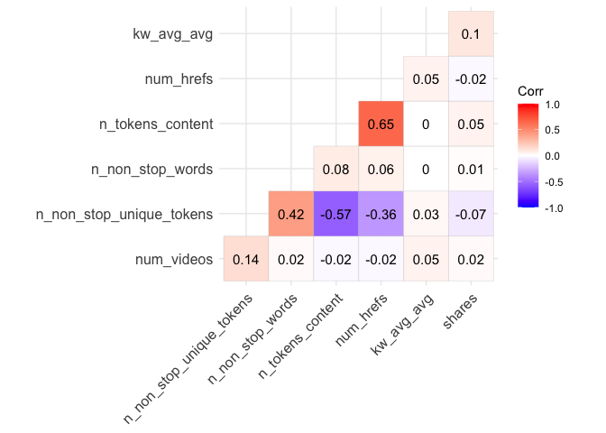

For this correlation plot, the color is red if two variables are
positively correlated and is blue if two variables are negatively
correlated.

Some tables for selected data channel of interest showing the counts and
percentage grouped by channel and weekday

``` r
#simple table displaying counts for different type of channel (all obs)
table(X$channel) 
```

    ## 
    ##           data_channel_is_bus data_channel_is_entertainment 
    ##                          6258                          7057 
    ##     data_channel_is_lifestyle        data_channel_is_socmed 
    ##                          2099                          2323 
    ##          data_channel_is_tech         data_channel_is_world 
    ##                          7346                          8427

``` r
#some summary stats grouped by channel 
C1 <- X %>% 
    group_by( channel ) %>% 
    summarise( percent = 100 * n() / nrow( new_data ),mean_shares = mean(shares), mean_images = mean(num_imgs),mean_video = mean(num_videos),mean_link = mean(num_hrefs))
knitr::kable(C1)
```

| channel                          |   percent | mean\_shares | mean\_images | mean\_video | mean\_link |
| :------------------------------- | --------: | -----------: | -----------: | ----------: | ---------: |
| data\_channel\_is\_bus           | 18.675022 |     3063.019 |     1.808405 |   0.6364653 |   9.356184 |
| data\_channel\_is\_entertainment | 21.059385 |     2970.487 |     6.317699 |   2.5458410 |  10.689670 |
| data\_channel\_is\_lifestyle     |  6.263802 |     3682.123 |     4.904717 |   0.4749881 |  13.419247 |
| data\_channel\_is\_socmed        |  6.932259 |     3629.383 |     4.290142 |   1.1175204 |  13.176065 |
| data\_channel\_is\_tech          | 21.921814 |     3072.283 |     4.434522 |   0.4471821 |   9.416825 |
| data\_channel\_is\_world         | 25.147717 |     2287.734 |     2.841225 |   0.5495431 |  10.195206 |

``` r
# using the subset data set containing weekday info in one column. 
table(pop.data$weekday)
```

    ## 
    ##    weekday_is_friday    weekday_is_monday  weekday_is_saturday    weekday_is_sunday 
    ##                  972                 1358                  380                  536 
    ##  weekday_is_thursday   weekday_is_tuesday weekday_is_wednesday 
    ##                 1231                 1285                 1295

``` r
C2 <- pop.data %>% 
    group_by( weekday ) %>% 
    summarise( percent = 100 * n() / nrow( X ),mean_shares = mean(shares), mean_images = mean(num_imgs),mean_video = mean(num_videos),mean_link = mean(num_hrefs))
knitr::kable(C2)
```

| weekday                |  percent | mean\_shares | mean\_images | mean\_video | mean\_link |
| :--------------------- | -------: | -----------: | -----------: | ----------: | ---------: |
| weekday\_is\_friday    | 2.900627 |     3000.947 |     5.969136 |    2.373457 |  10.305556 |
| weekday\_is\_monday    | 4.052522 |     2931.036 |     5.863034 |    2.692194 |  10.991900 |
| weekday\_is\_saturday  | 1.133990 |     3416.400 |     7.086842 |    3.210526 |  12.136842 |
| weekday\_is\_sunday    | 1.599522 |     3810.951 |     8.397388 |    2.098881 |  11.429104 |
| weekday\_is\_thursday  | 3.673530 |     2882.213 |     6.300569 |    2.552396 |  10.485784 |
| weekday\_is\_tuesday   | 3.834676 |     2708.033 |     6.690272 |    2.463813 |  11.044358 |
| weekday\_is\_wednesday | 3.864518 |     2854.619 |     5.616216 |    2.586873 |   9.772201 |

``` r
table(pop.data$weekday, pop.data$channel)
```

    ##                       
    ##                        data_channel_is_entertainment
    ##   weekday_is_friday                              972
    ##   weekday_is_monday                             1358
    ##   weekday_is_saturday                            380
    ##   weekday_is_sunday                              536
    ##   weekday_is_thursday                           1231
    ##   weekday_is_tuesday                            1285
    ##   weekday_is_wednesday                          1295

``` r
table(pop.data$channel, pop.data$is_weekend)
```

    ##                                
    ##                                    0    1
    ##   data_channel_is_entertainment 6141  916

``` r
C3 <- pop.data %>% group_by(is_weekend)%>% 
    summarise( percent = 100 * n() / nrow( X ),mean_shares = mean(shares), mean_images = mean(num_imgs),mean_video = mean(num_videos),mean_link = mean(num_hrefs))
knitr::kable(C3)
```

| is\_weekend |   percent | mean\_shares | mean\_images | mean\_video | mean\_link |
| :---------- | --------: | -----------: | -----------: | ----------: | ---------: |
| 0           | 18.325873 |     2869.537 |     6.088585 |    2.543722 |   10.53558 |
| 1           |  2.733512 |     3647.273 |     7.853712 |    2.560044 |   11.72271 |

### Graphical summaries

``` r
#Scatter plot for n_tokens_content v.s. Shares.
scatter.tc <- ggplot(data = pop.data, aes(x = n_tokens_content, y = shares))
scatter.tc + geom_point(aes(color = is_weekend)) + 
             geom_smooth(method = "lm") + 
             labs(title = "Number of Tokens in Content v.s. Shares", x = "Number of tokens in content", y = "shares") + 
             scale_color_discrete(name = "is_weekend")
```

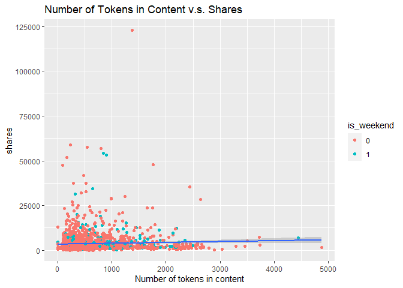

If the linear regression line shows an upward trend, then articles with
more words in content tend to be shared more often; if it shows a
downward trend, then articles with more words in content tend to be
shared less often.

``` r
#Scatter plot for Videos v.s. Shares.
scatter.video <- ggplot(pop.data,aes(x = num_videos, y =shares))
scatter.video + geom_point(aes(shape = is_weekend, color = weekday), size = 2) + 
                geom_smooth(method = "lm") + 
                labs(x = "Videos", y = "Shares", title = "Videos vs Shares ") +  
                scale_shape_manual(values = c(3:4))+
                scale_color_discrete(name = "weekday")+
                scale_shape_discrete(name="is_weekend")
```

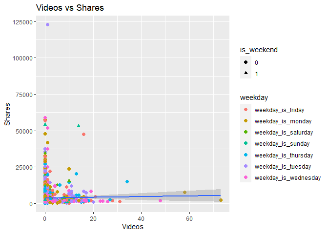

Similarly, if the linear regression line shows an upward trend, then
articles with more videos tend to be shared more often; if it shows a
downward trend, then articles with more videos tend to be shared less
often.

``` r
#Scatter plot for Number of Tokens in Content v.s. Number of Links.
scatter.stop <- ggplot(data = pop.data, aes(x = n_tokens_content, y = num_hrefs))
scatter.stop + geom_point(aes(color = is_weekend)) + 
               geom_smooth(method = "lm") + 
               labs(title = "Number of Tokens in Content v.s. Number of Links", 
                    x = "Number of Tokens in Content", 
                    y = "Number of Links") + 
               scale_color_discrete(name = "is_weekend")
```

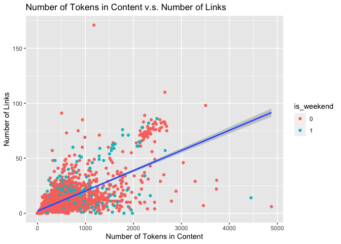

Observing from the plot, if the linear regression line is upward, there
is a positive correlation relationship between the number of words and
number of links in articles. The number of links increases as the number
of words increases in the articles. If the linear regression line is
downward, the result is the reverse.

#### General plots

This is a bar plot channel by weekend(is or not)

``` r
#bar plot channel by weekend
bar.weekend <-ggplot(X,aes(x = channel))
bar.weekend + geom_bar(aes(fill = as.factor(is_weekend)), position = "dodge") + 
              labs(x = "channel", y = "Count", title = "Channel by Weekend") +
              theme(axis.text.x = element_text(angle = 45, vjust = 1, hjust = 1)) +
              scale_fill_discrete(name = "is_weekend") 
```

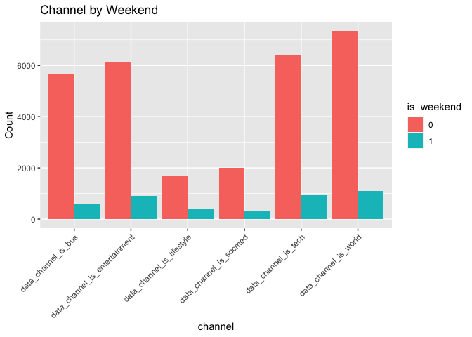
Observe the number of counts from the y-axis of this barplot, we can
compare whether there is more shares on the weekends or less shares on
weekends for each channels.

Boxplot for different channels.

``` r
box <- ggplot(X, aes(x = channel, y = shares))
box + geom_boxplot(position = "dodge") + 
      labs(x = "y", title = "Boxplot for popularity with channel type ") + 
      scale_x_discrete(name = "channel") + 
      geom_jitter(aes(color = as.factor(weekday))) + 
      scale_y_continuous() + 
      theme(axis.text.x = element_text(angle = 45, vjust = 1, hjust = 1)) +
      scale_color_discrete(name = "weekday")
```

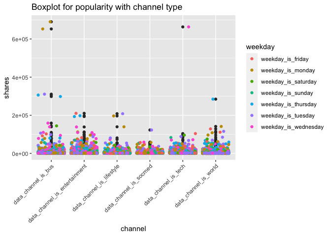
There are some outliers of shares if the points are away from the box.

This is the bar plot : channel by weekday(stacked bar).

``` r
s.bar <- ggplot(X, aes(x = weekday))
s.bar + geom_bar(aes(fill = as.factor(channel)), 
                 position = "stack",show.legend = NA) +         labs(x = "weekday") + 
        scale_fill_discrete(name = "channel") + 
        theme(axis.text.x = element_text(angle = 45, vjust = 1, hjust = 1)) +
        labs(title = "weekday by channel ")
```

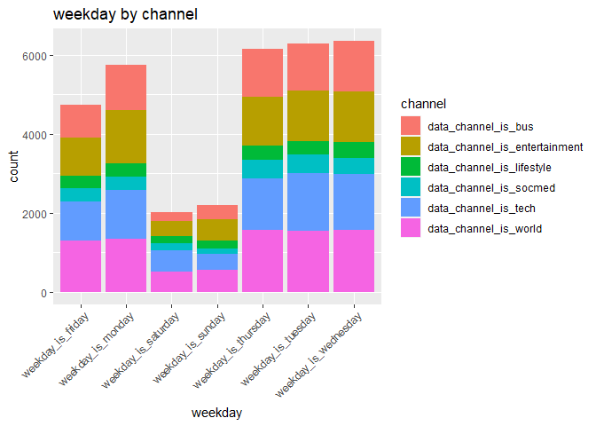

``` r
 # or  
g <- ggplot(X, aes(x = channel))
g + geom_bar(aes(fill = as.factor(weekday)),
             position = "stack",show.legend = NA) + 
    labs(x = "channel")+ 
    scale_fill_discrete(name = "weekday") + 
    theme(axis.text.x = element_text(angle = 45, vjust = 1, hjust = 1))+
    labs(title = " channel by weekday ")
```

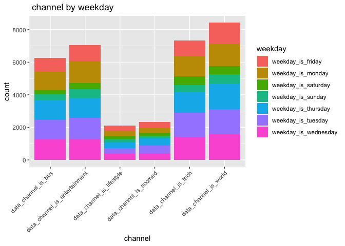

The stacked bar helps to understand the proportions between each
channels/weekdays by comparing the size of rectangles. (Different colors
represent different channels/weekdays.)

## Modeling(Regression Settings)

``` r
# Use parallel computing to speed up computations
cores <- detectCores()
cl <- makePSOCKcluster(cores-1)
registerDoParallel(cl)
```

Using 5-fold Cross-Validation.

``` r
ctrl <- trainControl(method = "cv", number = 5)
```

### Split the data set.

Before fitting any predictive models, we tried some methods that could
help reduce the dimension of data.  
We randomly selected some predictors of interest and perform the best
subset selection under the condition of least square linear regression.

``` r
# for the variable that can be used in the linear regression model. 
# try best subset selection, select number of variables using adjusted R^2, and mallow's cp, BIC,
 
final <- pop.data %>% select(n_tokens_content , n_non_stop_words , n_non_stop_unique_tokens , num_hrefs , num_imgs,num_keywords, num_videos , kw_avg_max , kw_min_avg , kw_max_avg , kw_avg_avg , self_reference_min_shares , self_reference_avg_sharess ,global_rate_positive_words,rate_positive_words, abs_title_subjectivity,abs_title_sentiment_polarity,shares)

set.seed(1033)

# split the subset data into training and testing set. Use p = 0.7.
train.index.sub <- createDataPartition(y = final$shares, p = 0.7, list = F)
train.sub <- final[train.index.sub, ] # training set
test.sub <- final[-train.index.sub, ] # test set

regression1 <- regsubsets(shares ~., data = train.sub, nvmax=17)
hh1<-summary(regression1)

# this is the indicators of the variables that are supposed to be included in the model each time(iteration)
knitr::kable(hh1$which)
```

| (Intercept) | n\_tokens\_content | n\_non\_stop\_words | n\_non\_stop\_unique\_tokens | num\_hrefs | num\_imgs | num\_keywords | num\_videos | kw\_avg\_max | kw\_min\_avg | kw\_max\_avg | kw\_avg\_avg | self\_reference\_min\_shares | self\_reference\_avg\_sharess | global\_rate\_positive\_words | rate\_positive\_words | abs\_title\_subjectivity | abs\_title\_sentiment\_polarity |
| :---------- | :----------------- | :------------------ | :--------------------------- | :--------- | :-------- | :------------ | :---------- | :----------- | :----------- | :----------- | :----------- | :--------------------------- | :---------------------------- | :---------------------------- | :-------------------- | :----------------------- | :------------------------------ |
| TRUE        | FALSE              | FALSE               | FALSE                        | FALSE      | FALSE     | FALSE         | FALSE       | FALSE        | FALSE        | FALSE        | TRUE         | FALSE                        | FALSE                         | FALSE                         | FALSE                 | FALSE                    | FALSE                           |
| TRUE        | FALSE              | FALSE               | FALSE                        | FALSE      | FALSE     | FALSE         | FALSE       | FALSE        | FALSE        | FALSE        | TRUE         | FALSE                        | TRUE                          | FALSE                         | FALSE                 | FALSE                    | FALSE                           |
| TRUE        | FALSE              | FALSE               | FALSE                        | FALSE      | FALSE     | FALSE         | FALSE       | FALSE        | TRUE         | FALSE        | TRUE         | FALSE                        | TRUE                          | FALSE                         | FALSE                 | FALSE                    | FALSE                           |
| TRUE        | FALSE              | FALSE               | FALSE                        | FALSE      | FALSE     | FALSE         | FALSE       | FALSE        | TRUE         | TRUE         | TRUE         | FALSE                        | TRUE                          | FALSE                         | FALSE                 | FALSE                    | FALSE                           |
| TRUE        | FALSE              | FALSE               | FALSE                        | FALSE      | FALSE     | FALSE         | FALSE       | TRUE         | TRUE         | TRUE         | TRUE         | FALSE                        | TRUE                          | FALSE                         | FALSE                 | FALSE                    | FALSE                           |
| TRUE        | TRUE               | FALSE               | FALSE                        | FALSE      | FALSE     | FALSE         | FALSE       | TRUE         | TRUE         | TRUE         | TRUE         | FALSE                        | TRUE                          | FALSE                         | FALSE                 | FALSE                    | FALSE                           |
| TRUE        | FALSE              | FALSE               | FALSE                        | TRUE       | TRUE      | FALSE         | FALSE       | TRUE         | TRUE         | TRUE         | TRUE         | FALSE                        | TRUE                          | FALSE                         | FALSE                 | FALSE                    | FALSE                           |
| TRUE        | TRUE               | FALSE               | FALSE                        | FALSE      | FALSE     | FALSE         | FALSE       | TRUE         | TRUE         | TRUE         | TRUE         | FALSE                        | TRUE                          | TRUE                          | TRUE                  | FALSE                    | FALSE                           |
| TRUE        | TRUE               | FALSE               | FALSE                        | FALSE      | FALSE     | FALSE         | FALSE       | TRUE         | TRUE         | TRUE         | TRUE         | FALSE                        | TRUE                          | TRUE                          | TRUE                  | FALSE                    | TRUE                            |
| TRUE        | TRUE               | FALSE               | FALSE                        | TRUE       | FALSE     | FALSE         | FALSE       | TRUE         | TRUE         | TRUE         | TRUE         | FALSE                        | TRUE                          | TRUE                          | TRUE                  | FALSE                    | TRUE                            |
| TRUE        | TRUE               | FALSE               | FALSE                        | TRUE       | TRUE      | FALSE         | FALSE       | TRUE         | TRUE         | TRUE         | TRUE         | FALSE                        | TRUE                          | TRUE                          | TRUE                  | FALSE                    | TRUE                            |
| TRUE        | TRUE               | FALSE               | TRUE                         | TRUE       | TRUE      | FALSE         | FALSE       | TRUE         | TRUE         | TRUE         | TRUE         | FALSE                        | TRUE                          | TRUE                          | TRUE                  | FALSE                    | TRUE                            |
| TRUE        | TRUE               | TRUE                | TRUE                         | TRUE       | TRUE      | FALSE         | FALSE       | TRUE         | TRUE         | TRUE         | TRUE         | FALSE                        | TRUE                          | TRUE                          | TRUE                  | FALSE                    | TRUE                            |
| TRUE        | TRUE               | TRUE                | TRUE                         | TRUE       | TRUE      | FALSE         | FALSE       | TRUE         | TRUE         | TRUE         | TRUE         | TRUE                         | TRUE                          | TRUE                          | TRUE                  | FALSE                    | TRUE                            |
| TRUE        | TRUE               | TRUE                | TRUE                         | TRUE       | TRUE      | FALSE         | FALSE       | TRUE         | TRUE         | TRUE         | TRUE         | TRUE                         | TRUE                          | TRUE                          | TRUE                  | TRUE                     | TRUE                            |
| TRUE        | TRUE               | TRUE                | TRUE                         | TRUE       | TRUE      | FALSE         | TRUE        | TRUE         | TRUE         | TRUE         | TRUE         | TRUE                         | TRUE                          | TRUE                          | TRUE                  | TRUE                     | TRUE                            |
| TRUE        | TRUE               | TRUE                | TRUE                         | TRUE       | TRUE      | TRUE          | TRUE        | TRUE         | TRUE         | TRUE         | TRUE         | TRUE                         | TRUE                          | TRUE                          | TRUE                  | TRUE                     | TRUE                            |

A simple function that helps to get the model for the best subset
selection.

``` r
get_model_formula <- function(id, object, outcome){
  # get models data
  models <- hh1$which[id,-1]
  # Get model predictors
  predictors <- names(which(models == TRUE))
  predictors <- paste(predictors, collapse = "+")
  # Build model formula
  as.formula(paste0(outcome, "~", predictors))
}
```

Using mallow’s cp, BIC and Adjusted R^2, to do model selection.

``` r
gk <- data.frame(
  Adj.R2 = which.max(hh1$adjr2),
  CP = which.min(hh1$cp),
  BIC = which.min(hh1$bic)
)
knitr::kable(gk)
```

| Adj.R2 | CP | BIC |
| -----: | -: | --: |
|     10 |  9 |   5 |

``` r
par(mfrow=c(2,2))
plot(hh1$cp ,xlab="Number of Variables ",ylab="Mallow's Cp", type='b')
plot(hh1$adjr2 ,xlab="Number of Variables ",ylab="Adjusted R^2 ", type='b')
plot(hh1$bic,xlab="Number of Variables ",ylab="BIC ", type='b')

# using the mallow's cp to choose model size. 
best_subset_model <- get_model_formula(which.min(hh1$cp),models,"shares")
```

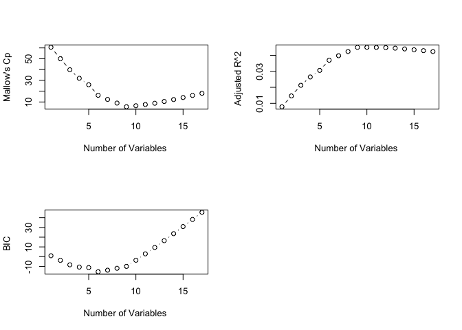

After using the best subset selection, some important variables are:
`n_tokens_content`, `num_videos`, `n_non_stop_words`,
`n_non_stop_unique_tokens`, `self_reference_min_shares`, `kw_avg_avg`,
`abs_title_subjectivity`, and `kw_max_avg`.

### Linear Regression

Since using all predictors is time-consuming and hard to render in
automation, we use the random selected variables(p = 17) from the best
subset selection to fit the linear regression models.

``` r
# check the model selected by the best subset selection 
lm.fit1 <- train(best_subset_model, data = train.sub,
                 method = "lm", preProcess =c("center", "scale"), 
                 trControl = ctrl)

# Consider all variables in the best subset, pick a model using forward selection method.
lm2 <- step(lm(shares ~ . , data = train.sub), direction = "forward")

# fit the model chosen from the forward selection for all linear terms
lm.fit2 <- train(lm2$call[["formula"]], data = train.sub, 
                 method = "lm", preProcess =c("center", "scale"), 
                 trControl = ctrl)

# Consider variables selected with forward selection (with 2-way interactions).
lm3 <- step(lm(lm2$call[["formula"]], data = train.sub), scope = . ~.^2, direction = "both", use.start = TRUE)

# fit the model chosen from both forward and backward method for the interaction terms and linear terms. 
lm.fit3 <- train(lm3$call[["formula"]], data = train.sub, 
                 method = "lm", preProcess =c("center", "scale"), 
                 trControl = ctrl)
```

``` r
# create a table to compare the results of linear regression from training data 
lm.compare <- data.frame(models= c("lm.fit1", "lm.fit2","lm.fit3"), 
                         results = bind_rows(lm.fit1$results[2:4], lm.fit2$results[2:4], lm.fit3$results[2:4]))
knitr::kable(lm.compare) 
```

| models  | results.RMSE | results.Rsquared | results.MAE |
| :------ | -----------: | ---------------: | ----------: |
| lm.fit1 |     7640.813 |        0.0307803 |    2877.452 |
| lm.fit2 |     7703.907 |        0.0253512 |    2912.848 |
| lm.fit3 |   165505.281 |        0.0377602 |    8189.167 |

Check Linear Regression model performance on test set

``` r
# Best subset
pred.lm1 <- predict(lm.fit1, newdata = test.sub)
test.RMSE.lm1 <- RMSE(pred.lm1, test.sub$shares)

# Forward
pred.lm2 <- predict(lm.fit2, newdata = test.sub)
test.RMSE.lm2 <- RMSE(pred.lm2, test.sub$shares)

# both
pred.lm3 <- predict(lm.fit3, newdata = test.sub)
test.RMSE.lm3 <- RMSE(pred.lm3, test.sub$shares)
```

### Lasso Regression

Since lasso perform the variable selection, we tried to use Lasso
Regression(adding tuning parameter/ penalty)  
Lasso using all the predictors and get the test MSE

``` r
pop.data <- X %>% filter(channel == params$channel) %>% select(-1:-2)

# split data
train.index <- createDataPartition(y = pop.data$shares, p = 0.7, list = F)

train.lasso <- pop.data[train.index, ] # training set
test.lasso <- pop.data[-train.index, ] # test set

# using all predictors (52 predictors)
cv.out.full <- cv.glmnet(as.matrix(train.lasso[,-47:-48]), train.lasso$shares, alpha=1)

#MSE versus the log(lambda)
plot(cv.out.full,main = "tuning parameter selection for lasso(full predictors)")
```

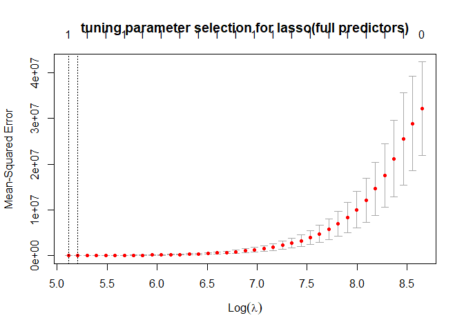

``` r
best.lambda.full <- cv.out.full$lambda.min

#fitting the lasso regression 
lasso.fit.full <- glmnet(train.lasso[,-46:-48] ,train.lasso$shares, alpha = 1, lambda = best.lambda.full)
lasso.coef.full <- predict(lasso.fit.full, type = "coefficients")
print(lasso.coef.full)
```

    ## 46 x 1 sparse Matrix of class "dgCMatrix"
    ##                                         s0
    ## (Intercept)                  -1.752722e+03
    ## n_tokens_title                .           
    ## n_tokens_content              .           
    ## n_unique_tokens               .           
    ## n_non_stop_words              .           
    ## n_non_stop_unique_tokens      .           
    ## num_hrefs                     5.767897e+00
    ## num_self_hrefs                .           
    ## num_imgs                      .           
    ## num_videos                    .           
    ## average_token_length          .           
    ## num_keywords                  .           
    ## kw_min_min                    .           
    ## kw_max_min                    5.726208e-02
    ## kw_avg_min                    1.547554e+00
    ## kw_min_max                   -2.301371e-04
    ## kw_max_max                    .           
    ## kw_avg_max                    .           
    ## kw_min_avg                    .           
    ## kw_max_avg                    .           
    ## kw_avg_avg                    1.174723e+00
    ## self_reference_min_shares     1.119279e-02
    ## self_reference_max_shares     .           
    ## self_reference_avg_sharess    3.076254e-02
    ## is_weekend                    4.179310e+01
    ## LDA_00                        .           
    ## LDA_01                        .           
    ## LDA_02                        .           
    ## LDA_03                        .           
    ## LDA_04                        .           
    ## global_subjectivity           7.082163e+02
    ## global_sentiment_polarity     .           
    ## global_rate_positive_words    .           
    ## global_rate_negative_words    .           
    ## rate_positive_words           .           
    ## rate_negative_words           .           
    ## avg_positive_polarity         .           
    ## min_positive_polarity         .           
    ## max_positive_polarity         .           
    ## avg_negative_polarity         .           
    ## min_negative_polarity         .           
    ## max_negative_polarity         .           
    ## title_subjectivity            .           
    ## title_sentiment_polarity      .           
    ## abs_title_subjectivity        .           
    ## abs_title_sentiment_polarity  2.913164e+01

Lasso method using the 17 predictors.

``` r
#using selected predictors (17 predictors) 
#use k-fold cv to select best lambda for the lasso regression 
cv.out <- cv.glmnet(as.matrix(train.sub), train.sub$shares, alpha=1)
#MSE versus the log(lambda)
plot(cv.out,main = "tuning parameter selection for lasso(17 predictors)")
```

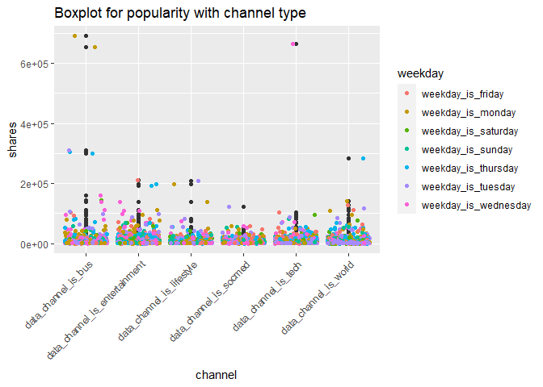

``` r
best.lambda <- cv.out$lambda.min

#fitting the lasso regression 
lasso.fit.18 <- glmnet(train.sub[,-18] ,train.sub$shares, alpha = 1, lambda = best.lambda)
lasso.coef <- predict(lasso.fit.18, type = "coefficients")
print(lasso.coef)
```

    ## 18 x 1 sparse Matrix of class "dgCMatrix"
    ##                                         s0
    ## (Intercept)                  -171.77410042
    ## n_tokens_content                .         
    ## n_non_stop_words                .         
    ## n_non_stop_unique_tokens        .         
    ## num_hrefs                       1.96223899
    ## num_imgs                        0.56828573
    ## num_keywords                   46.60795768
    ## num_videos                      .         
    ## kw_avg_max                      .         
    ## kw_min_avg                      .         
    ## kw_max_avg                      .         
    ## kw_avg_avg                      0.85077784
    ## self_reference_min_shares       .         
    ## self_reference_avg_sharess      0.02562518
    ## global_rate_positive_words      .         
    ## rate_positive_words             .         
    ## abs_title_subjectivity          .         
    ## abs_title_sentiment_polarity    .

Check Lasso performance on test set.

``` r
# Using the 17 predictors
lasso.partial.pred <- predict(lasso.fit.18, newx= as.matrix(test.sub[,-18]))
test.RMSE.lasso.partial <- RMSE(lasso.partial.pred, test.sub$shares)

# Using all predictors (52 predictors)
lasso.pred.full <- predict(lasso.fit.full, newx= as.matrix(test.lasso[,-46:-48]))
test.RMSE.lasso.full <- RMSE(lasso.pred.full, test.lasso$shares)
```

### Random Forest Regression

Random Forest regression is used to de-correlate each model fitting. We
use the model the previously get from the forward and both selection
method to fit the random forest regression. Take computation limit, and
time consumption into account, there are only a few tuning parameters
set for the test.

``` r
# create data frame for tuning parameter
rf.tGrid <- expand.grid(mtry = seq(from = 1, to = 15, by = 1))

# train the Random Forest model
# use model selected by forward selection
rf.fit1 <- train(lm2$call[["formula"]], data = train.sub, 
             method = "rf", trControl = ctrl, 
             preProcess = c("center", "scale"), 
             tuneGrid = rf.tGrid)

# use model selected by both selection
rf.fit2 <- train(lm3$call[["formula"]], data = train.sub, 
             method = "rf", trControl = ctrl, 
             preProcess = c("center", "scale"), 
             tuneGrid = rf.tGrid)

# plot RMSE for each iteration
plot(rf.fit1$results$mtry, rf.fit1$results$RMSE, 
     xlab = "mtry",ylab = "RMSE",type = 'p',main = 'random forest')
```

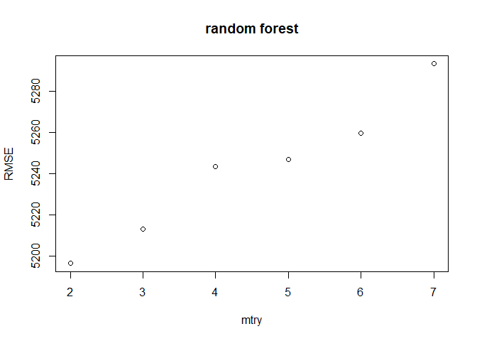

``` r
plot(rf.fit2$results$mtry, rf.fit2$results$RMSE, 
     xlab = "mtry",ylab = "RMSE",type = 'p',main = 'random forest')
```

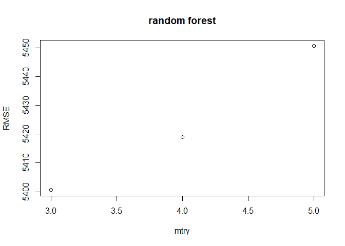

Check Random Forest model performance on test set.

``` r
# start model selected by forward
pred.rf1 <- predict(rf.fit1, newdata = test.sub)
test.RMSE.rf1 <- RMSE(pred.rf1, test.sub$shares)

# start model selected by both
pred.rf2 <- predict(rf.fit2, newdata = test.sub)
test.RMSE.rf2 <- RMSE(pred.rf2, test.sub$shares)
```

### Boosting model.(Stochastic Gradient Boosting)

Boosting is a slow learn method that learn from the previous fit each
time in order to prevent over fitting. We also use the model the
previously get from the forward and both selection method to fit the
boosted.  
Boosting tree have several tuning parameters, also, due to some
limitation, the number of tuning parameters and cross validation number
is set to be small.

``` r
# set tuning parameters
tune1 = c(25,50,100,150,200)
tune2 = c(1:10)
tune3 = 0.01
tune4 = 10
boos.grid <- expand.grid(n.trees = tune1, 
                         interaction.depth = tune2, 
                         shrinkage = tune3, 
                         n.minobsinnode = tune4)

# train the Boosted Tree model
# use model selected by forward selection
boostTreefit1 <- train(lm2$call[["formula"]], data = train.sub, 
                method = "gbm",
                preProcess = c("center","scale"),
                trControl = ctrl,
                tuneGrid = boos.grid)

par(mfrow=c(2,2))

plot(boostTreefit1$results$n.trees, boostTreefit1$results$RMSE, 
     xlab = "n.trees",ylab = "RMSE", type = 'p',main = 'boosted')
plot(boostTreefit1$results$interaction.depth, boostTreefit1$results$RMSE, 
     xlab = "subtrees",ylab = "RMSE",type = 'p',main = 'boosted')
plot(boostTreefit1$results$interaction.depth, boostTreefit1$results$Rsquared, 
     xlab = "subtrees",ylab = "R^2",type = 'p',main = 'boosted')

# use model selected by both selection
boostTreefit2 <- train(lm3$call[["formula"]], data = train.sub, 
                 method = "gbm",
                 preProcess = c("center","scale"),
                 trControl = ctrl,
                 tuneGrid = boos.grid)
```

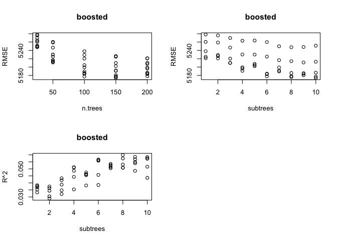

Check Boosted Tree model performance on test set.

``` r
# start model selected by forward
pred.boost1 <- predict(boostTreefit1 , newdata = test.sub)
test.RMSE.boost1 <- RMSE(pred.boost1, test.sub$shares)

# start model selected by both
pred.boost2 <- predict(boostTreefit2 , newdata = test.sub)
test.RMSE.boost2 <- RMSE(pred.boost2, test.sub$shares)
```

``` r
# done with parallel computing 
stopCluster(cl)
```

### Discussion and Model Selection

  - lm.fit1 is chosen by the best subset selection  
  - lm.fit2 is using forward selection to select variables of most
    interest.  
  - lm.fit3 is adding the interaction terms to the model fitting  
  - lasso.fit.full is using the lasso regression to fit the model for
    all predictors (it also perform variable selection)  
  - lasso.fit.18 is using the lasso regression to fit the model for
    random selected predictors(17 predictors )  
  - rf.fit1/rf.fit2 is using de-correlated method to reduce the
    variance  
  - boost.fit is using cross validation to select appropriate tuning
    parameter for the boosted model and use it for prediction.

This is a simple table containing these methods and the Root Mean Square
Error for each model fitting.

``` r
all.compare <- data.frame(models= c("lm.fit1", "lm.fit2","lm.fit3",
                                    "lasso.fit.full","lasso.fit.18",
                                    "rf.fit1","rf.fit2",
                                    "boostTreefit1","boostTreefit2"), 
                          test_RMSE = c(test.RMSE.lm1, test.RMSE.lm2, test.RMSE.lm3,
                                            test.RMSE.lasso.full, test.RMSE.lasso.partial,
                                            test.RMSE.rf1, test.RMSE.rf2, 
                                            test.RMSE.boost1, test.RMSE.boost2))
knitr::kable(all.compare) 
```

| models         | test\_RMSE |
| :------------- | ---------: |
| lm.fit1        |   7787.916 |
| lm.fit2        |   7772.391 |
| lm.fit3        |   8481.002 |
| lasso.fit.full |   7026.509 |
| lasso.fit.18   |   7720.387 |
| rf.fit1        |   7818.964 |
| rf.fit2        |   7713.333 |
| boostTreefit1  |   7802.644 |
| boostTreefit2  |   7735.536 |

Select model with lowest RMSE.

``` r
select <- all.compare %>% filter(test_RMSE == min(test_RMSE))
select
```

The model with lowest RMSE is the model. This model has the best
performance on test set.

### Automation of data channels

We need to read in libraries as well as some data set before knitting
the automation part.

``` r
channels <- unique(X$channel)
output_file <- paste0(channels,".md")

params = lapply(channels, FUN = function(x){list(channel = x)})

reports <- tibble(output_file, params)

library(rmarkdown)

apply(reports, MARGIN = 1,
      FUN = function(x){
        render(input = "./ST558_Project_2.Rmd",
               output_format = "github_document", 
               output_file = x[[1]], 
               params = x[[2]])
      })
```
