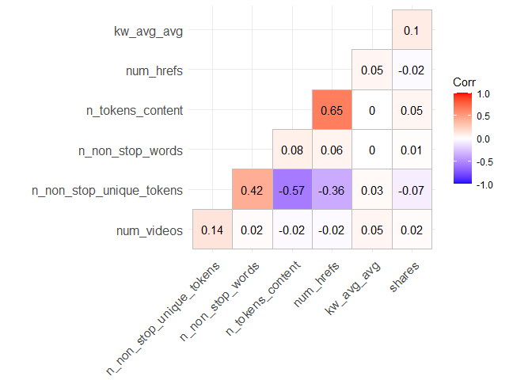
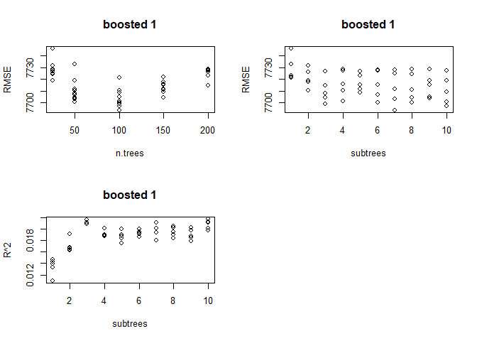
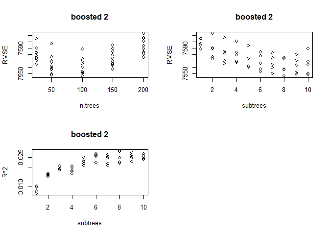

ST558 Project 2
================
Aries Zhou & Jiatao Wang
10/30/2021

## Introduction

This is a R project using the exploratory data analysis and supervised
statistical learning method to analyze a data set.  
This data set is called **Online News Popularity Data Set** and you can
access the data set
[here](https://archive.ics.uci.edu/ml/datasets/Online+News+Popularity)

The following variables are included in this data.

0.  `url`: URL of the article (non-predictive)  
1.  `timedelta`: Days between the article publication and the dataset
    acquisition (non-predictive)  
2.  `n_tokens_title`: Number of words in the title  
3.  `n_tokens_content`: Number of words in the content  
4.  `n_unique_tokens`: Rate of unique words in the content  
5.  `n_non_stop_words`: Rate of non-stop words in the content  
6.  `n_non_stop_unique_tokens`: Rate of unique non-stop words in the
    content  
7.  `num_hrefs`: Number of links  
8.  `num_self_hrefs`: Number of links to other articles published by
    Mashable  
9.  `num_imgs`: Number of images  
10. `num_videos`: Number of videos  
11. `average_token_length`: Average length of the words in the content  
12. `num_keywords`: Number of keywords in the metadata  
13. `data_channel_is_lifestyle`: Is data channel ‘Lifestyle’?  
14. `data_channel_is_entertainment`: Is data channel ‘Entertainment’?  
15. `data_channel_is_bus`: Is data channel ‘Business’?  
16. `data_channel_is_socmed`: Is data channel ‘Social Media’?  
17. `data_channel_is_tech`: Is data channel ‘Tech’?  
18. `data_channel_is_world`: Is data channel ‘World’?  
19. `kw_min_min`: Worst keyword (min. shares)  
20. `kw_max_min`: Worst keyword (max. shares)  
21. `kw_avg_min`: Worst keyword (avg. shares)  
22. `kw_min_max`: Best keyword (min. shares)  
23. `kw_max_max`: Best keyword (max. shares)  
24. `kw_avg_max`: Best keyword (avg. shares)  
25. `kw_min_avg`: Avg. keyword (min. shares)  
26. `kw_max_avg`: Avg. keyword (max. shares)  
27. `kw_avg_avg`: Avg. keyword (avg. shares)  
28. `self_reference_min_shares`: Min. shares of referenced articles in
    Mashable  
29. `self_reference_max_shares`: Max. shares of referenced articles in
    Mashable  
30. `self_reference_avg_sharess`: Avg. shares of referenced articles in
    Mashable  
31. `weekday_is_monday`: Was the article published on a Monday?  
32. `weekday_is_tuesday`: Was the article published on a Tuesday?  
33. `weekday_is_wednesday`: Was the article published on a Wednesday?  
34. `weekday_is_thursday`: Was the article published on a Thursday?  
35. `weekday_is_friday`: Was the article published on a Friday?  
36. `weekday_is_saturday`: Was the article published on a Saturday?  
37. `weekday_is_sunday`: Was the article published on a Sunday?  
38. `is_weekend`: Was the article published on the weekend?  
39. `LDA_00`: Closeness to LDA topic 0  
40. `LDA_01`: Closeness to LDA topic 1  
41. `LDA_02`: Closeness to LDA topic 2  
42. `LDA_03`: Closeness to LDA topic 3  
43. `LDA_04`: Closeness to LDA topic 4  
44. `global_subjectivity`: Text subjectivity  
45. `global_sentiment_polarity`: Text sentiment polarity  
46. `global_rate_positive_words`: Rate of positive words in the
    content  
47. `global_rate_negative_words`: Rate of negative words in the
    content  
48. `rate_positive_words`: Rate of positive words among non-neutral
    tokens  
49. `rate_negative_words`: Rate of negative words among non-neutral
    tokens  
50. `avg_positive_polarity`: Avg. polarity of positive words  
51. `min_positive_polarity`: Min. polarity of positive words  
52. `max_positive_polarity`: Max. polarity of positive words  
53. `avg_negative_polarity`: Avg. polarity of negative words  
54. `min_negative_polarity`: Min. polarity of negative words  
55. `max_negative_polarity`: Max. polarity of negative words  
56. `title_subjectivity`: Title subjectivity  
57. `title_sentiment_polarity`: Title polarity  
58. `abs_title_subjectivity`: Absolute subjectivity level  
59. `abs_title_sentiment_polarity`: Absolute polarity level  
60. `shares`: Number of shares (the response variables)

There are lots of measurements/heterogeneous features of articles,
including type of the data channel, number of images, number of videos,
number of links, counts of words in the title/content, when it is
published, summary statistics of polarity of positive/negative words and
etc…

The **main goal** of this project is to use those features/explanatory
variables to predict the popularity(number of the shares in social
networks)  
Before conducting any method to fit the data with models, we want to do
some exploratory data analysis (including some summary statistics and
graphs) to visualize the data. And then, we will fit the data under
regression setting.  
Supervised learning methods that will be used in this project include:
linear regression, generalized linear model, lasso regression, random
forest regression, boosted method, or any other method that we will find
that could be applicable through our discovering of the data.

### List of packages used:

``` r
library(dplyr)
library(tidyr)
library(ggcorrplot)
library(vcd)
library(caret)
library(class)
library(randomForest)
library(gbm)
library(readr)
library(leaps)
library(Matrix)
library(glmnet)
library(rmarkdown)
library(doParallel)
```

## Data Cleaning

### Data

Read in data and transpose data\_channel\_is\* and weekday\_is\* columns
into categorical columns.

``` r
# import data
pop <- read_csv("OnlineNewsPopularity.csv")

# check if there is any missing or NA values in the data set 
anyNA(pop) # returned FALSE, so no missing values 
```

    ## [1] FALSE

``` r
# convert the wide to long format (categorize data channel, and make them into one column)
new <- pop %>% pivot_longer(cols = data_channel_is_lifestyle:data_channel_is_world, names_to = "channel",values_to = 'logi.num.d') 
new_data <- new %>% filter(logi.num.d != 0) %>% select(-logi.num.d) # drop logical number

# merge those weekday columns into one.
Z <- new_data %>% pivot_longer(cols = weekday_is_monday:weekday_is_sunday, names_to = "weekday",values_to = 'logi.num.w') 
X <- Z %>% filter(logi.num.w != 0) %>% select(-logi.num.w) # drop logical numbers
```

Subset data on data channel of interest for analysis and set the params
to do automation.

``` r
pop.data <- X %>% filter(channel == params$channel) %>% select(-1:-2)
pop.data$is_weekend <- as.factor(pop.data$is_weekend)
pop.data$weekday <- as.factor(pop.data$weekday)
```

Check if there are observations that are not marked by channel variable.

``` r
nrow(new_data)< nrow(pop)
```

    ## [1] TRUE

Since `nrow(new_data)< nrow(pop)` returned `TRUE`, indicating that there
are some observations that are not in the types of channel listed in the
data set.

## Exploratory Data Analysis

### Summarizations And Graphs

``` r
#check data structures.
str(pop.data)
```

    ## tibble [7,057 x 48] (S3: tbl_df/tbl/data.frame)
    ##  $ n_tokens_title              : num [1:7057] 12 9 14 12 11 12 5 11 10 10 ...
    ##  $ n_tokens_content            : num [1:7057] 219 531 194 161 454 177 356 281 909 413 ...
    ##  $ n_unique_tokens             : num [1:7057] 0.664 0.504 0.765 0.669 0.566 ...
    ##  $ n_non_stop_words            : num [1:7057] 1 1 1 1 1 ...
    ##  $ n_non_stop_unique_tokens    : num [1:7057] 0.815 0.666 0.84 0.752 0.755 ...
    ##  $ num_hrefs                   : num [1:7057] 4 9 4 5 5 4 3 5 3 6 ...
    ##  $ num_self_hrefs              : num [1:7057] 2 0 4 4 3 3 3 4 2 1 ...
    ##  $ num_imgs                    : num [1:7057] 1 1 0 0 1 1 12 1 1 13 ...
    ##  $ num_videos                  : num [1:7057] 0 0 1 6 0 0 1 0 1 0 ...
    ##  $ average_token_length        : num [1:7057] 4.68 4.4 4.52 4.45 4.89 ...
    ##  $ num_keywords                : num [1:7057] 5 7 6 10 6 9 10 4 5 6 ...
    ##  $ kw_min_min                  : num [1:7057] 0 0 0 0 0 0 0 217 217 217 ...
    ##  $ kw_max_min                  : num [1:7057] 0 0 0 0 0 0 0 593 593 598 ...
    ##  $ kw_avg_min                  : num [1:7057] 0 0 0 0 0 ...
    ##  $ kw_min_max                  : num [1:7057] 0 0 0 0 0 0 0 0 0 0 ...
    ##  $ kw_max_max                  : num [1:7057] 0 0 0 0 0 0 0 17100 17100 17100 ...
    ##  $ kw_avg_max                  : num [1:7057] 0 0 0 0 0 ...
    ##  $ kw_min_avg                  : num [1:7057] 0 0 0 0 0 0 0 0 0 0 ...
    ##  $ kw_max_avg                  : num [1:7057] 0 0 0 0 0 ...
    ##  $ kw_avg_avg                  : num [1:7057] 0 0 0 0 0 ...
    ##  $ self_reference_min_shares   : num [1:7057] 496 0 6300 638 0 1100 1700 951 20900 527 ...
    ##  $ self_reference_max_shares   : num [1:7057] 496 0 6300 29200 0 1500 2500 951 20900 527 ...
    ##  $ self_reference_avg_sharess  : num [1:7057] 496 0 6300 8261 0 ...
    ##  $ is_weekend                  : Factor w/ 2 levels "0","1": 1 1 1 1 1 1 1 1 1 1 ...
    ##  $ LDA_00                      : num [1:7057] 0.5003 0.0286 0.0334 0.1258 0.2003 ...
    ##  $ LDA_01                      : num [1:7057] 0.3783 0.4193 0.0345 0.0203 0.3399 ...
    ##  $ LDA_02                      : num [1:7057] 0.04 0.4947 0.215 0.02 0.0333 ...
    ##  $ LDA_03                      : num [1:7057] 0.0413 0.0289 0.6837 0.8139 0.3931 ...
    ##  $ LDA_04                      : num [1:7057] 0.0401 0.0286 0.0333 0.02 0.0333 ...
    ##  $ global_subjectivity         : num [1:7057] 0.522 0.43 0.396 0.572 0.467 ...
    ##  $ global_sentiment_polarity   : num [1:7057] 0.0926 0.1007 0.3471 0.1662 0.1255 ...
    ##  $ global_rate_positive_words  : num [1:7057] 0.0457 0.0414 0.0567 0.0497 0.0441 ...
    ##  $ global_rate_negative_words  : num [1:7057] 0.0137 0.0207 0 0.0186 0.0132 ...
    ##  $ rate_positive_words         : num [1:7057] 0.769 0.667 1 0.727 0.769 ...
    ##  $ rate_negative_words         : num [1:7057] 0.231 0.333 0 0.273 0.231 ...
    ##  $ avg_positive_polarity       : num [1:7057] 0.379 0.386 0.545 0.427 0.363 ...
    ##  $ min_positive_polarity       : num [1:7057] 0.1 0.136 0.1 0.1 0.1 ...
    ##  $ max_positive_polarity       : num [1:7057] 0.7 0.8 1 0.85 1 1 1 0.5 1 0.8 ...
    ##  $ avg_negative_polarity       : num [1:7057] -0.35 -0.37 0 -0.364 -0.215 ...
    ##  $ min_negative_polarity       : num [1:7057] -0.6 -0.6 0 -0.8 -0.5 -0.2 -0.7 -0.5 -1 -0.7 ...
    ##  $ max_negative_polarity       : num [1:7057] -0.2 -0.167 0 -0.125 -0.1 ...
    ##  $ title_subjectivity          : num [1:7057] 0.5 0 0.4 0.583 0.427 ...
    ##  $ title_sentiment_polarity    : num [1:7057] -0.188 0 0.1 0.25 0.168 ...
    ##  $ abs_title_subjectivity      : num [1:7057] 0 0.5 0.1 0.0833 0.0727 ...
    ##  $ abs_title_sentiment_polarity: num [1:7057] 0.188 0 0.1 0.25 0.168 ...
    ##  $ shares                      : num [1:7057] 593 1200 2100 1200 4600 1200 631 1300 1700 455 ...
    ##  $ channel                     : chr [1:7057] "data_channel_is_entertainment" "data_channel_is_entertainment" "data_channel_is_entertainment" "data_channel_is_entertainment" ...
    ##  $ weekday                     : Factor w/ 7 levels "weekday_is_friday",..: 2 2 2 2 2 2 2 6 6 7 ...

``` r
#summary stats for the response variable. 
summary(pop.data$shares)
```

    ##    Min. 1st Qu.  Median    Mean 3rd Qu.    Max. 
    ##      47     833    1200    2970    2100  210300

The distribution of the response variable (shares) is:

-   **Right-skewed** if its mean is **greater** than its median.  
-   **Left-skewed** if its mean is **less** than its median.  
-   **Normal** if its mean **equals** to its median.

Check correlations.

``` r
#get all numeric variables without collinearity
pop.data.num <- select(pop.data, is.numeric) %>% mutate_all(~(scale(.) %>% as.vector)) 
```

``` r
# due to the large number of variables, try to get a best subset with the stepwise method. 
lm <- step(lm(shares ~ ., data = pop.data.num))
```

This is a multiple linear model selected based on AIC using step
function.

``` r
lm$call[["formula"]] # 
```

    ## shares ~ n_tokens_content + n_unique_tokens + n_non_stop_words + 
    ##     n_non_stop_unique_tokens + num_hrefs + num_self_hrefs + kw_min_min + 
    ##     kw_max_min + kw_avg_min + kw_min_max + kw_min_avg + kw_max_avg + 
    ##     kw_avg_avg + self_reference_min_shares + self_reference_avg_sharess + 
    ##     LDA_00 + global_subjectivity + global_rate_positive_words + 
    ##     rate_positive_words + abs_title_sentiment_polarity
    ## <environment: 0x000001ada06fa7c0>

plot of correlations.  
For this correlation plot, the color is red if two variables are
positively correlated and is blue if two variables are negatively
correlated.

``` r
# get the selected subset
num.s <- pop.data.num %>% select(n_tokens_content , n_non_stop_words , n_non_stop_unique_tokens , num_hrefs , num_videos , kw_avg_max , kw_min_avg , kw_max_avg , kw_avg_avg , self_reference_min_shares , self_reference_avg_sharess , abs_title_subjectivity, shares)

# check correlations
cor <- round(cor(num.s, use="complete.obs"), 2)

# select correlated variables without variables with collinearity (ex. kw_min_min and kw_max_min to kw_avg_min)
plot.s <- num.s %>% select(n_tokens_content, n_non_stop_unique_tokens, n_non_stop_words, num_hrefs, num_videos, kw_avg_avg, shares)

# plot a correlation plot
cor.plot <- round(cor(plot.s, use="complete.obs"), 2)
ggcorrplot(cor.plot, hc.order = TRUE, type = "lower", lab = TRUE)
```



Some tables for selected data channel of interest showing the counts and
percentage grouped by channel and weekday

``` r
#simple table displaying counts for different type of channel (all obs)
table(X$channel) 
```

    ## 
    ##           data_channel_is_bus data_channel_is_entertainment     data_channel_is_lifestyle        data_channel_is_socmed 
    ##                          6258                          7057                          2099                          2323 
    ##          data_channel_is_tech         data_channel_is_world 
    ##                          7346                          8427

``` r
#some summary stats grouped by channel and weekday
C1 <- X %>% 
    group_by( channel,weekday) %>% 
    summarise( percent = 100 * n() / nrow(X),mean_shares = mean(shares), mean_images = mean(num_imgs),mean_video = mean(num_videos),mean_link = mean(num_hrefs))
```

show percentage of channel and weekday grouped for all the observations.
as well as means within each group

``` r
knitr::kable(C1)
```

| channel                          | weekday                |   percent | mean\_shares | mean\_images | mean\_video | mean\_link |
|:---------------------------------|:-----------------------|----------:|-------------:|-------------:|------------:|-----------:|
| data\_channel\_is\_bus           | weekday\_is\_friday    | 2.4828409 |     2363.770 |     1.695914 |   0.6370192 |   9.012019 |
| data\_channel\_is\_bus           | weekday\_is\_monday    | 3.4407640 |     3887.436 |     1.889853 |   0.7380746 |   9.643539 |
| data\_channel\_is\_bus           | weekday\_is\_saturday  | 0.7251567 |     4426.897 |     2.057613 |   0.5390947 |  13.604938 |
| data\_channel\_is\_bus           | weekday\_is\_sunday    | 1.0235751 |     3543.784 |     1.956268 |   0.7871720 |  13.276968 |
| data\_channel\_is\_bus           | weekday\_is\_thursday  | 3.6824828 |     2885.192 |     1.772285 |   0.5745543 |   8.842788 |
| data\_channel\_is\_bus           | weekday\_is\_tuesday   | 3.5273053 |     2932.336 |     1.884941 |   0.7402707 |   8.740271 |
| data\_channel\_is\_bus           | weekday\_is\_wednesday | 3.7928976 |     2676.552 |     1.684500 |   0.4854445 |   8.521636 |
| data\_channel\_is\_entertainment | weekday\_is\_friday    | 2.9006267 |     3000.947 |     5.969136 |   2.3734568 |  10.305556 |
| data\_channel\_is\_entertainment | weekday\_is\_monday    | 4.0525216 |     2931.036 |     5.863034 |   2.6921944 |  10.991900 |
| data\_channel\_is\_entertainment | weekday\_is\_saturday  | 1.1339899 |     3416.400 |     7.086842 |   3.2105263 |  12.136842 |
| data\_channel\_is\_entertainment | weekday\_is\_sunday    | 1.5995225 |     3810.951 |     8.397388 |   2.0988806 |  11.429104 |
| data\_channel\_is\_entertainment | weekday\_is\_thursday  | 3.6735303 |     2882.213 |     6.300569 |   2.5523964 |  10.485784 |
| data\_channel\_is\_entertainment | weekday\_is\_tuesday   | 3.8346762 |     2708.033 |     6.690272 |   2.4638132 |  11.044358 |
| data\_channel\_is\_entertainment | weekday\_is\_wednesday | 3.8645181 |     2854.619 |     5.616216 |   2.5868726 |   9.772201 |
| data\_channel\_is\_lifestyle     | weekday\_is\_friday    | 0.9101761 |     3025.869 |     3.940984 |   0.4229508 |  13.567213 |
| data\_channel\_is\_lifestyle     | weekday\_is\_monday    | 0.9609072 |     4345.711 |     4.124224 |   0.6211180 |  12.220497 |
| data\_channel\_is\_lifestyle     | weekday\_is\_saturday  | 0.5431215 |     4062.451 |     8.510989 |   0.6043956 |  17.159341 |
| data\_channel\_is\_lifestyle     | weekday\_is\_sunday    | 0.6266786 |     3790.376 |     8.595238 |   0.4571429 |  17.433333 |
| data\_channel\_is\_lifestyle     | weekday\_is\_thursday  | 1.0683378 |     3500.268 |     3.927374 |   0.4022346 |  11.762570 |
| data\_channel\_is\_lifestyle     | weekday\_is\_tuesday   | 0.9967174 |     4152.494 |     3.562874 |   0.4580838 |  11.892216 |
| data\_channel\_is\_lifestyle     | weekday\_is\_wednesday | 1.1578633 |     3173.180 |     4.677835 |   0.4252577 |  13.213918 |
| data\_channel\_is\_socmed        | weekday\_is\_friday    | 0.9907490 |     4012.880 |     3.262048 |   1.2710843 |  11.746988 |
| data\_channel\_is\_socmed        | weekday\_is\_monday    | 1.0056699 |     4010.442 |     3.421365 |   1.3590504 |  11.204748 |
| data\_channel\_is\_socmed        | weekday\_is\_saturday  | 0.5371531 |     3508.711 |     5.733333 |   0.5611111 |  20.983333 |
| data\_channel\_is\_socmed        | weekday\_is\_sunday    | 0.4088332 |     4525.350 |     5.649635 |   1.1021898 |  13.437956 |
| data\_channel\_is\_socmed        | weekday\_is\_thursday  | 1.3816771 |     3092.168 |     4.853132 |   1.0453564 |  13.416847 |
| data\_channel\_is\_socmed        | weekday\_is\_tuesday   | 1.3667562 |     3503.290 |     5.126638 |   1.0021834 |  14.054585 |
| data\_channel\_is\_socmed        | weekday\_is\_wednesday | 1.2414205 |     3508.510 |     3.194711 |   1.2524038 |  11.213942 |
| data\_channel\_is\_tech          | weekday\_is\_friday    | 2.9513578 |     3050.813 |     3.990900 |   0.4226491 |   9.267947 |
| data\_channel\_is\_tech          | weekday\_is\_monday    | 3.6854670 |     2821.483 |     5.428340 |   0.4202429 |   9.950607 |
| data\_channel\_is\_tech          | weekday\_is\_saturday  | 1.5666965 |     3615.453 |     5.007619 |   0.3847619 |  12.230476 |
| data\_channel\_is\_tech          | weekday\_is\_sunday    | 1.1817368 |     3935.687 |     4.229798 |   0.4974747 |  11.618687 |
| data\_channel\_is\_tech          | weekday\_is\_thursday  | 3.9092808 |     2744.543 |     4.102290 |   0.4076336 |   8.632061 |
| data\_channel\_is\_tech          | weekday\_is\_tuesday   | 4.3986870 |     2883.410 |     4.307327 |   0.4911805 |   8.884668 |
| data\_channel\_is\_tech          | weekday\_is\_wednesday | 4.2285885 |     3362.784 |     4.162315 |   0.4876500 |   8.676782 |
| data\_channel\_is\_world         | weekday\_is\_friday    | 3.8943599 |     2228.411 |     3.266667 |   0.5915709 |  10.329502 |
| data\_channel\_is\_world         | weekday\_is\_monday    | 4.0465533 |     2456.054 |     2.583333 |   0.5715339 |   9.942478 |
| data\_channel\_is\_world         | weekday\_is\_saturday  | 1.5487914 |     2760.202 |     2.736031 |   0.5549133 |  11.179191 |
| data\_channel\_is\_world         | weekday\_is\_sunday    | 1.6920322 |     2605.483 |     3.156966 |   0.5996473 |  10.894180 |
| data\_channel\_is\_world         | weekday\_is\_thursday  | 4.6821844 |     2394.008 |     2.773104 |   0.5003187 |  10.297642 |
| data\_channel\_is\_world         | weekday\_is\_tuesday   | 4.6135482 |     2220.135 |     2.718629 |   0.5595084 |  10.034929 |
| data\_channel\_is\_world         | weekday\_is\_wednesday | 4.6702477 |     1879.788 |     2.819808 |   0.5150160 |   9.778275 |

Show percentage of each grouped category as well as stats

``` r
# using the subset data set containing weekday info in one column. 
table(pop.data$weekday)
```

    ## 
    ##    weekday_is_friday    weekday_is_monday  weekday_is_saturday    weekday_is_sunday  weekday_is_thursday   weekday_is_tuesday 
    ##                  972                 1358                  380                  536                 1231                 1285 
    ## weekday_is_wednesday 
    ##                 1295

``` r
C2 <- pop.data %>% 
    group_by( weekday ) %>% 
    summarise( percent = 100 * n() / nrow( pop.data ),mean_shares = mean(shares), mean_images = mean(num_imgs),mean_video = mean(num_videos),mean_link = mean(num_hrefs))
knitr::kable(C2)
```

| weekday                |   percent | mean\_shares | mean\_images | mean\_video | mean\_link |
|:-----------------------|----------:|-------------:|-------------:|------------:|-----------:|
| weekday\_is\_friday    | 13.773558 |     3000.947 |     5.969136 |    2.373457 |  10.305556 |
| weekday\_is\_monday    | 19.243305 |     2931.036 |     5.863034 |    2.692194 |  10.991900 |
| weekday\_is\_saturday  |  5.384724 |     3416.400 |     7.086842 |    3.210526 |  12.136842 |
| weekday\_is\_sunday    |  7.595295 |     3810.951 |     8.397388 |    2.098881 |  11.429104 |
| weekday\_is\_thursday  | 17.443673 |     2882.213 |     6.300569 |    2.552396 |  10.485784 |
| weekday\_is\_tuesday   | 18.208871 |     2708.033 |     6.690272 |    2.463813 |  11.044358 |
| weekday\_is\_wednesday | 18.350574 |     2854.619 |     5.616216 |    2.586873 |   9.772201 |

``` r
table(pop.data$channel, pop.data$is_weekend)
```

    ##                                
    ##                                    0    1
    ##   data_channel_is_entertainment 6141  916

``` r
C3 <- pop.data %>% group_by(is_weekend)%>% 
    summarise( percent = 100 * n() / nrow( pop.data ),mean_shares = mean(shares), mean_images = mean(num_imgs),mean_video = mean(num_videos),mean_link = mean(num_hrefs))
knitr::kable(C3)
```

| is\_weekend |  percent | mean\_shares | mean\_images | mean\_video | mean\_link |
|:------------|---------:|-------------:|-------------:|------------:|-----------:|
| 0           | 87.01998 |     2869.537 |     6.088585 |    2.543722 |   10.53558 |
| 1           | 12.98002 |     3647.273 |     7.853712 |    2.560044 |   11.72271 |

### Graphical summaries

``` r
#Scatter plot for n_tokens_content v.s. Shares.
scatter.tc <- ggplot(data = pop.data, aes(x = n_tokens_content, y = shares))
scatter.tc + geom_point(aes(color = is_weekend)) + 
             geom_smooth(method = "lm") + 
             labs(title = "Number of Tokens in Content v.s. Shares", x = "Number of tokens in content", y = "shares") + 
             scale_color_discrete(name = "is_weekend")
```


If the linear regression line shows an upward trend, then articles with
more words in content tend to be shared more often; if it shows a
downward trend, then articles with more words in content tend to be
shared less often.

``` r
#Scatter plot for Videos v.s. Shares.
scatter.video <- ggplot(pop.data,aes(x = num_videos, y =shares))
scatter.video + geom_point(aes(shape = is_weekend, color = weekday), size = 2) + 
                geom_smooth(method = "lm") + 
                labs(x = "Videos", y = "Shares", title = "Videos vs Shares ") +  
                scale_shape_manual(values = c(3:4))+
                scale_color_discrete(name = "weekday")+
                scale_shape_discrete(name="is_weekend")
```


Similarly, if the linear regression line shows an upward trend, then
articles with more videos tend to be shared more often; if it shows a
downward trend, then articles with more videos tend to be shared less
often.

``` r
#Scatter plot for Number of Tokens in Content v.s. Number of Links.
scatter.stop <- ggplot(data = pop.data, aes(x = n_tokens_content, 
                                            y = num_hrefs))
scatter.stop + geom_point(aes(color = is_weekend)) + 
               geom_smooth(method = "lm") + 
               labs(title = "Number of Tokens in Content v.s. Number of Links", 
                    x = "Number of Tokens in Content", 
                    y = "Number of Links") + 
               scale_color_discrete(name = "is_weekend")
```


Observing from the plot, if the linear regression line is upward, there
is a positive correlation relationship between the number of words and
number of links in articles. The number of links increases as the number
of words increases in the articles. If the linear regression line is
downward, the result is the reverse.

#### General plots

This is a bar plot channel by weekend(is or not)

``` r
#bar plot channel by weekend
bar.weekend <-ggplot(X,aes(x = channel))
bar.weekend + geom_bar(aes(fill = as.factor(is_weekend)), 
                       position = "dodge") + 
              labs(x = "channel", y = "Count", 
                   title = "Channel by Weekend") +
              theme(axis.text.x = element_text(angle = 45, 
                                               vjust = 1, hjust = 1)) +
              scale_fill_discrete(name = "is_weekend") 
```


Observe the number of counts from the y-axis of this barplot, we can
compare whether there is more shares on the weekends or less shares on
weekends for each channels.

Boxplot for different channels.

``` r
box <- ggplot(X, aes(x = channel, y = shares))
box + geom_boxplot(position = "dodge") + 
      labs(x = "y", 
           title = "Boxplot for popularity with channel type ") + 
      scale_x_discrete(name = "channel") + 
      geom_jitter(aes(color = as.factor(weekday))) + 
      scale_y_continuous() + 
      theme(axis.text.x = element_text(angle = 45, 
                                       vjust = 1, hjust = 1)) +
      scale_color_discrete(name = "weekday")
```


There are some outliers of shares if the points are away from the box.

This is the bar plot : channel by weekday(stacked bar).

``` r
s.bar <- ggplot(X, aes(x = weekday))
s.bar + geom_bar(aes(fill = as.factor(channel)), 
                 position = "stack",
                 show.legend = NA) +         labs(x = "weekday") + 
        scale_fill_discrete(name = "channel") + 
        theme(axis.text.x = element_text(angle = 45, vjust = 1, hjust = 1)) +
        labs(title = "weekday by channel ")
```


``` r
 # or  
g <- ggplot(X, aes(x = channel))
g + geom_bar(aes(fill = as.factor(weekday)),
             position = "stack",show.legend = NA) + 
    labs(x = "channel")+ 
    scale_fill_discrete(name = "weekday") + 
    theme(axis.text.x = element_text(angle = 45, vjust = 1, hjust = 1))+
    labs(title = " channel by weekday ")
```


The stacked bar helps to understand the proportions between each
channels/weekdays by comparing the size of rectangles. (Different colors
represent different channels/weekdays.)

## Modeling(Regression Settings)

Using parallel computing to speed up computations

``` r
cores <- detectCores()
cl <- makePSOCKcluster(cores-1)
registerDoParallel(cl)
```

Using 5-fold Cross-Validation.

``` r
ctrl <- trainControl(method = "cv", number = 5)
```

### Split the data set.

Before fitting any predictive models, we tried some methods that could
help reduce the dimension of data.  
We randomly selected some predictors of interest and perform the best
subset selection under the condition of least square linear regression.

``` r
# for the variable that can be used in the linear regression model. 
# try best subset selection, select number of variables using adjusted R^2, and mallow's cp, BIC,
 
final <- pop.data %>% select(n_tokens_content , n_non_stop_words , n_non_stop_unique_tokens , num_hrefs , num_imgs,num_keywords, num_videos , kw_avg_max , kw_min_avg , kw_max_avg , kw_avg_avg , self_reference_min_shares , self_reference_avg_sharess ,global_rate_positive_words,rate_positive_words, abs_title_subjectivity,abs_title_sentiment_polarity,shares)

set.seed(1033)

# split the subset data into training and testing set. Use p = 0.7.
train.index.sub <- createDataPartition(y = final$shares, p = 0.7, list = F)
train.sub <- final[train.index.sub, ] # training set
test.sub <- final[-train.index.sub, ] # test set

regression1 <- regsubsets(shares ~., data = train.sub, nvmax=17)
hh1<-summary(regression1)

# this is the indicators of the variables that are supposed to be included in the model each time(iteration)
knitr::kable(hh1$which)
```

| (Intercept) | n\_tokens\_content | n\_non\_stop\_words | n\_non\_stop\_unique\_tokens | num\_hrefs | num\_imgs | num\_keywords | num\_videos | kw\_avg\_max | kw\_min\_avg | kw\_max\_avg | kw\_avg\_avg | self\_reference\_min\_shares | self\_reference\_avg\_sharess | global\_rate\_positive\_words | rate\_positive\_words | abs\_title\_subjectivity | abs\_title\_sentiment\_polarity |
|:------------|:-------------------|:--------------------|:-----------------------------|:-----------|:----------|:--------------|:------------|:-------------|:-------------|:-------------|:-------------|:-----------------------------|:------------------------------|:------------------------------|:----------------------|:-------------------------|:--------------------------------|
| TRUE        | FALSE              | FALSE               | FALSE                        | FALSE      | FALSE     | FALSE         | FALSE       | FALSE        | FALSE        | FALSE        | TRUE         | FALSE                        | FALSE                         | FALSE                         | FALSE                 | FALSE                    | FALSE                           |
| TRUE        | FALSE              | FALSE               | FALSE                        | FALSE      | FALSE     | FALSE         | FALSE       | FALSE        | FALSE        | FALSE        | TRUE         | FALSE                        | TRUE                          | FALSE                         | FALSE                 | FALSE                    | FALSE                           |
| TRUE        | FALSE              | FALSE               | FALSE                        | FALSE      | FALSE     | FALSE         | FALSE       | FALSE        | TRUE         | FALSE        | TRUE         | FALSE                        | TRUE                          | FALSE                         | FALSE                 | FALSE                    | FALSE                           |
| TRUE        | FALSE              | FALSE               | FALSE                        | FALSE      | FALSE     | FALSE         | FALSE       | FALSE        | TRUE         | TRUE         | TRUE         | FALSE                        | TRUE                          | FALSE                         | FALSE                 | FALSE                    | FALSE                           |
| TRUE        | FALSE              | FALSE               | FALSE                        | FALSE      | FALSE     | FALSE         | FALSE       | TRUE         | TRUE         | TRUE         | TRUE         | FALSE                        | TRUE                          | FALSE                         | FALSE                 | FALSE                    | FALSE                           |
| TRUE        | TRUE               | FALSE               | FALSE                        | FALSE      | FALSE     | FALSE         | FALSE       | TRUE         | TRUE         | TRUE         | TRUE         | FALSE                        | TRUE                          | FALSE                         | FALSE                 | FALSE                    | FALSE                           |
| TRUE        | FALSE              | FALSE               | FALSE                        | TRUE       | TRUE      | FALSE         | FALSE       | TRUE         | TRUE         | TRUE         | TRUE         | FALSE                        | TRUE                          | FALSE                         | FALSE                 | FALSE                    | FALSE                           |
| TRUE        | TRUE               | FALSE               | FALSE                        | FALSE      | FALSE     | FALSE         | FALSE       | TRUE         | TRUE         | TRUE         | TRUE         | FALSE                        | TRUE                          | TRUE                          | TRUE                  | FALSE                    | FALSE                           |
| TRUE        | TRUE               | FALSE               | FALSE                        | FALSE      | FALSE     | FALSE         | FALSE       | TRUE         | TRUE         | TRUE         | TRUE         | FALSE                        | TRUE                          | TRUE                          | TRUE                  | FALSE                    | TRUE                            |
| TRUE        | TRUE               | FALSE               | FALSE                        | TRUE       | FALSE     | FALSE         | FALSE       | TRUE         | TRUE         | TRUE         | TRUE         | FALSE                        | TRUE                          | TRUE                          | TRUE                  | FALSE                    | TRUE                            |
| TRUE        | TRUE               | FALSE               | FALSE                        | TRUE       | TRUE      | FALSE         | FALSE       | TRUE         | TRUE         | TRUE         | TRUE         | FALSE                        | TRUE                          | TRUE                          | TRUE                  | FALSE                    | TRUE                            |
| TRUE        | TRUE               | FALSE               | TRUE                         | TRUE       | TRUE      | FALSE         | FALSE       | TRUE         | TRUE         | TRUE         | TRUE         | FALSE                        | TRUE                          | TRUE                          | TRUE                  | FALSE                    | TRUE                            |
| TRUE        | TRUE               | TRUE                | TRUE                         | TRUE       | TRUE      | FALSE         | FALSE       | TRUE         | TRUE         | TRUE         | TRUE         | FALSE                        | TRUE                          | TRUE                          | TRUE                  | FALSE                    | TRUE                            |
| TRUE        | TRUE               | TRUE                | TRUE                         | TRUE       | TRUE      | FALSE         | FALSE       | TRUE         | TRUE         | TRUE         | TRUE         | TRUE                         | TRUE                          | TRUE                          | TRUE                  | FALSE                    | TRUE                            |
| TRUE        | TRUE               | TRUE                | TRUE                         | TRUE       | TRUE      | FALSE         | FALSE       | TRUE         | TRUE         | TRUE         | TRUE         | TRUE                         | TRUE                          | TRUE                          | TRUE                  | TRUE                     | TRUE                            |
| TRUE        | TRUE               | TRUE                | TRUE                         | TRUE       | TRUE      | FALSE         | TRUE        | TRUE         | TRUE         | TRUE         | TRUE         | TRUE                         | TRUE                          | TRUE                          | TRUE                  | TRUE                     | TRUE                            |
| TRUE        | TRUE               | TRUE                | TRUE                         | TRUE       | TRUE      | TRUE          | TRUE        | TRUE         | TRUE         | TRUE         | TRUE         | TRUE                         | TRUE                          | TRUE                          | TRUE                  | TRUE                     | TRUE                            |

A simple function that helps to get the model for the best subset
selection.

``` r
get_model_formula <- function(id, object, outcome){
  # get models data
  models <- hh1$which[id,-1]
  # Get model predictors
  predictors <- names(which(models == TRUE))
  predictors <- paste(predictors, collapse = "+")
  # Build model formula
  as.formula(paste0(outcome, "~", predictors))
}
```

Using mallow’s cp, BIC and Adjusted R^2, to do model selection.

``` r
gk <- data.frame(
  Adj.R2 = which.max(hh1$adjr2),
  CP = which.min(hh1$cp),
  BIC = which.min(hh1$bic)
)
knitr::kable(gk)
```

| Adj.R2 |  CP | BIC |
|-------:|----:|----:|
|     10 |   9 |   5 |

``` r
par(mfrow=c(2,2))
plot(hh1$cp ,xlab="Number of Variables ",ylab="Mallow's Cp", type='b')
plot(hh1$adjr2 ,xlab="Number of Variables ",ylab="Adjusted R^2 ", type='b')
plot(hh1$bic,xlab="Number of Variables ",ylab="BIC ", type='b')

# using the mallow's cp to choose model size. 
best_subset_model <- get_model_formula(which.min(hh1$cp),models,"shares")
```


After using the best subset selection, some important variables are:
`n_tokens_content`, `num_videos`, `n_non_stop_words`,
`n_non_stop_unique_tokens`, `self_reference_min_shares`, `kw_avg_avg`,
`abs_title_subjectivity`, and `kw_max_avg`.

### Linear Regression

linear regression models are models that shows linear relationship
between the response variable (y) and the predictor variable(s) (x). The
coefficients of each predictor variable in the model demonstrate how
increase/decrease of the predictor variables influences the change of
the response variable.

Since using all predictors is time-consuming and hard to render in
automation, we use the random selected variables(p = 17) from the best
subset selection to fit the linear regression models.

``` r
# check the model selected by the best subset selection 
lm.fit1 <- train(best_subset_model, data = train.sub,
                 method = "lm", preProcess =c("center", "scale"), 
                 trControl = ctrl)

# Consider all variables in the best subset, pick a model using forward selection method.
lm2 <- step(lm(shares ~ . , data = train.sub), direction = "forward")

# fit the model chosen from the forward selection for all linear terms
lm.fit2 <- train(lm2$call[["formula"]], data = train.sub, 
                 method = "lm", preProcess =c("center", "scale"), 
                 trControl = ctrl)

# Consider variables selected with forward selection (with 2-way interactions).
lm3 <- step(lm(lm2$call[["formula"]], data = train.sub), scope = . ~.^2, direction = "both", use.start = TRUE)

# fit the model chosen from both forward and backward method for the interaction terms and linear terms. 
lm.fit3 <- train(lm3$call[["formula"]], data = train.sub, 
                 method = "lm", preProcess =c("center", "scale"), 
                 trControl = ctrl)
```

``` r
# create a table to compare the results of linear regression from training data 
lm.compare <- data.frame(models= c("lm.fit1", "lm.fit2","lm.fit3"), 
                         results = bind_rows(lm.fit1$results[2:4], lm.fit2$results[2:4], lm.fit3$results[2:4]))
knitr::kable(lm.compare) 
```

| models  | results.RMSE | results.Rsquared | results.MAE |
|:--------|-------------:|-----------------:|------------:|
| lm.fit1 |     7640.813 |        0.0307803 |    2877.452 |
| lm.fit2 |     7703.907 |        0.0253512 |    2912.848 |
| lm.fit3 |   165505.281 |        0.0377602 |    8189.167 |

Check Linear Regression model performance on test set

``` r
# Best subset
pred.lm1 <- predict(lm.fit1, newdata = test.sub)
test.RMSE.lm1 <- RMSE(pred.lm1, test.sub$shares)

# Forward
pred.lm2 <- predict(lm.fit2, newdata = test.sub)
test.RMSE.lm2 <- RMSE(pred.lm2, test.sub$shares)

# both
pred.lm3 <- predict(lm.fit3, newdata = test.sub)
test.RMSE.lm3 <- RMSE(pred.lm3, test.sub$shares)
```

### Lasso Regression

Since lasso perform the variable selection, we tried to use Lasso
Regression(adding tuning parameter/ penalty)  
Lasso using all the predictors and get the test MSE

``` r
pop.data <- X %>% filter(channel == params$channel) %>% select(-1:-2)

# split data
train.index <- createDataPartition(y = pop.data$shares, p = 0.7, list = F)

train.lasso <- pop.data[train.index, ] # training set
test.lasso <- pop.data[-train.index, ] # test set

# using all predictors (52 predictors)
cv.out.full <- cv.glmnet(as.matrix(train.lasso[,-47:-48]), train.lasso$shares, alpha=1)

#MSE versus the log(lambda)
plot(cv.out.full,main = "tuning parameter selection for lasso(full predictors)")
```


``` r
best.lambda.full <- cv.out.full$lambda.min

#fitting the lasso regression 
lasso.fit.full <- glmnet(train.lasso[,-46:-48] ,train.lasso$shares, alpha = 1, lambda = best.lambda.full)
lasso.coef.full <- predict(lasso.fit.full, type = "coefficients")
print(lasso.coef.full)
```

    ## 46 x 1 sparse Matrix of class "dgCMatrix"
    ##                                         s0
    ## (Intercept)                  -1.752722e+03
    ## n_tokens_title                .           
    ## n_tokens_content              .           
    ## n_unique_tokens               .           
    ## n_non_stop_words              .           
    ## n_non_stop_unique_tokens      .           
    ## num_hrefs                     5.767897e+00
    ## num_self_hrefs                .           
    ## num_imgs                      .           
    ## num_videos                    .           
    ## average_token_length          .           
    ## num_keywords                  .           
    ## kw_min_min                    .           
    ## kw_max_min                    5.726208e-02
    ## kw_avg_min                    1.547554e+00
    ## kw_min_max                   -2.301371e-04
    ## kw_max_max                    .           
    ## kw_avg_max                    .           
    ## kw_min_avg                    .           
    ## kw_max_avg                    .           
    ## kw_avg_avg                    1.174723e+00
    ## self_reference_min_shares     1.119279e-02
    ## self_reference_max_shares     .           
    ## self_reference_avg_sharess    3.076254e-02
    ## is_weekend                    4.179310e+01
    ## LDA_00                        .           
    ## LDA_01                        .           
    ## LDA_02                        .           
    ## LDA_03                        .           
    ## LDA_04                        .           
    ## global_subjectivity           7.082163e+02
    ## global_sentiment_polarity     .           
    ## global_rate_positive_words    .           
    ## global_rate_negative_words    .           
    ## rate_positive_words           .           
    ## rate_negative_words           .           
    ## avg_positive_polarity         .           
    ## min_positive_polarity         .           
    ## max_positive_polarity         .           
    ## avg_negative_polarity         .           
    ## min_negative_polarity         .           
    ## max_negative_polarity         .           
    ## title_subjectivity            .           
    ## title_sentiment_polarity      .           
    ## abs_title_subjectivity        .           
    ## abs_title_sentiment_polarity  2.913164e+01

Lasso method using the 17 predictors.

``` r
#using selected predictors (17 predictors) 
#use k-fold cv to select best lambda for the lasso regression 
cv.out <- cv.glmnet(as.matrix(train.sub), train.sub$shares, alpha=1)
#MSE versus the log(lambda)
plot(cv.out,main = "tuning parameter selection for lasso(17 predictors)")
```


``` r
best.lambda <- cv.out$lambda.min

#fitting the lasso regression 
lasso.fit.18 <- glmnet(train.sub[,-18] ,train.sub$shares, alpha = 1, lambda = best.lambda)
lasso.coef <- predict(lasso.fit.18, type = "coefficients")
print(lasso.coef)
```

    ## 18 x 1 sparse Matrix of class "dgCMatrix"
    ##                                         s0
    ## (Intercept)                  -171.77410042
    ## n_tokens_content                .         
    ## n_non_stop_words                .         
    ## n_non_stop_unique_tokens        .         
    ## num_hrefs                       1.96223899
    ## num_imgs                        0.56828573
    ## num_keywords                   46.60795768
    ## num_videos                      .         
    ## kw_avg_max                      .         
    ## kw_min_avg                      .         
    ## kw_max_avg                      .         
    ## kw_avg_avg                      0.85077784
    ## self_reference_min_shares       .         
    ## self_reference_avg_sharess      0.02562518
    ## global_rate_positive_words      .         
    ## rate_positive_words             .         
    ## abs_title_subjectivity          .         
    ## abs_title_sentiment_polarity    .

Check Lasso performance on test set.

``` r
# Using the 17 predictors
lasso.partial.pred <- predict(lasso.fit.18, newx= as.matrix(test.sub[,-18]))
test.RMSE.lasso.partial <- RMSE(lasso.partial.pred, test.sub$shares)

# Using all predictors (52 predictors)
lasso.pred.full <- predict(lasso.fit.full, newx= as.matrix(test.lasso[,-46:-48]))
test.RMSE.lasso.full <- RMSE(lasso.pred.full, test.lasso$shares)
```

### Random Forest Regression

Random Forest is an ensemble tree-based model that helps to solve
regression and classification problems. Its algorithm consists of many
decision trees, which its forest is generated and train through
bootstrapping, expanding the forest improves its precision.

Random Forest regression is used to de-correlate each model fitting. We
use the model the previously get from the forward and both selection
method to fit the random forest regression. Take computation limit, and
time consumption into account, there are only a few tuning parameters
set for the test.

``` r
# create data frame for tuning parameter
rf.tGrid <- expand.grid(mtry = seq(from = 2, to = 7, by = 1))

# train the Random Forest model
# use model selected by forward selection
rf.fit1 <- train(lm2$call[["formula"]], data = train.sub, 
             method = "rf", trControl = ctrl, 
             preProcess = c("center", "scale"), 
             tuneGrid = rf.tGrid)

# use model selected by both selection
rf.fit2 <- train(lm3$call[["formula"]], data = train.sub, 
             method = "rf", trControl = ctrl, 
             preProcess = c("center", "scale"), 
             tuneGrid = rf.tGrid)

# plot RMSE for each iteration
plot(rf.fit1$results$mtry, rf.fit1$results$RMSE, 
     xlab = "mtry",ylab = "RMSE",type = 'p',main = 'random forest')
```


``` r
plot(rf.fit2$results$mtry, rf.fit2$results$RMSE, 
     xlab = "mtry",ylab = "RMSE",type = 'p',main = 'random forest')
```


Check Random Forest model performance on test set.

``` r
# start model selected by forward
pred.rf1 <- predict(rf.fit1, newdata = test.sub)
test.RMSE.rf1 <- RMSE(pred.rf1, test.sub$shares)

# start model selected by both
pred.rf2 <- predict(rf.fit2, newdata = test.sub)
test.RMSE.rf2 <- RMSE(pred.rf2, test.sub$shares)
```

### Boosting model. (Stochastic Gradient Boosting)

Boosting is a slow learn method that learn from the previous fit each
time in order to prevent over fitting. We also use the model the
previously get from the forward and both selection method to fit the
boosted.  
Boosting tree have several tuning parameters, also, due to some
limitation, the number of tuning parameters and cross validation number
is set to be small.

``` r
# set tuning parameters
tune1 = c(25,50,100,150,200)
tune2 = c(1:10)
tune3 = 0.01
tune4 = 10
boos.grid <- expand.grid(n.trees = tune1, 
                         interaction.depth = tune2, 
                         shrinkage = tune3, 
                         n.minobsinnode = tune4)

# train the Boosted Tree model
# use model selected by forward selection
boostTreefit1 <- train(lm2$call[["formula"]], data = train.sub, 
                method = "gbm",
                preProcess = c("center","scale"),
                trControl = ctrl,
                tuneGrid = boos.grid)

# use model selected by both selection
boostTreefit2 <- train(lm3$call[["formula"]], data = train.sub, 
                 method = "gbm",
                 preProcess = c("center","scale"),
                 trControl = ctrl,
                 tuneGrid = boos.grid)
```

Plot for the RMSE associated with tuning parameters

``` r
par(mfrow=c(2,2))
plot(boostTreefit1$results$n.trees, boostTreefit1$results$RMSE, 
     xlab = "n.trees",ylab = "RMSE", type = 'p',main = 'boosted 1')
plot(boostTreefit1$results$interaction.depth, boostTreefit1$results$RMSE, 
     xlab = "subtrees",ylab = "RMSE",type = 'p',main = 'boosted 1')
plot(boostTreefit1$results$interaction.depth, boostTreefit1$results$Rsquared, 
     xlab = "subtrees",ylab = "R^2",type = 'p',main = 'boosted 1')

par(mfrow=c(2,2))
```



``` r
plot(boostTreefit2$results$n.trees, boostTreefit2$results$RMSE, 
     xlab = "n.trees",ylab = "RMSE", type = 'p',main = 'boosted 2')
plot(boostTreefit2$results$interaction.depth, boostTreefit2$results$RMSE, 
     xlab = "subtrees",ylab = "RMSE",type = 'p',main = 'boosted 2')
plot(boostTreefit2$results$interaction.depth, boostTreefit2$results$Rsquared, 
     xlab = "subtrees",ylab = "R^2",type = 'p',main = 'boosted 2')
```



Check Boosted Tree model performance on test set.

``` r
# start model selected by forward
pred.boost1 <- predict(boostTreefit1 , newdata = test.sub)
test.RMSE.boost1 <- RMSE(pred.boost1, test.sub$shares)

# start model selected by both
pred.boost2 <- predict(boostTreefit2 , newdata = test.sub)
test.RMSE.boost2 <- RMSE(pred.boost2, test.sub$shares)
```

``` r
# done with parallel computing 
stopCluster(cl)
```

### Discussion and Model Selection

-   lm.fit1 is chosen by the best subset selection  
-   lm.fit2 is using forward selection to select variables of most
    interest.  
-   lm.fit3 is adding the interaction terms to the model fitting  
-   lasso.fit.full is using the lasso regression to fit the model for
    all predictors (it also perform variable selection)  
-   lasso.fit.18 is using the lasso regression to fit the model for
    random selected predictors(17 predictors )  
-   rf.fit1/rf.fit2 is using de-correlated method to reduce the
    variance  
-   boost.fit is using cross validation to select appropriate tuning
    parameter for the boosted model and use it for prediction.

This is a simple table containing these methods and the Root Mean Square
Error for each model fitting.

``` r
all.compare <- data.frame(models= c("lm.fit1", "lm.fit2","lm.fit3",
                                    "lasso.fit.full","lasso.fit.18",
                                    "rf.fit1","rf.fit2",
                                    "boostTreefit1","boostTreefit2"), 
                          test_RMSE = c(test.RMSE.lm1, test.RMSE.lm2, test.RMSE.lm3,
                                            test.RMSE.lasso.full, test.RMSE.lasso.partial,
                                            test.RMSE.rf1, test.RMSE.rf2, 
                                            test.RMSE.boost1, test.RMSE.boost2))
knitr::kable(all.compare) 
```

| models         | test\_RMSE |
|:---------------|-----------:|
| lm.fit1        |   7787.916 |
| lm.fit2        |   7772.391 |
| lm.fit3        |   8481.002 |
| lasso.fit.full |   7026.509 |
| lasso.fit.18   |   7720.387 |
| rf.fit1        |   7890.774 |
| rf.fit2        |   7767.027 |
| boostTreefit1  |   7814.914 |
| boostTreefit2  |   7718.258 |

Select model with lowest RMSE.

``` r
select <- all.compare %>% filter(test_RMSE == min(test_RMSE))
select
```

The model with lowest RMSE is the lasso.fit.full model. This model has
the best performance on test set.

### Automation of data channels

We need to read in libraries as well as some data set before knitting
the automation part.

``` r
channels <- unique(X$channel)
output_file <- paste0(channels,".md")

params = lapply(channels, FUN = function(x){list(channel = x)})

reports <- tibble(output_file, params)

library(rmarkdown)

apply(reports, MARGIN = 1,
      FUN = function(x){
        render(input = "./ST558_Project_2.Rmd",
               output_format = "github_document", 
               output_file = x[[1]], 
               params = x[[2]])
      })
```
