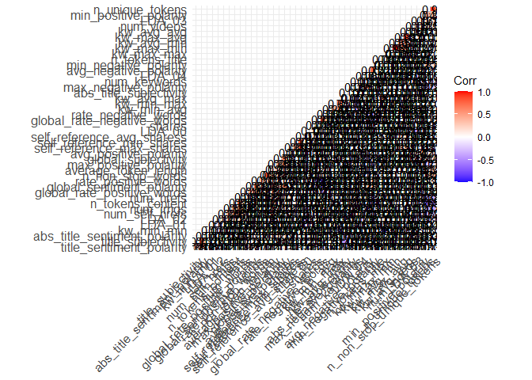
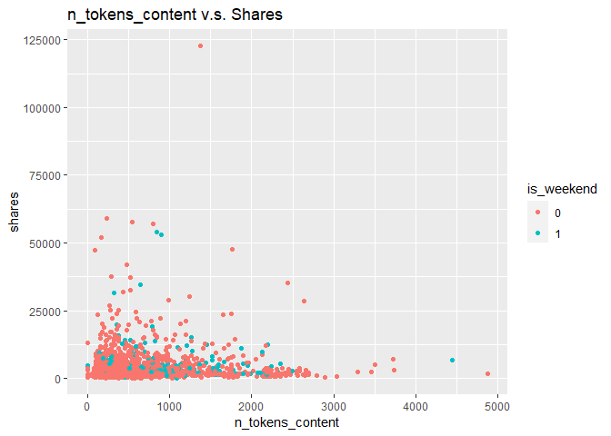
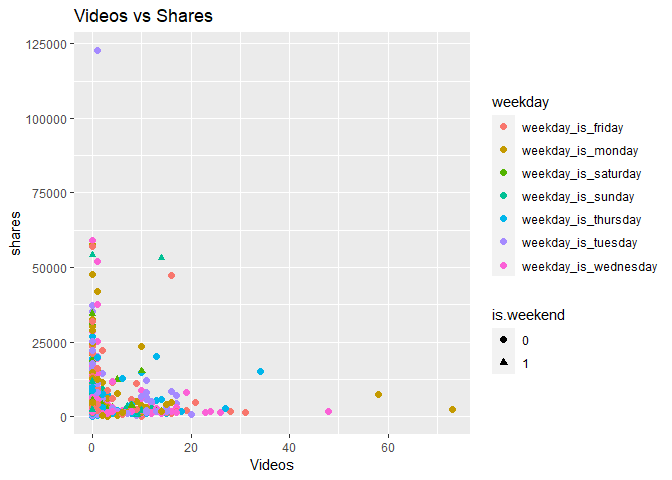
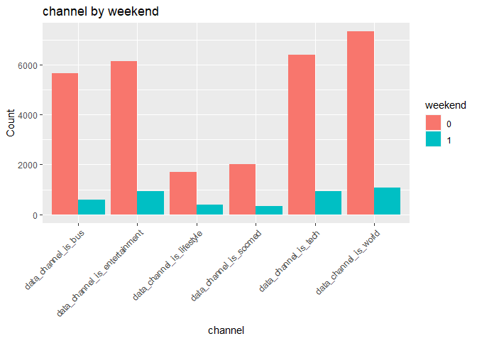
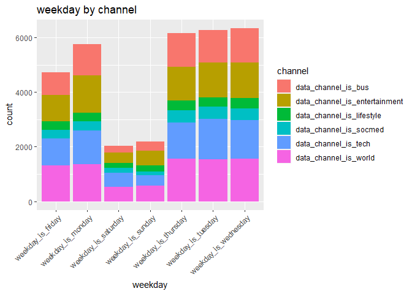
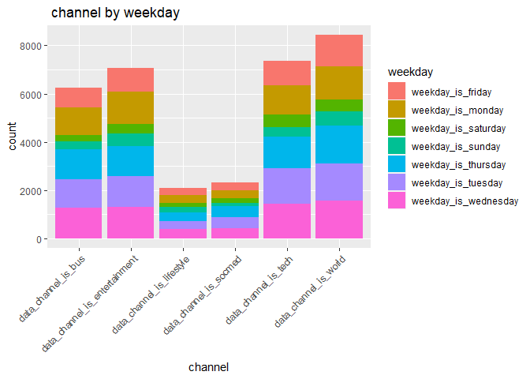
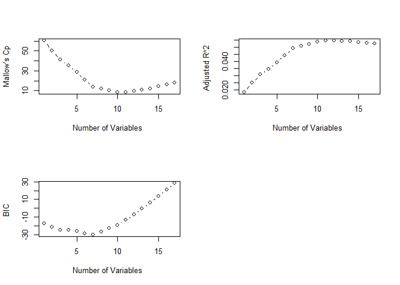
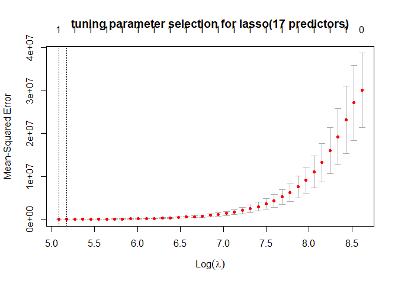

ST558 Project 2
================
Aries Zhou & Jiatao Wang
10/19/2021

## Introduction

This is a R project using the exploratory data analysis and supervised
statistical learning method to analyze a data set.  
This data set is called **Online News Popularity Data Set** and you can
access the data set
[here](https://archive.ics.uci.edu/ml/datasets/Online+News+Popularity)  
There are lots of measurements/heterogeneous features of articles,
including type of the data channel, number of images, number of videos,
number of links, counts of words in the title/content, when it is
published, summary statistics of polarity of positive/negative words and
etc…  
The **main goal** of this project is to use those features/explanatory
variables to predict the popularity(number of the shares in social
networks)  
Before conducting any method to fit the data with models, we want to do
some exploratory data analysis (including some summary statistics and
graphs) to visualize the data. And then, we will fit the data under
regression setting.  
Supervised learning methods that will be used in this project include:
linear regression, generalized linear model, lasso regression, random
forest regression, boosted method, or any other method that we will find
that could be applicable through our discovering of the data.

List of packages used:

``` r
library(dplyr)
library(tidyr)
library(ggcorrplot)
library(vcd)
library(caret)
library(class)
library(randomForest)
library(gbm)
library(readr)
library(leaps)
library(Matrix)
library(glmnet)
library(rmarkdown)
#library(MASS)
```

## Data Cleaning

### Data

Read in data and combine certain numerical columns to a single
column(categorical)

``` r
# import data
pop <- read_csv("OnlineNewsPopularity.csv")
#check if there is any missing or NA values in the data set 
anyNA(pop)
```

    ## [1] FALSE

``` r
#convert the wide to long format (categorize data channel, and make them into one column)
new <- pop %>% pivot_longer(cols = data_channel_is_lifestyle:data_channel_is_world, names_to = "channel",values_to = 'things') 
new_data <- new %>% filter(things != 0) %>% select(-things)

#pop.data2 <- new_data %>% subset(channel == 'data_channel_is_lifestyle') %>% select( -1:-2)

# merge those weekday columns into one.
Z <- new_data %>% pivot_longer(cols = weekday_is_monday:weekday_is_sunday, names_to = "weekday",values_to = 'whatever') 
X <- Z %>% filter(whatever != 0) %>% select(-whatever)
```

Subset the data set to be used for the analysis and set the params to do
automation

``` r
pop.data2 <- X %>% filter(channel == params$channel) %>% select( -1:-2)

#there are some observations that are not in the types of channel listed in the data set. 
nrow(new_data)< nrow(pop)
```

    ## [1] TRUE

``` r
# subset data on data channel of interest
pop.data <- new_data %>% filter(channel == params$channel) %>% select(-starts_with("data_channel_is_"), -1:-2,-channel)
```

## Exploratory Data Analysis

### Summarizations And Graphs

Some attempts

``` r
pop.data$weekday_is_monday <- as.factor(pop.data$weekday_is_monday)
pop.data$weekday_is_tuesday <- as.factor(pop.data$weekday_is_tuesday)
pop.data$weekday_is_wednesday <- as.factor(pop.data$weekday_is_wednesday)
pop.data$weekday_is_thursday <- as.factor(pop.data$weekday_is_thursday)
pop.data$weekday_is_friday <- as.factor(pop.data$weekday_is_friday)
pop.data$weekday_is_saturday <- as.factor(pop.data$weekday_is_saturday)
pop.data$weekday_is_sunday <- as.factor(pop.data$weekday_is_sunday)
pop.data$is_weekend <- as.factor(pop.data$is_weekend)

#summary stats for the response varaible. 
summary(pop.data$shares)
```

    ##    Min. 1st Qu.  Median    Mean 3rd Qu.    Max. 
    ##       5    1400    2100    3629    3800  122800

``` r
# check the counts of binary variables.
pop.data.char <- pop.data %>% select(is.factor)


#table(pop.data.char)
pop.data.num <- select(pop.data, is.numeric) %>% mutate_all(~(scale(.) %>% as.vector)) 

# check correlations
cor <- round(cor(pop.data.num, use="complete.obs"), 2)
```

``` r
# Consider all numeric variables.
lm <- step(lm(shares ~ . , data = pop.data.num), direction = "backward")
```

``` r
l.fit<- lm(lm$call[["formula"]], data = pop.data.num)
summary(l.fit)
```

    ## 
    ## Call:
    ## lm(formula = lm$call[["formula"]], data = pop.data.num)
    ## 
    ## Residuals:
    ##     Min      1Q  Median      3Q     Max 
    ## -2.7493 -0.3744 -0.1861  0.0716 21.1256 
    ## 
    ## Coefficients:
    ##                                Estimate Std. Error t value Pr(>|t|)    
    ## (Intercept)                  -4.627e-16  2.011e-02   0.000 1.000000    
    ## n_unique_tokens              -1.309e-01  2.751e-02  -4.758 2.08e-06 ***
    ## n_non_stop_words              4.921e-02  2.407e-02   2.044 0.041062 *  
    ## num_self_hrefs               -5.967e-02  2.280e-02  -2.617 0.008926 ** 
    ## num_imgs                     -6.828e-02  2.443e-02  -2.795 0.005233 ** 
    ## num_videos                    3.317e-02  2.110e-02   1.572 0.116011    
    ## num_keywords                  3.726e-02  2.404e-02   1.550 0.121281    
    ## kw_min_min                    3.714e-02  2.449e-02   1.517 0.129393    
    ## kw_max_min                   -2.389e-01  9.994e-02  -2.391 0.016899 *  
    ## kw_avg_min                    2.060e-01  9.869e-02   2.087 0.036996 *  
    ## kw_avg_max                   -5.750e-02  2.883e-02  -1.994 0.046228 *  
    ## kw_max_avg                   -1.738e-01  4.830e-02  -3.599 0.000326 ***
    ## kw_avg_avg                    3.008e-01  5.198e-02   5.786 8.18e-09 ***
    ## self_reference_min_shares     8.060e-02  2.030e-02   3.971 7.39e-05 ***
    ## LDA_01                       -6.110e-02  2.117e-02  -2.886 0.003943 ** 
    ## LDA_02                       -6.118e-02  2.278e-02  -2.686 0.007283 ** 
    ## LDA_03                       -7.399e-02  2.286e-02  -3.237 0.001226 ** 
    ## max_positive_polarity        -6.046e-02  2.372e-02  -2.548 0.010884 *  
    ## min_negative_polarity        -8.041e-02  2.257e-02  -3.563 0.000374 ***
    ## abs_title_sentiment_polarity  6.186e-02  2.089e-02   2.961 0.003095 ** 
    ## ---
    ## Signif. codes:  0 '***' 0.001 '**' 0.01 '*' 0.05 '.' 0.1 ' ' 1
    ## 
    ## Residual standard error: 0.9695 on 2303 degrees of freedom
    ## Multiple R-squared:  0.06778,    Adjusted R-squared:  0.06009 
    ## F-statistic: 8.813 on 19 and 2303 DF,  p-value: < 2.2e-16

``` r
lm$call[["formula"]]
```

    ## shares ~ n_unique_tokens + n_non_stop_words + num_self_hrefs + 
    ##     num_imgs + num_videos + num_keywords + kw_min_min + kw_max_min + 
    ##     kw_avg_min + kw_avg_max + kw_max_avg + kw_avg_avg + self_reference_min_shares + 
    ##     LDA_01 + LDA_02 + LDA_03 + max_positive_polarity + min_negative_polarity + 
    ##     abs_title_sentiment_polarity
    ## <environment: 0x000001d08f7f2330>

``` r
gsub("[+]", ",", lm$call[["formula"]])
```

    ## [1] "~"                                                                                                                                                                                                                                                                                                             
    ## [2] "shares"                                                                                                                                                                                                                                                                                                        
    ## [3] "n_unique_tokens , n_non_stop_words , num_self_hrefs , num_imgs , num_videos , num_keywords , kw_min_min , kw_max_min , kw_avg_min , kw_avg_max , kw_max_avg , kw_avg_avg , self_reference_min_shares , LDA_01 , LDA_02 , LDA_03 , max_positive_polarity , min_negative_polarity , abs_title_sentiment_polarity"

``` r
pop.data.num.s <- pop.data.num %>% select(n_tokens_content , n_non_stop_words , n_non_stop_unique_tokens , num_hrefs , num_videos , kw_avg_max , kw_min_avg , kw_max_avg , kw_avg_avg , self_reference_min_shares , self_reference_avg_sharess , abs_title_subjectivity)

cor.selected <- round(cor(pop.data.num, use="complete.obs"), 2)


ggcorrplot(cor.selected, hc.order = TRUE, type = "lower", lab = TRUE)
```



Some tables for selected data channel of interest showing the counts and
percentage grouped by channel and weekday

``` r
#summary statistics 
#simple table displaying counts for different type of channel (all obs)
table(X$channel) 
```

    ## 
    ##           data_channel_is_bus data_channel_is_entertainment     data_channel_is_lifestyle        data_channel_is_socmed 
    ##                          6258                          7057                          2099                          2323 
    ##          data_channel_is_tech         data_channel_is_world 
    ##                          7346                          8427

``` r
#some summary stats grouped by channel 
C1 <- X %>% 
    group_by( channel ) %>% 
    summarise( percent = 100 * n() / nrow( new_data ),mean_shares = mean(shares), mean_images = mean(num_imgs),mean_video = mean(num_videos),mean_link = mean(num_hrefs))
knitr::kable(C1)
```

| channel                          |   percent | mean\_shares | mean\_images | mean\_video | mean\_link |
|:---------------------------------|----------:|-------------:|-------------:|------------:|-----------:|
| data\_channel\_is\_bus           | 18.675022 |     3063.019 |     1.808405 |   0.6364653 |   9.356184 |
| data\_channel\_is\_entertainment | 21.059385 |     2970.487 |     6.317699 |   2.5458410 |  10.689670 |
| data\_channel\_is\_lifestyle     |  6.263802 |     3682.123 |     4.904717 |   0.4749881 |  13.419247 |
| data\_channel\_is\_socmed        |  6.932259 |     3629.383 |     4.290142 |   1.1175204 |  13.176065 |
| data\_channel\_is\_tech          | 21.921814 |     3072.283 |     4.434522 |   0.4471821 |   9.416825 |
| data\_channel\_is\_world         | 25.147717 |     2287.734 |     2.841225 |   0.5495431 |  10.195206 |

``` r
# using the subset data set containing weekday info in one column. 
table(pop.data2$weekday)
```

    ## 
    ##    weekday_is_friday    weekday_is_monday  weekday_is_saturday    weekday_is_sunday  weekday_is_thursday   weekday_is_tuesday 
    ##                  332                  337                  180                  137                  463                  458 
    ## weekday_is_wednesday 
    ##                  416

``` r
C2 <- pop.data2 %>% 
    group_by( weekday ) %>% 
    summarise( percent = 100 * n() / nrow( X ),mean_shares = mean(shares), mean_images = mean(num_imgs),mean_video = mean(num_videos),mean_link = mean(num_hrefs))
knitr::kable(C2)
```

| weekday                |   percent | mean\_shares | mean\_images | mean\_video | mean\_link |
|:-----------------------|----------:|-------------:|-------------:|------------:|-----------:|
| weekday\_is\_friday    | 0.9907490 |     4012.880 |     3.262048 |   1.2710843 |   11.74699 |
| weekday\_is\_monday    | 1.0056699 |     4010.442 |     3.421365 |   1.3590504 |   11.20475 |
| weekday\_is\_saturday  | 0.5371531 |     3508.711 |     5.733333 |   0.5611111 |   20.98333 |
| weekday\_is\_sunday    | 0.4088332 |     4525.350 |     5.649635 |   1.1021898 |   13.43796 |
| weekday\_is\_thursday  | 1.3816771 |     3092.168 |     4.853132 |   1.0453564 |   13.41685 |
| weekday\_is\_tuesday   | 1.3667562 |     3503.290 |     5.126638 |   1.0021834 |   14.05459 |
| weekday\_is\_wednesday | 1.2414205 |     3508.510 |     3.194711 |   1.2524038 |   11.21394 |

``` r
table(pop.data2$weekday, pop.data2$channel)
```

    ##                       
    ##                        data_channel_is_socmed
    ##   weekday_is_friday                       332
    ##   weekday_is_monday                       337
    ##   weekday_is_saturday                     180
    ##   weekday_is_sunday                       137
    ##   weekday_is_thursday                     463
    ##   weekday_is_tuesday                      458
    ##   weekday_is_wednesday                    416

``` r
#V <- ifelse(X$is_weekend == 0, "No","Yes")
table(pop.data2$channel, pop.data2$is_weekend)
```

    ##                         
    ##                             0    1
    ##   data_channel_is_socmed 2006  317

``` r
C3 <- pop.data2 %>% group_by(is_weekend)%>% 
    summarise( percent = 100 * n() / nrow( X ),mean_shares = mean(shares), mean_images = mean(num_imgs),mean_video = mean(num_videos),mean_link = mean(num_hrefs))
knitr::kable(C3)
```

| is\_weekend |   percent | mean\_shares | mean\_images | mean\_video | mean\_link |
|------------:|----------:|-------------:|-------------:|------------:|-----------:|
|           0 | 5.9862728 |     3579.021 |     4.067797 |   1.1684945 |   12.45763 |
|           1 | 0.9459863 |     3948.079 |     5.697161 |   0.7949527 |   17.72240 |

### Graphical summaries

``` r
#Scatter plot for n_tokens_content v.s. Shares.
scatter <- ggplot(data = pop.data2, aes(x = n_tokens_content, y = shares))
scatter + geom_point(aes(color = as.factor(is_weekend))) + 
geom_smooth(method = lm) + 
labs(title = "n_tokens_content v.s. Shares", x = "n_tokens_content", y = "shares") + 
scale_color_discrete(name = "is_weekend")
```



``` r
g<-ggplot(pop.data2,aes(x = num_videos, 
                       y =shares))
  g + 
    geom_point(aes(shape = as.factor(is_weekend),
                   color = as.factor(weekday)),
               size = 2) + 
    geom_smooth(method = lm) + 
    labs(x = "Videos", 
         y = "shares",
         title = "Videos vs Shares ")+  
    scale_shape_manual(values = c(3:4))+
    scale_color_discrete(name = "weekday")+
    scale_shape_discrete(name="is.weekend")
```



#### General plots

This is a bar plot channel by weekend(is or not)  
We can see from the plot that weekend shares far more less than the
shares that is not on weekend

``` r
#some graphs 


g <-ggplot(X,aes(x = channel))
  g + 
    geom_bar(aes(fill = as.factor(is_weekend)),
               position = "dodge") + 
    labs(x = "channel", y = "Count", title = "channel by weekend") +
    theme(axis.text.x = element_text(angle = 45, vjust = 1, hjust = 1))+
    scale_fill_discrete(name = "weekend") 
```



Boxplot for different channels  
There are some outliers of shares in certain channels.

``` r
g<-ggplot(X,aes(x = channel,
                       y = shares))
  g + 
    geom_boxplot(position = "dodge") + 
    labs(x = "y",
         title = "Boxplot for popularity with channel type ")+ 
    scale_x_discrete(name = "channel")+ 
    geom_jitter(aes(color = as.factor(weekday))) + 
    scale_y_continuous() + 
    theme(axis.text.x = element_text(angle = 45, vjust = 1, hjust = 1))+
    scale_color_discrete(name = "weekday")
```


This is the bar plot : channel by weekday(stacked bar)

``` r
  g<-ggplot(X,
          aes(x = weekday))
  g + 
    geom_bar(aes(fill = as.factor(channel)),
             position = "stack",show.legend = NA) + 
    labs(x = "weekday")+ 
    scale_fill_discrete(name = "channel") + 
    theme(axis.text.x = element_text(angle = 45, vjust = 1, hjust = 1))+
    labs(title = "weekday by channel ")
```



``` r
 # or  
   g<-ggplot(X,
          aes(x = channel))
  g + 
    geom_bar(aes(fill = as.factor(weekday)),
             position = "stack",show.legend = NA) + 
    labs(x = "channel")+ 
    scale_fill_discrete(name = "weekday") + 
    theme(axis.text.x = element_text(angle = 45, vjust = 1, hjust = 1))+
    labs(title = " channel by weekday ")
```



## Modeling(Regression Settings)

### Split the data set.

Split the data set into training and testing set. Use p = 0.7.

``` r
# set seed
set.seed(234)

train.index <- createDataPartition(y = pop.data$shares, p = 0.7, list = F)
train <- pop.data[train.index, ] # training set
test <- pop.data[-train.index, ] # test set

#train.index<- sample(1:nrow(pop.data), size = nrow(pop.data) *0.7)
#test.index<- dplyr::setdiff(1:nrow(pop.data), train)

#train <- pop.data[train.index, ] # training set
#test <- pop.data[test.index, ] # test set
```

### Linear Regression

Before fitting any predictive models, we tried some methods that could
help reduce the dimension of data.  
We randomly selected some predictors of interest and perform the best
subset selection under the condition of least square linear regression.

``` r
# for the variable that can be used in the linear regression model. 
# try best subset selection, select number of variables using adjusted R^2, and mallow's cp, BIC,
 
final <- pop.data2 %>% select(n_tokens_content , n_non_stop_words , n_non_stop_unique_tokens , num_hrefs , num_imgs,num_keywords, num_videos , kw_avg_max , kw_min_avg , kw_max_avg , kw_avg_avg , self_reference_min_shares , self_reference_avg_sharess ,global_rate_positive_words,rate_positive_words, abs_title_subjectivity,abs_title_sentiment_polarity,shares)


train.index.sub <- createDataPartition(y = final$shares, p = 0.7, list = F)
train.sub <- final[train.index.sub, ] # training set
test.sub <- final[-train.index.sub, ] # test set


regression1 <- regsubsets(shares ~., data = train.sub,nvmax=17)
hh1<-summary(regression1)

# this is the indicators of the variables that are supposed to be included in the model each time(iteration)
knitr::kable(hh1$which)
```

| (Intercept) | n\_tokens\_content | n\_non\_stop\_words | n\_non\_stop\_unique\_tokens | num\_hrefs | num\_imgs | num\_keywords | num\_videos | kw\_avg\_max | kw\_min\_avg | kw\_max\_avg | kw\_avg\_avg | self\_reference\_min\_shares | self\_reference\_avg\_sharess | global\_rate\_positive\_words | rate\_positive\_words | abs\_title\_subjectivity | abs\_title\_sentiment\_polarity |
|:------------|:-------------------|:--------------------|:-----------------------------|:-----------|:----------|:--------------|:------------|:-------------|:-------------|:-------------|:-------------|:-----------------------------|:------------------------------|:------------------------------|:----------------------|:-------------------------|:--------------------------------|
| TRUE        | FALSE              | FALSE               | FALSE                        | FALSE      | FALSE     | FALSE         | FALSE       | FALSE        | FALSE        | FALSE        | FALSE        | FALSE                        | TRUE                          | FALSE                         | FALSE                 | FALSE                    | FALSE                           |
| TRUE        | FALSE              | FALSE               | FALSE                        | FALSE      | FALSE     | FALSE         | FALSE       | FALSE        | FALSE        | FALSE        | TRUE         | TRUE                         | FALSE                         | FALSE                         | FALSE                 | FALSE                    | FALSE                           |
| TRUE        | FALSE              | FALSE               | TRUE                         | FALSE      | FALSE     | FALSE         | FALSE       | FALSE        | FALSE        | FALSE        | TRUE         | TRUE                         | FALSE                         | FALSE                         | FALSE                 | FALSE                    | FALSE                           |
| TRUE        | FALSE              | FALSE               | TRUE                         | FALSE      | TRUE      | FALSE         | FALSE       | FALSE        | FALSE        | FALSE        | TRUE         | TRUE                         | FALSE                         | FALSE                         | FALSE                 | FALSE                    | FALSE                           |
| TRUE        | FALSE              | TRUE                | TRUE                         | FALSE      | TRUE      | FALSE         | FALSE       | FALSE        | FALSE        | FALSE        | TRUE         | TRUE                         | FALSE                         | FALSE                         | FALSE                 | FALSE                    | FALSE                           |
| TRUE        | FALSE              | FALSE               | TRUE                         | FALSE      | TRUE      | FALSE         | FALSE       | TRUE         | FALSE        | TRUE         | TRUE         | FALSE                        | TRUE                          | FALSE                         | FALSE                 | FALSE                    | FALSE                           |
| TRUE        | FALSE              | TRUE                | TRUE                         | FALSE      | TRUE      | FALSE         | FALSE       | TRUE         | FALSE        | TRUE         | TRUE         | TRUE                         | FALSE                         | FALSE                         | FALSE                 | FALSE                    | FALSE                           |
| TRUE        | FALSE              | TRUE                | TRUE                         | FALSE      | TRUE      | FALSE         | FALSE       | TRUE         | FALSE        | TRUE         | TRUE         | TRUE                         | TRUE                          | FALSE                         | FALSE                 | FALSE                    | FALSE                           |
| TRUE        | FALSE              | TRUE                | TRUE                         | FALSE      | TRUE      | FALSE         | FALSE       | TRUE         | FALSE        | TRUE         | TRUE         | TRUE                         | TRUE                          | FALSE                         | TRUE                  | FALSE                    | FALSE                           |
| TRUE        | FALSE              | TRUE                | TRUE                         | TRUE       | TRUE      | FALSE         | FALSE       | TRUE         | FALSE        | TRUE         | TRUE         | TRUE                         | TRUE                          | FALSE                         | TRUE                  | FALSE                    | FALSE                           |
| TRUE        | TRUE               | TRUE                | TRUE                         | TRUE       | TRUE      | FALSE         | FALSE       | TRUE         | FALSE        | TRUE         | TRUE         | TRUE                         | TRUE                          | FALSE                         | TRUE                  | FALSE                    | FALSE                           |
| TRUE        | TRUE               | TRUE                | TRUE                         | TRUE       | TRUE      | TRUE          | FALSE       | TRUE         | FALSE        | TRUE         | TRUE         | TRUE                         | TRUE                          | FALSE                         | TRUE                  | FALSE                    | FALSE                           |
| TRUE        | TRUE               | TRUE                | TRUE                         | TRUE       | TRUE      | TRUE          | FALSE       | TRUE         | FALSE        | TRUE         | TRUE         | TRUE                         | TRUE                          | FALSE                         | TRUE                  | FALSE                    | TRUE                            |
| TRUE        | TRUE               | TRUE                | TRUE                         | TRUE       | TRUE      | TRUE          | FALSE       | TRUE         | TRUE         | TRUE         | TRUE         | TRUE                         | TRUE                          | FALSE                         | TRUE                  | FALSE                    | TRUE                            |
| TRUE        | TRUE               | TRUE                | TRUE                         | TRUE       | TRUE      | TRUE          | FALSE       | TRUE         | TRUE         | TRUE         | TRUE         | TRUE                         | TRUE                          | TRUE                          | TRUE                  | FALSE                    | TRUE                            |
| TRUE        | TRUE               | TRUE                | TRUE                         | TRUE       | TRUE      | TRUE          | TRUE        | TRUE         | TRUE         | TRUE         | TRUE         | TRUE                         | TRUE                          | TRUE                          | TRUE                  | FALSE                    | TRUE                            |
| TRUE        | TRUE               | TRUE                | TRUE                         | TRUE       | TRUE      | TRUE          | TRUE        | TRUE         | TRUE         | TRUE         | TRUE         | TRUE                         | TRUE                          | TRUE                          | TRUE                  | TRUE                     | TRUE                            |

A simple function that helps to get the model for the best subset
selection

``` r
get_model_formula <- function(id, object, outcome){
  # get models data
  models <- hh1$which[id,-1]
  # Get model predictors
  predictors <- names(which(models == TRUE))
  predictors <- paste(predictors, collapse = "+")
  # Build model formula
  as.formula(paste0(outcome, "~", predictors))
}
```

Using mallow’s cp, BIC and Adjusted R^2, to do model selection.

``` r
gk <- data.frame(
  Adj.R2 = which.max(hh1$adjr2),
  CP = which.min(hh1$cp),
  BIC = which.min(hh1$bic)
)
knitr::kable(gk)
```

| Adj.R2 |  CP | BIC |
|-------:|----:|----:|
|     12 |  10 |   7 |

``` r
par(mfrow=c(2,2))
plot(hh1$cp ,xlab="Number of Variables ",ylab="Mallow's Cp", type='b')
plot(hh1$adjr2 ,xlab="Number of Variables ",ylab="Adjusted R^2 ", type='b')
plot(hh1$bic,xlab="Number of Variables ",ylab="BIC ", type='b')

# using the mallow's cp to choose model size. 
best_subset_model <- get_model_formula(which.min(hh1$cp),models,"shares")


#for the linear regression, after using the best subset selection, some important variables are 
#n_tokens_content num_videos   n_non_stop_words   n_non_stop_unique_tokens    self_reference_min_shares  kw_avg_avg  abs_title_subjectivity  kw_max_avg
```



Since using all predictors is time-consuming and hard to render in
automation, we use the random selected variables(p = 17) :predictors
chosen from backward selection, and best subset selection to fit the
linear model.

``` r
# Consider all numeric variables.
lm1 <- step(lm(shares ~ . , data = train.sub), direction = "backward",use.start = TRUE)

lm2 <- step(lm(lm1$call[["formula"]], data = train.sub), scope = . ~.^2, direction = "both",use.start = TRUE)
```

Fit the linear regression using cross validation

``` r
ctrl <- trainControl(method = "cv", number = 5)

# fit the model chosen from the backward selection for all linear terms, 
lm.fit1 <- train(lm1$call[["formula"]], data = train.sub, 
                 method = "lm", preProcess =c("center", "scale"), 
                 trControl = ctrl)
#lm.fit1$results[2:4]

#fit the model chosen from both forward and backward method for the interaction terms and linear terms. 
lm.fit2 <- train(lm2$call[["formula"]], data = train.sub, 
                 method = "lm", preProcess =c("center", "scale"), 
                 trControl = ctrl)

#check the model selected by the best subset selection 
lm.fit3 <- train(best_subset_model,data = train.sub,
                 method = "lm", preProcess =c("center", "scale"), 
                 trControl = ctrl)

# create a table to compare the results of linear regression from training data 
lm.compare <- data.frame(models= c("lm.fit1", "lm.fit2","lm.fit3"), results = bind_rows(lm.fit1$results[2:4], lm.fit2$results[2:4], lm.fit3$results[2:4]))
knitr::kable(lm.compare) 
```

| models  | results.RMSE | results.Rsquared | results.MAE |
|:--------|-------------:|-----------------:|------------:|
| lm.fit1 |     5243.142 |        0.0554764 |    2489.998 |
| lm.fit2 |     5127.106 |        0.0858424 |    2509.075 |
| lm.fit3 |     5261.654 |        0.0563558 |    2487.340 |

``` r
#select the linear model with lowest RMSE. 
#lm.select <- lm.compare %>% filter(results.RMSE == min(results.RMSE))

#lm.select

pred.lm1 <- predict(lm.fit1, newdata = test.sub)
test.MSE.lm1 <- mean((pred.lm1 - test.sub$shares)^2)

pred.lm2 <- predict(lm.fit2, newdata = test.sub)
test.MSE.lm2 <- mean((pred.lm2 - test.sub$shares)^2)

pred.lm3 <- predict(lm.fit3, newdata = test.sub)
test.MSE.lm3 <- mean((pred.lm3 - test.sub$shares)^2)
```

### Lasso Regression

Since lasso perform the variable selection, we tried to use Lasso
Regression(adding tuning parameter/ penalty)

Lasso using all the predictors and get the test MSE

``` r
train.lasso <- pop.data2[train.index, ] # training set
test.lasso <- pop.data2[-train.index, ] # test set

# using all predictors (52 predictors)
cv.out.full <- cv.glmnet(as.matrix(train.lasso[,-47:-48]), train.lasso$shares, alpha=1)
#MSE versus the log(lambda)
plot(cv.out.full,main = "tuning parameter selection for lasso(full predictors)")
```


``` r
best.lambda.full <- cv.out.full$lambda.min

#fitting the lasso regression 
lasso.fit.full <- glmnet(train.lasso[,-46:-48] ,train.lasso$shares, alpha = 1, lambda = best.lambda.full)
lasso.coef.full <- predict(lasso.fit.full, type = "coefficients")
print(lasso.coef.full)
```

    ## 46 x 1 sparse Matrix of class "dgCMatrix"
    ##                                         s0
    ## (Intercept)                   3.963370e+03
    ## n_tokens_title                .           
    ## n_tokens_content              .           
    ## n_unique_tokens              -3.361163e+03
    ## n_non_stop_words              .           
    ## n_non_stop_unique_tokens      .           
    ## num_hrefs                     .           
    ## num_self_hrefs               -8.053720e+00
    ## num_imgs                     -1.491193e+01
    ## num_videos                    .           
    ## average_token_length          .           
    ## num_keywords                  .           
    ## kw_min_min                    1.875580e+00
    ## kw_max_min                    .           
    ## kw_avg_min                    .           
    ## kw_min_max                   -7.412187e-04
    ## kw_max_max                    .           
    ## kw_avg_max                    .           
    ## kw_min_avg                    1.873284e-01
    ## kw_max_avg                    .           
    ## kw_avg_avg                    1.571758e-01
    ## self_reference_min_shares     .           
    ## self_reference_max_shares     .           
    ## self_reference_avg_sharess    1.234220e-02
    ## is_weekend                    .           
    ## LDA_00                        1.240907e+03
    ## LDA_01                       -1.346053e+03
    ## LDA_02                       -3.874189e+02
    ## LDA_03                        .           
    ## LDA_04                        2.070789e+02
    ## global_subjectivity           .           
    ## global_sentiment_polarity    -5.422030e+02
    ## global_rate_positive_words    .           
    ## global_rate_negative_words    .           
    ## rate_positive_words           .           
    ## rate_negative_words           4.059996e+01
    ## avg_positive_polarity         .           
    ## min_positive_polarity         .           
    ## max_positive_polarity         .           
    ## avg_negative_polarity         .           
    ## min_negative_polarity        -4.252808e+02
    ## max_negative_polarity         .           
    ## title_subjectivity            .           
    ## title_sentiment_polarity      4.130724e+01
    ## abs_title_subjectivity        .           
    ## abs_title_sentiment_polarity  8.650405e+02

``` r
lasso.pred.full <- predict(lasso.fit.full, newx= as.matrix(test.lasso[,-46:-48]))
test.MSE.lasso.full <- mean((lasso.pred.full - test.lasso$shares)^2)
```

Lasso method using the 17 predictors and get test MSE

``` r
#using selected predictors (17 predictors) 
#use k-fold cv to select best lambda for the lasso regression 
cv.out <- cv.glmnet(as.matrix(train.sub), train.sub$shares, alpha=1)
#MSE versus the log(lambda)
plot(cv.out,main = "tuning parameter selection for lasso(17 predictors)")
```



``` r
best.lambda <- cv.out$lambda.min

#fitting the lasso regression 
lasso.fit.18 <- glmnet(train.sub[,-18] ,train.sub$shares, alpha = 1, lambda = best.lambda)
lasso.coef <- predict(lasso.fit.18, type = "coefficients")
print(lasso.coef)
```

    ## 18 x 1 sparse Matrix of class "dgCMatrix"
    ##                                         s0
    ## (Intercept)                   3.806740e+03
    ## n_tokens_content              1.046303e-01
    ## n_non_stop_words              7.958012e+02
    ## n_non_stop_unique_tokens     -2.776630e+03
    ## num_hrefs                    -2.527378e+00
    ## num_imgs                     -2.040225e+01
    ## num_keywords                  3.170429e+01
    ## num_videos                    .           
    ## kw_avg_max                   -1.230216e-03
    ## kw_min_avg                    1.298204e-01
    ## kw_max_avg                    .           
    ## kw_avg_avg                    1.866703e-01
    ## self_reference_min_shares     3.133126e-02
    ## self_reference_avg_sharess    1.070778e-02
    ## global_rate_positive_words    .           
    ## rate_positive_words           .           
    ## abs_title_subjectivity        .           
    ## abs_title_sentiment_polarity  .

``` r
lasso.partial.pred <- predict(lasso.fit.18, newx= as.matrix(test.sub[,-18]))
test.MSE.lasso.partial <- mean((lasso.partial.pred - test.sub$shares)^2)
```

### Random Forest Regression

Random Forest regression is used to de-correlate each model fitting. We
use the model the previously get from the backward and both selection
method to fit the random forest regression. Take computation limit, and
time consumption into account, there are only a few tuning parameters
set for the test.

``` r
# create data frame for tuning parameter
#rf.tGrid <- expand.grid(mtry = seq(from = 1, to = 15, by = 1))
ctrl2 <- trainControl(method = "cv", number = 2)
# train the Random Forest model
rf.fit1 <- train(lm1$call[["formula"]], data = train.sub, 
             method = "rf", trControl = ctrl2, 
             preProcess = c("center", "scale"), 
             tuneGrid =data.frame(mtry = c(3,4,5)))
#new method 


#library("randomForest")
#random1<-randomForest(formula = lm1$call[["formula"]], data = train.sub, mtry = 3, importance = T)
#random2<-randomForest(formula = lm1$call[["formula"]], data = train.sub, mtry = 4, importance = T)
#random3<-randomForest(formula = lm1$call[["formula"]], data = train.sub, mtry = 5, importance = T)

rf.fit2 <- train(lm2$call[["formula"]], data = train.sub, 
             method = "rf", trControl = ctrl2, 
             preProcess = c("center", "scale"), 
             tuneGrid =data.frame(mtry = c(3,4,5)))
# create a table to compare the results of linear regression
plot(rf.fit1$results$mtry, rf.fit1$results$RMSE, xlab = "mtry",ylab = "RMSE",type = 'p',main = 'random forest')
```


``` r
plot(rf.fit2$results$mtry, rf.fit2$results$RMSE, xlab = "mtry",ylab = "RMSE",type = 'p',main = 'random forest')
```


``` r
pred.rf1 <- predict(rf.fit1, newdata = test.sub)
test.MSE.rf1 <- mean((pred.rf1 - test.sub$shares)^2)

pred.rf2 <- predict(rf.fit2, newdata = test.sub)
test.MSE.rf2 <- mean((pred.rf2 - test.sub$shares)^2)
```

### Boosting model.(Stochastic Gradient Boosting)

Boosting is a slow learn method that learn from the previous fit each
time in order to prevent over fitting. We also use the model the
previously get from the backward and both selection method to fit the
boosted.  
Boosting tree have several tuning parameters, also, due to some
limitation, the number of tuning parameters and cross validation number
is set to be small.

``` r
# using boosted method 


#final <- pop.data %>% select(n_tokens_content , n_non_stop_words , n_non_stop_unique_tokens , num_hrefs , num_videos , kw_avg_max , kw_min_avg , kw_max_avg , kw_avg_avg , self_reference_min_shares , self_reference_avg_sharess , abs_title_subjectivity,shares)


#train.index <- createDataPartition(y = final$shares, p = 0.7, list = F)
#train.sub <- final[train.index, ] # training set
#test.sub <- final[-train.index, ] # test set


# boosted tree 
tune1 = c(25,50,100,150,200)
tune2 = c(1:10)
tune3 = 0.01
tune4= 10
boostTreefit1 <- train(lm1$call[["formula"]], data = train.sub, 
                method = "gbm",
                preProcess = c("center","scale"),
              trControl = trainControl(method = "cv",number = 3),
              tuneGrid = expand.grid(n.trees = tune1,interaction.depth = tune2,shrinkage= tune3,n.minobsinnode= tune4))
par(mfrow=c(2,2))
plot(boostTreefit1$results$n.trees, boostTreefit1$results$RMSE, xlab = "n.trees",ylab = "RMSE",type = 'p',main = 'boosted')
plot(boostTreefit1$results$interaction.depth, boostTreefit1$results$RMSE, xlab = "subtrees",ylab = "RMSE",type = 'p',main = 'boosted')
plot(boostTreefit1$results$interaction.depth, boostTreefit1$results$Rsquared, xlab = "subtrees",ylab = "R^2",type = 'p',main = 'boosted')


tune1 = c(25,50,100,150,200)
tune2 = c(1:10)
tune3 = 0.01
tune4= 10
boostTreefit2 <- train(lm2$call[["formula"]], data = train.sub, 
                method = "gbm",
                preProcess = c("center","scale"),
              trControl = trainControl(method = "cv",number = 3),
              tuneGrid = expand.grid(n.trees = tune1,interaction.depth = tune2,shrinkage= tune3,n.minobsinnode= tune4))
```


``` r
pred.boost1 <- predict(boostTreefit1 , newdata = test.sub)

test.MSE.boost1 <- mean((pred.boost1 - test.sub$shares)^2)

pred.boost2 <- predict(boostTreefit2 , newdata = test.sub)

test.MSE.boost2 <- mean((pred.boost2 - test.sub$shares)^2)
```

### Discussion and Model Selection

lm.fit1 is using backward selection to select variables of most
interest.  
lm.fit2 is adding the interaction terms to the model fitting  
im.fit3 is chosen by the best subset selection  
lasso.fit.full is using the lasso regression to fit the model for all
predictors (it also perform variable selection)  
lasso.fit.18 is using the lasso regression to fit the model for random
selected predictors(17 predictors )  
rf.fit1/rf.fit2 is using de-correlated method to reduce the variance  
boost.fit is using cross validation to select appropriate tuning
parameter for the boosted model and use it for prediction.  
This is a simple table containing these methods and the Root Mean Square
Error for each model fitting.

``` r
all.compare <- data.frame(models= c("lm.fit1", "lm.fit2","lm.fit3","lasso.fit.full","lasso.fit.18","rf.fit1","rf.fit2","boostTreefit1","boostTreefit2"), test_RMSE = rbind(sqrt(test.MSE.lm1),sqrt(test.MSE.lm2),sqrt(test.MSE.lm3),sqrt(test.MSE.lasso.full),sqrt(test.MSE.lasso.partial),sqrt(test.MSE.rf1),sqrt(test.MSE.rf2),sqrt(test.MSE.boost1),sqrt(test.MSE.boost2)))
knitr::kable(all.compare) 
```

| models         | test\_RMSE |
|:---------------|-----------:|
| lm.fit1        |   5551.583 |
| lm.fit2        |   5641.434 |
| lm.fit3        |   5551.583 |
| lasso.fit.full |   5347.899 |
| lasso.fit.18   |   5547.064 |
| rf.fit1        |   5379.971 |
| rf.fit2        |   5409.255 |
| boostTreefit1  |   5383.799 |
| boostTreefit2  |   5406.882 |

### Automation of data\_channel is\*\*\*

We need to read in libraries as well as some data set before knitting
the automation part.

``` r
channels <- unique(X$channel)
output_file <- paste0(channels,".md")

params = lapply(channels, FUN = function(x){list(channel = x)})

reports <- tibble(output_file, params)

library(rmarkdown)

apply(reports, MARGIN = 1,
      FUN = function(x){
        render(input = "./ST558_Project_2.Rmd",
               output_format = "github_document", 
               output_file = x[[1]], 
               params = x[[2]])
      })
```
